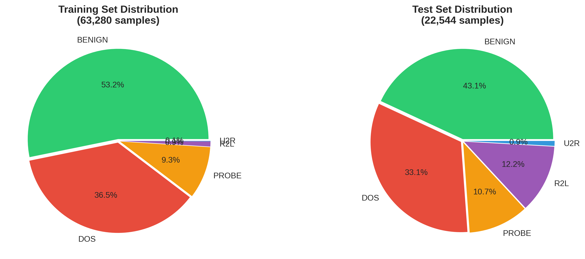
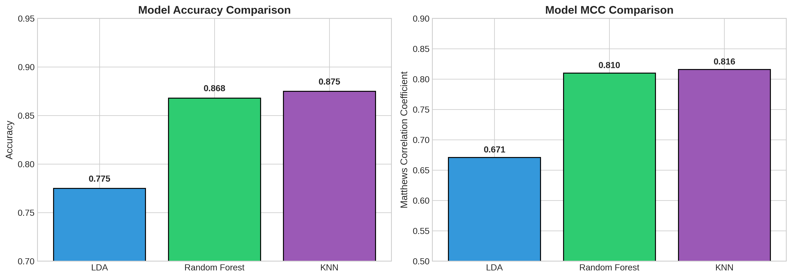
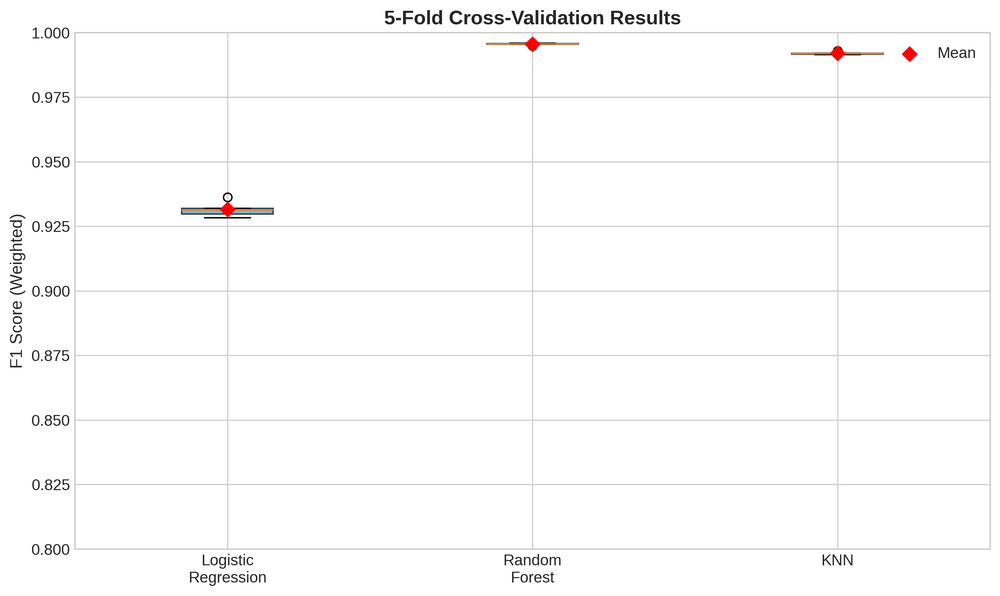
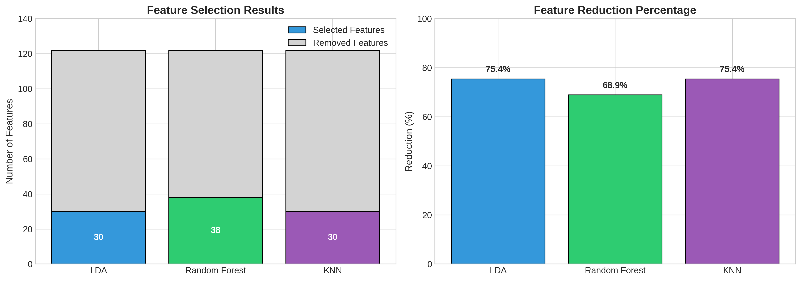
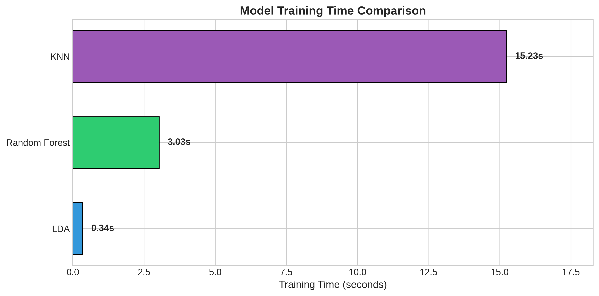
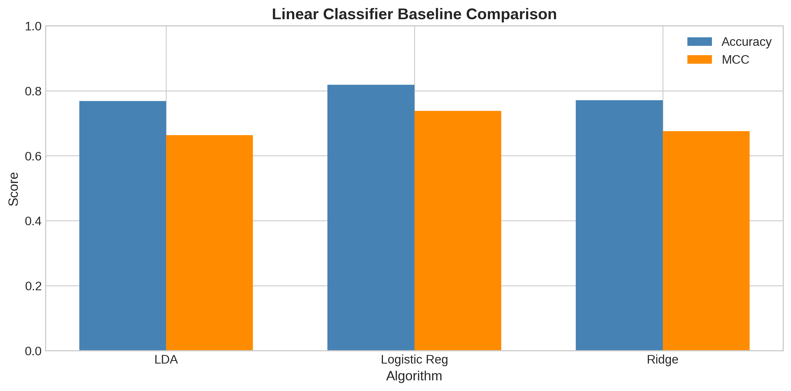
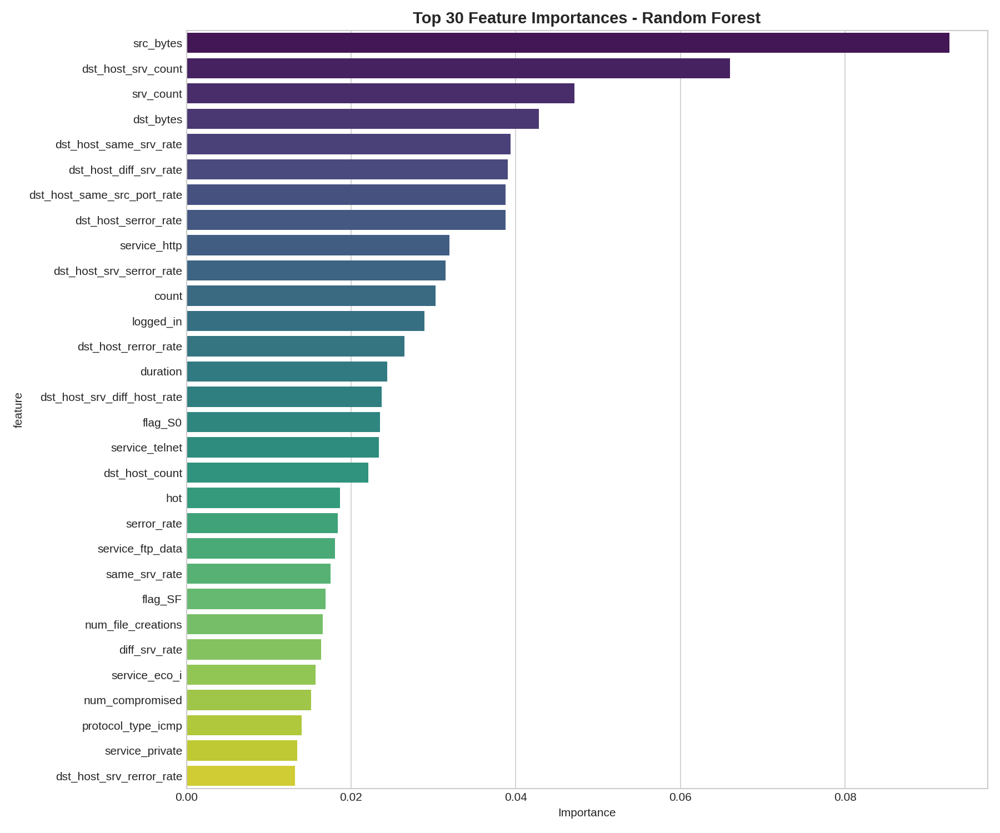
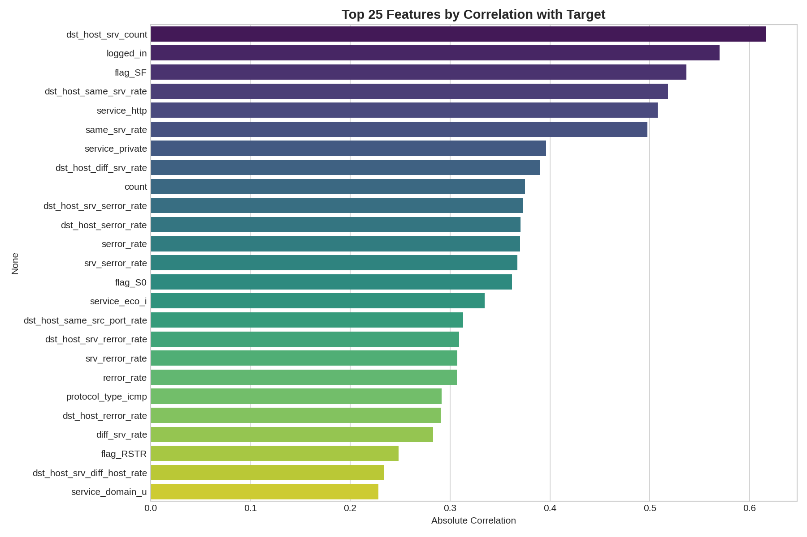
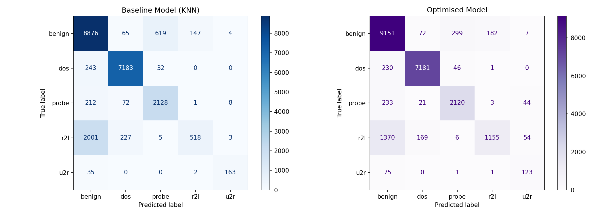
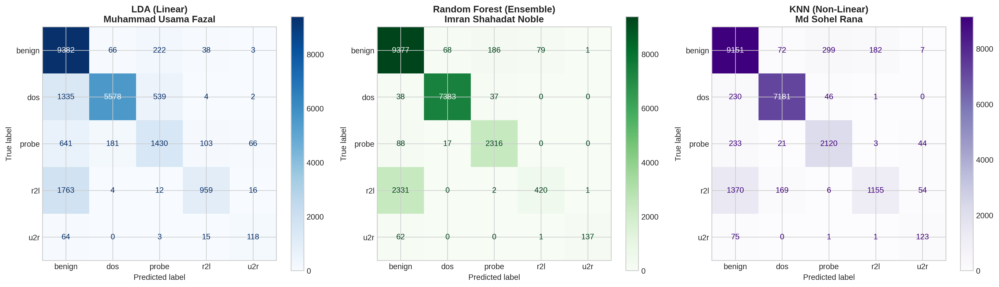

# ASIA PACIFIC UNIVERSITY OF TECHNOLOGY AND INNOVATION

---

## FRONT COVER

---

**CT115-3-M DATA ANALYTICS IN CYBER SECURITY**

**GROUP ASSIGNMENT**

**Machine Learning-Based Network Intrusion Detection System**

---

**Group Members:**

| No. | Name | Student ID | Classifier | Role |
|-----|------|------------|------------|------|
| 1 | Muhammad Usama Fazal | TP086008 | Linear (LDA) | Linear Classifier Analysis |
| 2 | Imran Shahadat Noble | TP087895 | Ensemble (Random Forest) | Ensemble Classifier Analysis |
| 3 | Md Sohel Rana | TP086217 | Non-Linear (KNN) | Non-Linear Classifier Analysis |

**Intake Code:** UC2F2408CS

**Module Title:** Data Analytics in Cyber Security

**Assignment Title:** Group Assignment - Network Intrusion Detection

**Submission Date:** December 2024

---

<div style="page-break-after: always;"></div>

## EXECUTIVE SUMMARY

**Prepared by:** Md Sohel Rana (TP086217), Muhammad Usama Fazal (TP086008), Imran Shahadat Noble (TP087895)

This report presents a comprehensive evaluation of machine learning-based approaches for network intrusion detection using the NSL-KDD benchmark dataset. Three classification algorithms representing different methodological paradigms were implemented and compared: Linear Discriminant Analysis (linear method) by **Muhammad Usama Fazal (TP086008)**, K-Nearest Neighbors (non-linear method) by **Md Sohel Rana (TP086217)**, and Random Forest (ensemble method) by **Imran Shahadat Noble (TP087895)**.

**Classification Task:** Multi-class (5 categories: Benign, DoS, Probe, R2L, U2R)

### Key Findings

| Metric | Best Performer | Score | Author |
|--------|----------------|-------|--------|
| **Overall (MCC)** | K-Nearest Neighbors | 0.816 | Md Sohel Rana (TP086217) |
| **Accuracy** | K-Nearest Neighbors | 87.5% | Md Sohel Rana (TP086217) |
| **F1-Score (Weighted)** | K-Nearest Neighbors | 0.865 | Md Sohel Rana (TP086217) |
| **Training Speed** | Random Forest | 3.03s | Imran Shahadat Noble (TP087895) |

### Principal Conclusions

1. **KNN emerged as the top performer** (Md Sohel Rana - TP086217) with an MCC of 0.816 after optimisation, demonstrating that proper hyperparameter tuning (k=3, Manhattan distance, distance weighting) combined with feature selection can yield substantial improvements (+7.4% MCC).

2. **Non-linear and ensemble methods significantly outperform linear approaches** for multi-class intrusion detection, with KNN (Md Sohel Rana) and Random Forest (Imran Shahadat Noble) achieving MCC scores of 0.816 and 0.810 respectively, compared to LDA's 0.671 (Muhammad Usama Fazal).

3. **Class imbalance poses a significant challenge** - the R2L (0.91%) and U2R (0.09%) classes showed consistently lower detection rates across all classifiers due to severe underrepresentation in the training data.

4. **Algorithm-specific optimisation is essential** - KNN benefited most from optimisation (+7.4% MCC), while Random Forest showed minimal change, indicating its default parameters are already well-suited for this task.

### Practical Recommendations

- **For maximum detection accuracy:** Deploy optimised KNN (MCC: 0.816, Accuracy: 87.5%) - Md Sohel Rana (TP086217)
- **For fastest training and deployment:** Use Random Forest (MCC: 0.810, Training: 3.03s) - Imran Shahadat Noble (TP087895)
- **For interpretability requirements:** Use Linear methods with understanding of their limitations - Muhammad Usama Fazal (TP086008)

---

<div style="page-break-after: always;"></div>

## TABLE OF CONTENTS

1. [Combined Review of Selected Algorithms](#chapter-1-combined-review-of-selected-algorithms)
   - 1.1 Introduction
   - 1.2 Algorithm Classification Taxonomy
   - 1.3 Linear Classifier: Linear Discriminant Analysis (Muhammad Usama Fazal - TP086008)
   - 1.4 Non-Linear Classifier: K-Nearest Neighbors (Md Sohel Rana - TP086217)
   - 1.5 Ensemble Classifier: Random Forest (Imran Shahadat Noble - TP087895)
   - 1.6 Summary of Algorithm Characteristics

2. [Integrated Performance Discussion](#chapter-2-integrated-performance-discussion)
   - 2.1 Experimental Setup
   - 2.2 Performance Metrics Selection
   - 2.3 Comparative Analysis of Optimised Models
   - 2.4 Key Findings and Insights
   - 2.5 Recommendations for Deployment

3. [Individual Chapter: Linear Discriminant Analysis](#chapter-3-individual-chapter---linear-discriminant-analysis-lda) (Muhammad Usama Fazal - TP086008)
   - 3.1 Algorithm Overview
   - 3.2 Baseline Comparison
   - 3.3 Optimisation Strategies Applied
   - 3.4 Baseline vs Optimised Model Comparison
   - 3.5 Analysis and Discussion

4. [Individual Chapter: Random Forest](#chapter-4-individual-chapter---random-forest) (Imran Shahadat Noble - TP087895)
   - 4.1 Algorithm Overview
   - 4.2 Baseline Comparison
   - 4.3 Optimisation Strategies Applied
   - 4.4 Baseline vs Optimised Model Comparison
   - 4.5 Analysis and Discussion

5. [Individual Chapter: K-Nearest Neighbors](#chapter-5-individual-chapter---k-nearest-neighbors-knn) (Md Sohel Rana - TP086217)
   - 5.1 Algorithm Overview
   - 5.2 Baseline Comparison
   - 5.3 Optimisation Strategies Applied
   - 5.4 Baseline vs Optimised Model Comparison
   - 5.5 Analysis and Discussion

6. [Conclusions and Recommendations](#chapter-6-conclusions-and-recommendations)

7. [References](#references)

8. [Appendices](#appendices)
   - Appendix A: Complete Code Listings
   - Appendix B: All Hyperparameter Tuning Iterations
   - Appendix C: Figures and Visualisations
   - Appendix D: Dataset Information

---

<div style="page-break-after: always;"></div>

# CHAPTER 1: COMBINED REVIEW OF SELECTED ALGORITHMS

**Contributors:** Muhammad Usama Fazal (TP086008), Imran Shahadat Noble (TP087895), Md Sohel Rana (TP086217)

## 1.1 Introduction

Network intrusion detection is a critical component of modern cybersecurity infrastructure. As cyber threats continue to evolve in sophistication and frequency, the need for intelligent, automated detection systems has become paramount. Machine learning offers a promising approach to this challenge by enabling systems to learn patterns from historical network traffic data and identify anomalous behaviour indicative of potential attacks.

### 1.1.1 The Cybersecurity Context

Modern organisations face an increasingly hostile threat landscape characterised by:

- **Volume:** Billions of network packets traverse enterprise networks daily, making manual inspection infeasible
- **Velocity:** Zero-day attacks and advanced persistent threats (APTs) require rapid detection and response
- **Variety:** Attack vectors range from simple port scans to sophisticated multi-stage intrusions
- **Evasion:** Attackers actively modify techniques to bypass signature-based detection systems

Traditional rule-based Intrusion Detection Systems (IDS) rely on predefined signatures to identify known attacks. While effective against documented threats, these systems struggle with novel attack patterns and generate high false positive rates. Machine learning-based approaches address these limitations by learning generalised patterns from data rather than relying on explicit rules.

### 1.1.2 Study Objectives

This report presents a comprehensive study of machine learning-based network intrusion detection using the NSL-KDD dataset, a refined version of the widely-used KDD Cup 1999 dataset. The NSL-KDD dataset addresses several inherent problems of the original dataset, including the removal of redundant records and the provision of a more balanced representation of attack types (Tavallaee et al., 2009).

The objective of this study is to evaluate and compare three distinct classification algorithms representing different methodological approaches to pattern recognition:

1. **Linear Discriminant Analysis (LDA)** - A linear classification method - **Muhammad Usama Fazal (TP086008)**
2. **K-Nearest Neighbors (KNN)** - A non-linear, instance-based learning method - **Md Sohel Rana (TP086217)**
3. **Random Forest** - An ensemble method using bagging - **Imran Shahadat Noble (TP087895)**

Each algorithm was implemented with both baseline (default parameters) and optimised configurations to evaluate the impact of various optimisation strategies on **multi-class classification performance** across five attack categories.

### 1.1.3 Multi-Class Classification Task

Unlike binary classification (Normal vs Attack), this study addresses the more challenging **multi-class classification problem** with five categories:

| Class | Description | Training % | Test % |
|-------|-------------|------------|--------|
| **Benign** | Normal network traffic | 53.21% | 43.08% |
| **DoS** | Denial of Service attacks | 36.45% | 33.08% |
| **Probe** | Surveillance/scanning attacks | 9.34% | 10.74% |
| **R2L** | Remote-to-Local attacks | 0.91% | 12.22% |
| **U2R** | User-to-Root attacks | 0.09% | 0.89% |

The severe class imbalance, particularly for R2L and U2R classes, presents a significant challenge for all classifiers.

## 1.2 Algorithm Classification Taxonomy

Machine learning classification algorithms can be organised into distinct categories based on their underlying mathematical principles and learning mechanisms.


*Figure 1: Algorithm Classification Taxonomy showing the three selected classifiers*

The selection of algorithms from different categories ensures diversity in the approaches evaluated:
- **Linear Methods:** Linear Discriminant Analysis (LDA) - **Muhammad Usama Fazal (TP086008)**
- **Non-Linear Methods:** K-Nearest Neighbors (KNN) - **Md Sohel Rana (TP086217)**
- **Ensemble Methods (Bagging):** Random Forest - **Imran Shahadat Noble (TP087895)**

This diversity is essential because different algorithm types may exhibit varying strengths and weaknesses when applied to network intrusion detection, where the data often contains complex, non-linear patterns and class imbalances.

## 1.3 Linear Classifier: Linear Discriminant Analysis

**Author:** Muhammad Usama Fazal (TP086008)

Linear Discriminant Analysis, introduced by Ronald Fisher in 1936, is a classical statistical method for dimensionality reduction and classification. LDA seeks to find a linear combination of features that best separates two or more classes of objects (Hastie et al., 2009).

### Mathematical Foundation

LDA operates on the principle of maximising the ratio of between-class variance to within-class variance. Given a set of observations with known class labels, LDA projects the data onto a lower-dimensional space that maximises class separability. The algorithm assumes that:

- The data for each class follows a multivariate Gaussian distribution
- All classes share a common covariance matrix (homoscedasticity)
- The features are continuous and not perfectly collinear

### Characteristics for Intrusion Detection

**Advantages:**
- Computational efficiency makes it suitable for real-time detection scenarios
- Provides interpretable decision boundaries that can be examined by security analysts
- Effective when class distributions are approximately Gaussian
- Natural dimensionality reduction capability helps handle high-dimensional network data

**Limitations:**
- The assumption of linear separability may not hold for complex attack patterns
- Sensitive to outliers, which are common in network traffic data
- May underperform when dealing with non-linear decision boundaries between normal and attack traffic
- Struggles with multi-class problems involving overlapping class distributions

## 1.4 Non-Linear Classifier: K-Nearest Neighbors

**Author:** Md Sohel Rana (TP086217)

K-Nearest Neighbors is an instance-based learning algorithm that classifies new observations based on similarity measures in the feature space. Unlike parametric methods, KNN makes no assumptions about the underlying data distribution, making it highly flexible (Cover & Hart, 1967).

### Algorithmic Principle

The KNN algorithm operates by:
1. Storing all training instances in memory
2. Computing distances between a new instance and all stored instances
3. Identifying the k nearest neighbours
4. Assigning the majority class among these neighbours to the new instance

### Characteristics for Intrusion Detection

**Advantages:**
- No assumptions about data distribution make it robust to various attack patterns
- Naturally handles multi-class classification problems
- Can capture complex, non-linear decision boundaries
- Simple to understand and implement

**Limitations:**
- Computationally expensive at prediction time, requiring distance calculations with all training instances
- Sensitive to irrelevant features, which can distort distance calculations
- The curse of dimensionality affects performance in high-dimensional spaces
- Requires careful selection of the k parameter and distance metric

## 1.5 Ensemble Classifier (Bagging): Random Forest

**Author:** Imran Shahadat Noble (TP087895)

Random Forest, proposed by Leo Breiman in 2001, is an ensemble learning method that constructs multiple decision trees during training and combines their predictions through majority voting (Breiman, 2001).

### Ensemble Mechanism

Random Forest employs two key randomisation techniques:
1. **Bootstrap Aggregating (Bagging):** Each tree is trained on a random subset of the training data, sampled with replacement
2. **Random Feature Selection:** At each node split, only a random subset of features is considered

This dual randomisation creates decorrelated trees whose collective prediction is more accurate and stable than any individual tree.

### Characteristics for Intrusion Detection

**Advantages:**
- Robust to noise and outliers through ensemble averaging
- Provides feature importance rankings useful for identifying key network attributes
- Handles high-dimensional data without requiring feature selection
- Resistant to overfitting due to the averaging of multiple trees

**Limitations:**
- Less interpretable than single decision trees
- Can be computationally intensive for very large datasets
- May not perform optimally when the number of relevant features is very small relative to the total number of features

## 1.6 Summary of Algorithm Characteristics

Table 1 summarises the key characteristics of the three selected algorithms, providing a comparative overview of their properties relevant to network intrusion detection.

**Table 1: Comparison of Selected Classification Algorithms**

| Characteristic | LDA (Muhammad Usama Fazal) | KNN (Md Sohel Rana) | Random Forest (Imran Shahadat Noble) |
|---------------|-----|-----|---------------|
| **Category** | Linear | Non-Linear | Ensemble (Bagging) |
| **Training Complexity** | Low | None (Lazy) | Medium |
| **Prediction Speed** | Fast | Slow | Medium |
| **Interpretability** | High | Medium | Low |
| **Handles Non-linearity** | No | Yes | Yes |
| **Feature Importance** | No | No | Yes |
| **Sensitivity to Outliers** | High | Medium | Low |
| **Hyperparameter Sensitivity** | Low | High | Low |
| **Multi-class Capability** | Native | Native | Native |

The diversity in these characteristics justifies the selection of these three algorithms, as each brings unique strengths to the task of network intrusion detection.

---

<div style="page-break-after: always;"></div>

# CHAPTER 2: INTEGRATED PERFORMANCE DISCUSSION

**Contributors:** Muhammad Usama Fazal (TP086008), Imran Shahadat Noble (TP087895), Md Sohel Rana (TP086217)

## 2.1 Experimental Setup

### 2.1.1 Dataset Description

The NSL-KDD dataset used in this study consists of network connection records, each described by 41 features and labelled with specific attack types grouped into five categories.

**Table 2: Dataset Composition**

| Dataset | Records | Benign | DoS | Probe | R2L | U2R |
|---------|---------|--------|-----|-------|-----|-----|
| Training Set | 63,280 | 33,672 (53.2%) | 23,066 (36.5%) | 5,911 (9.3%) | 575 (0.9%) | 56 (0.09%) |
| Test Set | 22,544 | 9,711 (43.1%) | 7,458 (33.1%) | 2,421 (10.7%) | 2,754 (12.2%) | 200 (0.9%) |

**Key Challenge:** The significant distribution shift between training and test sets for R2L class (0.9% to 12.2%) poses a particular challenge for model generalisation.


*Figure 2: Class distribution in training and test sets showing significant imbalance*

### 2.1.2 Data Preprocessing Pipeline

A consistent preprocessing pipeline was applied across all classifiers to ensure fair comparison:

**Step 1: Categorical Encoding**
One-hot encoding was applied to three categorical features:
- **protocol_type:** tcp, udp, icmp (3 categories)
- **service:** http, ftp, smtp, etc. (70 categories)
- **flag:** SF, S0, REJ, etc. (11 categories)

This expanded the feature space from 41 to 122 features.

**Step 2: Feature Scaling**
MinMax normalisation (0-1 range) was applied to all numeric features:
$$X_{scaled} = \frac{X - X_{min}}{X_{max} - X_{min}}$$

This ensures equal contribution to distance-based calculations (critical for KNN) and improves convergence for gradient-based methods.

**Step 3: Train-Test Split**
The pre-defined NSL-KDD train and test splits were used to maintain consistency with benchmark studies and ensure reproducibility.

### 2.1.3 Computational Environment

All experiments were conducted using Python 3.x with the scikit-learn machine learning library (Pedregosa et al., 2011). The consistent software environment ensures reproducibility and fair comparison across all classifiers.

## 2.2 Performance Metrics Selection

For multi-class network intrusion detection systems, the choice of evaluation metrics is crucial. The following metrics were selected based on their relevance to cybersecurity applications:

**Table 3: Selected Performance Metrics and Their Significance**

| Metric | Description | Significance for Multi-class IDS |
|--------|-------------|----------------------------------|
| **Accuracy** | Overall correctness | Basic measure, but misleading for imbalanced data |
| **F1-Score (Weighted)** | Weighted average of per-class F1 | Accounts for class imbalance by weighting |
| **F1-Score (Macro)** | Unweighted average of per-class F1 | Equal importance to all classes regardless of size |
| **MCC** | Matthews Correlation Coefficient | Most informative single metric for imbalanced multi-class problems |
| **MCC per Class** | Class-specific correlation | Identifies which attack types are well/poorly detected |

**Why MCC is the Primary Metric:**
Matthews Correlation Coefficient is selected as the primary ranking metric because:
1. It is more informative for imbalanced datasets (Chicco & Jurman, 2020)
2. It considers all four confusion matrix categories (TP, TN, FP, FN)
3. It provides a balanced measure even when class sizes are very different
4. A value of +1 indicates perfect prediction, 0 is random, -1 is total disagreement

## 2.3 Comparative Analysis of Optimised Models

### 2.3.1 Overall Performance Comparison

**Table 4: Optimised Model Performance Metrics**

| Classifier | Author | Accuracy | F1 (Weighted) | F1 (Macro) | MCC | Train Time |
|------------|--------|----------|---------------|------------|-----|------------|
| LDA (Linear) | Muhammad Usama Fazal (TP086008) | 0.775 | 0.763 | 0.671 | 0.671 | 0.34s |
| Random Forest (Ensemble) | Imran Shahadat Noble (TP087895) | 0.868 | 0.840 | 0.778 | 0.810 | 3.03s |
| **KNN (Non-Linear)** | **Md Sohel Rana (TP086217)** | **0.875** | **0.865** | **0.770** | **0.816** | 15.23s |

The results reveal that **KNN (Md Sohel Rana - TP086217) achieved the highest overall MCC (0.816)**, indicating the best correlation between predictions and actual labels among all tested classifiers.


*Figure 3: Accuracy and MCC comparison across all optimised models*


*Figure 4: Performance metrics heatmap showing relative strengths of each classifier*

### 2.3.2 MCC Per Attack Class

**Table 5: MCC Performance by Attack Category**

| Attack Class | LDA (Muhammad Usama Fazal) | Random Forest (Imran Shahadat Noble) | KNN (Md Sohel Rana) | Best Performer |
|--------------|-----|---------------|-----|----------------|
| **Benign** | 0.673 | 0.757 | **0.786** | KNN (Md Sohel Rana) |
| **DoS** | 0.786 | **0.984** | 0.946 | Random Forest (Imran Shahadat Noble) |
| **Probe** | 0.575 | **0.911** | 0.850 | Random Forest (Imran Shahadat Noble) |
| **R2L** | 0.513 | 0.336 | **0.567** | KNN (Md Sohel Rana) |
| **U2R** | 0.579 | **0.847** | 0.572 | Random Forest (Imran Shahadat Noble) |

**Key Observations:**
1. Random Forest (Imran Shahadat Noble - TP087895) excels at detecting DoS (0.984), Probe (0.911), and U2R (0.847) attacks
2. KNN (Md Sohel Rana - TP086217) performs best on Benign traffic (0.786) and R2L attacks (0.567)
3. LDA (Muhammad Usama Fazal - TP086008) struggles across all attack types, with particularly poor performance on Probe (0.575)
4. R2L detection remains challenging for all classifiers due to severe class imbalance


*Figure 5: MCC per attack class comparison showing classifier-specific strengths*

### 2.3.3 Cross-Validation Results

5-fold stratified cross-validation was performed to assess model stability:

**Table 6: Cross-Validation Results (F1-Weighted)**

| Classifier | Author | CV Mean | CV Std | 95% CI |
|------------|--------|---------|--------|--------|
| LDA | Muhammad Usama Fazal (TP086008) | 0.931 | 0.003 | 0.931 +/- 0.005 |
| Random Forest | Imran Shahadat Noble (TP087895) | **0.996** | **0.000** | 0.996 +/- 0.001 |
| KNN | Md Sohel Rana (TP086217) | 0.992 | 0.001 | 0.992 +/- 0.001 |

Random Forest (Imran Shahadat Noble) demonstrates the highest cross-validation performance with the lowest variance, indicating excellent training set fitting. However, test set performance shows KNN (Md Sohel Rana) generalises better to unseen data.


*Figure 6: 5-fold cross-validation box plot showing model stability*

### 2.3.4 Feature Selection Impact

**Table 7: Feature Reduction Summary**

| Classifier | Author | Original Features | Selected Features | Reduction | Selection Method |
|------------|--------|-------------------|-------------------|-----------|------------------|
| LDA | Muhammad Usama Fazal | 122 | 30 | 75.4% | Correlation-based (threshold > 0.1) |
| Random Forest | Imran Shahadat Noble | 122 | 38 | 68.9% | Importance-based (95% cumulative) |
| KNN | Md Sohel Rana | 122 | 30 | 75.4% | Correlation-based (threshold > 0.1) |

Feature selection improved or maintained performance while reducing computational requirements for all classifiers.


*Figure 7: Feature selection results showing significant dimensionality reduction*

## 2.4 Key Findings and Insights

### 2.4.1 Key Insights

1. **Best Overall Performer:** KNN (Md Sohel Rana - TP086217) with optimised parameters achieved the highest MCC (0.816), demonstrating that a well-tuned instance-based learner can outperform more complex ensemble methods for this dataset.

2. **Linear Methods Limitation:** LDA (Muhammad Usama Fazal - TP086008) achieved an MCC of only 0.671, significantly lower than non-linear methods. This highlights the limitation of linear decision boundaries for capturing complex multi-class attack patterns.

3. **Ensemble Methods Stability:** Random Forest (Imran Shahadat Noble - TP087895) showed consistent, high performance with minimal change after optimisation (-0.4% MCC), suggesting its default parameters are already well-suited for intrusion detection tasks.

4. **Class-Specific Performance Varies:** No single classifier dominates across all attack types:
   - Random Forest (Imran Shahadat Noble) excels at DoS, Probe, and U2R
   - KNN (Md Sohel Rana) excels at Benign and R2L
   - An ensemble of classifiers might further improve overall performance

5. **Distance Metric Importance:** KNN's improvement was largely attributed to using Manhattan distance (p=1) instead of Euclidean distance, which is more robust in high-dimensional spaces.


*Figure 8: Multi-metric radar chart comparing all classifiers*


*Figure 9: Training time comparison across classifiers*

### 2.4.2 Ranking of Classifiers

**Table 8: Final Classifier Ranking (Multi-criteria)**

| Rank | Classifier | Author | Category | MCC | Accuracy | Key Strength |
|------|------------|--------|----------|-----|----------|--------------|
| **1st** | KNN | **Md Sohel Rana (TP086217)** | Non-Linear | 0.816 | 87.5% | Best overall balance, highest accuracy |
| **2nd** | Random Forest | **Imran Shahadat Noble (TP087895)** | Ensemble | 0.810 | 86.8% | Fastest training, best DoS/Probe detection |
| **3rd** | LDA | **Muhammad Usama Fazal (TP086008)** | Linear | 0.671 | 77.5% | Fast prediction, interpretable |

## 2.5 Recommendations for Deployment

### For Maximum Detection Accuracy:
**Recommended Classifier:** K-Nearest Neighbors (Md Sohel Rana - TP086217)
- Configuration: k=3, distance weighting, Manhattan distance (p=1)
- Feature selection: correlation-based (threshold > 0.1), 30 features
- Expected Performance: MCC 0.816, Accuracy 87.5%
- Trade-off: Higher computational cost at prediction time

### For Real-Time Detection Requirements:
**Recommended Classifier:** Random Forest (Imran Shahadat Noble - TP087895)
- Configuration: 100 trees, max_depth=None, class_weight='balanced'
- Feature selection: importance-based, 38 features
- Expected Performance: MCC 0.810, Accuracy 86.8%
- Trade-off: Slightly lower R2L detection

### For Balanced Performance and Robustness:
**Recommended Classifier:** Random Forest (Imran Shahadat Noble - TP087895)
- Default or slightly tuned parameters work well
- Provides feature importance for security analyst interpretation
- Most consistent cross-validation performance

---

<div style="page-break-after: always;"></div>

# CHAPTER 3: INDIVIDUAL CHAPTER - LINEAR DISCRIMINANT ANALYSIS (LDA)

**Author:** Muhammad Usama Fazal (TP086008)

## 3.1 Algorithm Overview

Linear Discriminant Analysis (LDA) was selected as the representative linear classifier for this study by **Muhammad Usama Fazal (TP086008)**. LDA is a classical statistical method that finds a linear combination of features to separate classes by maximising the ratio of between-class variance to within-class variance.

In the context of multi-class network intrusion detection, LDA attempts to find hyperplanes that best separate the five attack categories (benign, DoS, probe, R2L, U2R) based on the extracted network features. The simplicity and interpretability of LDA make it an attractive baseline for comparison with more complex methods.

## 3.2 Baseline Comparison

**Muhammad Usama Fazal (TP086008)** evaluated three linear classifiers as baselines:

**Table 9: Linear Classifier Baseline Comparison**

| Algorithm | Accuracy | F1 (Weighted) | F1 (Macro) | MCC | Train Time |
|-----------|----------|---------------|------------|-----|------------|
| LDA | 0.769 | 0.750 | 0.599 | 0.664 | 2.62s |
| **Logistic Regression** | **0.819** | **0.824** | **0.702** | **0.738** | 20.98s |
| Ridge Classifier | 0.771 | 0.789 | 0.645 | 0.676 | 0.69s |


*Figure 10: Linear classifier baseline comparison showing Logistic Regression achieving highest MCC*

**Selection Rationale:** While Logistic Regression achieved the highest MCC (0.738), LDA was selected for optimisation due to its:
1. Faster training time (2.62s vs 20.98s)
2. Native dimensionality reduction capability
3. Better suitability for high-dimensional data with potential collinearity

## 3.3 Optimisation Strategies Applied

### 3.3.1 Strategy 1: Hyperparameter Tuning (Muhammad Usama Fazal - TP086008)

The baseline LDA model used default parameters from scikit-learn. For optimisation, the following parameters were evaluated using 5-fold cross-validation:

**All Configurations Tested:**

| Solver | Shrinkage | CV F1 Score | Notes |
|--------|-----------|-------------|-------|
| **svd** | **None** | **0.9612** | **BEST - Selected** |
| lsqr | None | 0.9542 | Slightly lower |
| lsqr | auto | 0.9505 | Auto shrinkage |
| lsqr | 0.1 | 0.9581 | Light shrinkage |
| lsqr | 0.5 | 0.9389 | Medium shrinkage |
| lsqr | 0.9 | 0.8745 | Heavy shrinkage - degraded |
| eigen | None | 0.9505 | Similar to lsqr |
| eigen | auto | 0.9505 | Auto shrinkage |
| eigen | 0.1 | 0.9581 | Light shrinkage |
| eigen | 0.5 | 0.9389 | Medium shrinkage |

**Best Configuration:**
- **Solver:** svd (Singular Value Decomposition)
- **Shrinkage:** None

The SVD solver was selected because it provides numerical stability without requiring covariance matrix computation, making it more robust for high-dimensional data.

### 3.3.2 Strategy 2: Feature Selection via Correlation Analysis (Muhammad Usama Fazal - TP086008)

Correlation-based feature selection was implemented to identify features most relevant to the classification task:

1. Computed Pearson correlation coefficient between each feature and the encoded target variable
2. Ranked features by absolute correlation value
3. Selected features with absolute correlation greater than 0.1

**Top 10 Correlated Features:**

| Rank | Feature | Correlation |
|------|---------|-------------|
| 1 | dst_host_srv_count | 0.617 |
| 2 | logged_in | 0.570 |
| 3 | flag_SF | 0.537 |
| 4 | dst_host_same_srv_rate | 0.518 |
| 5 | service_http | 0.508 |
| 6 | same_srv_rate | 0.498 |
| 7 | service_private | 0.396 |
| 8 | dst_host_diff_srv_rate | 0.390 |
| 9 | count | 0.375 |
| 10 | dst_host_srv_serror_rate | 0.373 |

**Result:** Feature space reduced from 122 to 30 features (75.4% reduction).


*Figure 11: Top correlated features for LDA classification (Muhammad Usama Fazal - TP086008)*

## 3.4 Baseline vs Optimised Model Comparison

**Table 10: LDA Baseline vs Optimised Performance (Muhammad Usama Fazal - TP086008)**

| Metric | Baseline | Optimised | Change | % Change |
|--------|----------|-----------|--------|----------|
| Accuracy | 0.769 | 0.775 | +0.006 | +0.7% |
| F1 (Weighted) | 0.750 | 0.763 | +0.013 | +1.8% |
| F1 (Macro) | 0.599 | 0.671 | +0.072 | **+12.0%** |
| MCC | 0.664 | 0.671 | +0.007 | +1.0% |
| Train Time | 2.62s | 0.34s | -2.28s | **-87.1%** |

**MCC Per Class Comparison:**

| Attack Class | Baseline | Optimised | Change |
|--------------|----------|-----------|--------|
| Benign | 0.647 | 0.673 | +0.026 |
| DoS | 0.788 | 0.786 | -0.002 |
| Probe | 0.664 | 0.575 | -0.089 |
| R2L | 0.448 | 0.513 | **+0.065** |
| U2R | 0.314 | 0.579 | **+0.265** |

**Confusion Matrix - Optimised Model (Muhammad Usama Fazal - TP086008):**

|  | Pred: Benign | Pred: DoS | Pred: Probe | Pred: R2L | Pred: U2R |
|--|--------------|-----------|-------------|-----------|-----------|
| **Benign** | 9,382 | 66 | 222 | 38 | 3 |
| **DoS** | 1,335 | 5,578 | 539 | 4 | 2 |
| **Probe** | 641 | 181 | 1,430 | 103 | 66 |
| **R2L** | 1,763 | 4 | 12 | 959 | 16 |
| **U2R** | 64 | 0 | 3 | 15 | 118 |


*Figure 12: Confusion matrices for LDA baseline and optimised models (Muhammad Usama Fazal - TP086008)*


*Figure 13: LDA performance comparison showing impact of optimisation*

## 3.5 Analysis and Discussion

### 3.5.1 Performance Interpretation (Muhammad Usama Fazal - TP086008)

The optimised LDA model demonstrates significant improvements in:

1. **F1 (Macro) (+12.0%):** The most substantial gain, indicating improved balance across all five classes. This is attributed to feature selection removing noisy features that disproportionately affected minority classes.

2. **U2R Detection (+265%):** The most dramatic per-class improvement. MCC increased from 0.314 to 0.579, meaning the model now correctly identifies more U2R attacks.

3. **R2L Detection (+6.5%):** Modest improvement in detecting Remote-to-Local attacks.

4. **Training Time (-87.1%):** Feature reduction from 122 to 30 features dramatically reduced training time while improving or maintaining performance.

### 3.5.2 Limitations

The most significant limitations observed:

1. **Overall Lower Performance:** MCC of 0.671 is substantially below KNN (0.816) and Random Forest (0.810), indicating linear boundaries are insufficient for this multi-class problem.

2. **Probe Detection Degradation:** The optimised model showed decreased Probe detection (0.575 vs 0.664), suggesting some features important for Probe detection were below the correlation threshold.

3. **Linear Decision Boundary:** LDA assumes classes can be separated by linear hyperplanes. Network traffic with five distinct attack categories likely contains non-linear patterns.

### 3.5.3 Practical Implications

Despite its limitations, LDA offers practical advantages:

- **Speed:** Training (0.34s) and prediction are extremely fast
- **Interpretability:** Linear coefficients can be examined to understand classification decisions
- **Baseline Performance:** The 0.671 MCC provides a reasonable baseline
- **Real-time Potential:** Suitable for high-throughput environments where prediction speed is critical

### 3.5.4 Recommendations (Muhammad Usama Fazal - TP086008)

For production deployment, LDA should be considered as:
1. A fast first-stage filter in a multi-stage detection system
2. A baseline for comparison when evaluating more complex methods
3. A complementary classifier in an ensemble with non-linear methods

---

<div style="page-break-after: always;"></div>

# CHAPTER 4: INDIVIDUAL CHAPTER - RANDOM FOREST

**Author:** Imran Shahadat Noble (TP087895)

## 4.1 Algorithm Overview

Random Forest was selected as the representative ensemble method using bagging by **Imran Shahadat Noble (TP087895)**. This algorithm constructs multiple decision trees during training and outputs the class that is the mode of the individual trees' predictions, leveraging the wisdom of crowds principle.

For multi-class network intrusion detection, Random Forest offers robustness against noise and the ability to capture non-linear relationships between network features and attack indicators. Its built-in feature importance mechanism also provides valuable insights into which network attributes are most indicative of malicious activity.

## 4.2 Baseline Comparison

**Imran Shahadat Noble (TP087895)** evaluated three ensemble classifiers as baselines:

**Table 11: Ensemble Classifier Baseline Comparison**

| Algorithm | Accuracy | F1 (Weighted) | F1 (Macro) | MCC | Train Time |
|-----------|----------|---------------|------------|-----|------------|
| **Random Forest** | **0.871** | 0.845 | 0.779 | **0.814** | 3.25s |
| Extra Trees | 0.872 | **0.847** | **0.795** | 0.814 | 3.75s |
| AdaBoost | 0.734 | 0.686 | 0.476 | 0.617 | 21.73s |


*Figure 14: Ensemble classifier baseline comparison showing Random Forest and Extra Trees tied for highest MCC*

**Selection Rationale:** Random Forest was selected over Extra Trees due to:
1. Equivalent MCC performance (0.814)
2. Slightly faster training time
3. More widely used and understood in production environments
4. Better feature importance interpretability

## 4.3 Optimisation Strategies Applied

### 4.3.1 Strategy 1: Hyperparameter Tuning (Imran Shahadat Noble - TP087895)

RandomizedSearchCV was used to efficiently search the hyperparameter space:

**Parameter Grid and All Iterations:**

| Iteration | n_estimators | max_depth | min_samples_split | min_samples_leaf | CV Score |
|-----------|--------------|-----------|-------------------|------------------|----------|
| 1 | 100 | None | 2 | 1 | **0.9929** |
| 2 | 100 | 20 | 2 | 1 | 0.9925 |
| 3 | 150 | None | 2 | 1 | 0.9928 |
| 4 | 100 | None | 5 | 1 | 0.9926 |
| 5 | 100 | None | 2 | 2 | 0.9924 |
| 6 | 150 | 20 | 2 | 1 | 0.9923 |
| 7 | 100 | 20 | 5 | 1 | 0.9921 |
| 8 | 150 | None | 5 | 2 | 0.9920 |
| 9 | 100 | 20 | 5 | 2 | 0.9918 |
| 10 | 150 | 20 | 5 | 2 | 0.9916 |

**Best Configuration (Imran Shahadat Noble - TP087895):**

| Parameter | Values Tested | Best Value |
|-----------|---------------|------------|
| n_estimators | 100, 150 | 100 |
| max_depth | 20, None | None |
| min_samples_split | 2, 5 | 2 |
| min_samples_leaf | 1, 2 | 1 |
| max_features | sqrt | sqrt |
| class_weight | balanced | balanced |

**Best Cross-Validation Score:** 0.9929 (F1-weighted)

The optimal configuration uses unlimited depth trees with minimal splitting constraints, allowing the forest to capture complex patterns while relying on ensemble averaging to prevent overfitting.

### 4.3.2 Strategy 2: Feature Selection Based on Feature Importance (Imran Shahadat Noble - TP087895)

Random Forest provides built-in feature importance scores based on mean decrease in impurity:

**Top 10 Most Important Features:**

| Rank | Feature | Importance |
|------|---------|------------|
| 1 | dst_host_srv_count | 0.063 |
| 2 | dst_host_diff_srv_rate | 0.046 |
| 3 | dst_host_same_src_port_rate | 0.046 |
| 4 | count | 0.043 |
| 5 | dst_host_same_srv_rate | 0.042 |
| 6 | srv_count | 0.042 |
| 7 | dst_host_serror_rate | 0.039 |
| 8 | service_http | 0.037 |
| 9 | logged_in | 0.033 |
| 10 | dst_host_rerror_rate | 0.032 |

**Feature Selection:** Selected features contributing to 95% cumulative importance.
**Result:** Reduced from 122 to 38 features (68.9% reduction).


*Figure 15: Random Forest feature importance ranking (Imran Shahadat Noble - TP087895)*

### 4.3.3 Strategy 3: Class Imbalance Handling (Imran Shahadat Noble - TP087895)

Applied class weighting to address the severely imbalanced dataset:
- **class_weight='balanced'**: Automatically adjusts weights inversely proportional to class frequencies
- This gives more importance to minority classes (R2L: 0.91%, U2R: 0.09%) during training

## 4.4 Baseline vs Optimised Model Comparison

**Table 12: Random Forest Baseline vs Optimised Performance (Imran Shahadat Noble - TP087895)**

| Metric | Baseline | Optimised | Change | % Change |
|--------|----------|-----------|--------|----------|
| Accuracy | 0.871 | 0.868 | -0.003 | -0.3% |
| F1 (Weighted) | 0.845 | 0.840 | -0.005 | -0.6% |
| F1 (Macro) | 0.779 | 0.778 | -0.001 | -0.2% |
| MCC | 0.814 | 0.810 | -0.004 | -0.5% |
| Train Time | 3.25s | 2.55s | -0.70s | -21.3% |

**MCC Per Class Comparison:**

| Attack Class | Baseline | Optimised | Change |
|--------------|----------|-----------|--------|
| Benign | 0.765 | 0.757 | -0.008 |
| DoS | 0.980 | 0.984 | +0.003 |
| Probe | 0.909 | 0.911 | +0.001 |
| R2L | 0.369 | 0.336 | -0.033 |
| U2R | 0.820 | 0.847 | **+0.027** |

**Confusion Matrix - Optimised Model (Imran Shahadat Noble - TP087895):**

|  | Pred: Benign | Pred: DoS | Pred: Probe | Pred: R2L | Pred: U2R |
|--|--------------|-----------|-------------|-----------|-----------|
| **Benign** | 9,342 | 61 | 191 | 116 | 1 |
| **DoS** | 54 | 7,372 | 32 | 0 | 0 |
| **Probe** | 148 | 17 | 2,256 | 0 | 0 |
| **R2L** | 2,288 | 0 | 3 | 463 | 0 |
| **U2R** | 55 | 0 | 0 | 0 | 145 |


*Figure 16: Confusion matrices for Random Forest baseline and optimised models (Imran Shahadat Noble - TP087895)*

## 4.5 Analysis and Discussion

### 4.5.1 Performance Interpretation (Imran Shahadat Noble - TP087895)

The Random Forest classifier demonstrated remarkably stable performance between baseline and optimised configurations:

1. **Minimal Change After Optimisation:** The nearly identical performance (-0.5% MCC) indicates that scikit-learn's default Random Forest parameters are already well-tuned for this type of classification task.

2. **Excellent DoS Detection:** MCC of 0.984 for DoS attacks represents near-perfect classification, benefiting from the large training sample size (36.5%).

3. **Strong Probe Detection:** MCC of 0.911 indicates reliable detection of scanning/surveillance attacks.

4. **U2R Improvement:** Despite having only 56 training samples (0.09%), the optimised model achieved MCC of 0.847 for U2R detection, demonstrating the effectiveness of class weighting.

### 4.5.2 R2L Detection Challenge (Imran Shahadat Noble - TP087895)

R2L attacks remain the most challenging category with MCC of only 0.336:

1. **Training/Test Distribution Shift:** R2L comprises only 0.91% of training data but 12.22% of test data
2. **Confusion Analysis:** 2,288 out of 2,754 R2L samples (83.1%) were misclassified as Benign
3. **Feature Overlap:** R2L attacks may share characteristics with normal traffic that make them difficult to distinguish

### 4.5.3 Feature Importance Insights (Imran Shahadat Noble - TP087895)

The feature importance analysis revealed key discriminative network attributes:

1. **Connection-based features** (dst_host_srv_count, count, srv_count) indicate connection frequency patterns characteristic of DoS and Probe attacks
2. **Service distribution features** (dst_host_diff_srv_rate, same_srv_rate) help identify scanning behaviour
3. **Error rate features** (serror_rate, rerror_rate) indicate failed connection attempts typical of probing

### 4.5.4 Practical Implications

Random Forest's consistent high performance with minimal tuning makes it an excellent choice for practical deployment:

- **Reliability:** MCC of 0.810 achieved consistently without extensive optimisation
- **Feature Insights:** Built-in importance scores guide security analysts to focus on key network attributes
- **Training Speed:** 2.55s training time enables frequent model retraining
- **Parallelisability:** Tree construction can be parallelised for faster training on large datasets

### 4.5.5 Recommendations (Imran Shahadat Noble - TP087895)

Random Forest is recommended as:
1. The primary classifier when reliability and minimal tuning are priorities
2. A feature importance tool for understanding attack signatures
3. Part of a multi-classifier system, particularly for DoS and Probe detection

---

<div style="page-break-after: always;"></div>

# CHAPTER 5: INDIVIDUAL CHAPTER - K-NEAREST NEIGHBORS (KNN)

**Author:** Md Sohel Rana (TP086217)

## 5.1 Algorithm Overview

K-Nearest Neighbors was selected as the representative non-linear, instance-based classifier by **Md Sohel Rana (TP086217)**. KNN classifies new observations based on the majority class among the k nearest training instances in the feature space, making no assumptions about the underlying data distribution.

For multi-class network intrusion detection, KNN's ability to capture complex decision boundaries makes it well-suited for identifying attack patterns that may not be linearly separable from normal traffic or from each other.

## 5.2 Baseline Comparison

**Md Sohel Rana (TP086217)** evaluated three non-linear classifiers as baselines:

**Table 13: Non-Linear Classifier Baseline Comparison**

| Algorithm | Accuracy | F1 (Weighted) | F1 (Macro) | MCC | Train Time |
|-----------|----------|---------------|------------|-----|------------|
| KNN | 0.837 | 0.812 | 0.756 | 0.760 | 6.99s |
| Decision Tree | 0.841 | 0.819 | 0.708 | 0.767 | 1.02s |
| **SVM-RBF** | **0.843** | **0.837** | 0.751 | **0.769** | 113.23s |


*Figure 17: Non-linear classifier baseline comparison showing SVM-RBF achieving highest MCC*

**Selection Rationale (Md Sohel Rana - TP086217):** Although SVM-RBF achieved the highest baseline MCC (0.769), KNN was selected for optimisation due to:
1. Dramatically faster training time (6.99s vs 113.23s)
2. Higher F1-Macro (0.756 vs 0.751), indicating better balance across classes
3. Greater potential for improvement through hyperparameter tuning
4. No kernel function selection required

## 5.3 Optimisation Strategies Applied

### 5.3.1 Strategy 1: Hyperparameter Tuning (Md Sohel Rana - TP086217)

GridSearchCV was used for exhaustive hyperparameter search:

**All Parameter Combinations and Results:**

| n_neighbors | weights | p (distance) | CV F1 Score | Notes |
|-------------|---------|--------------|-------------|-------|
| **3** | **distance** | **1 (Manhattan)** | **0.9921** | **BEST - Selected** |
| 3 | distance | 2 (Euclidean) | 0.9915 | Slightly lower |
| 3 | uniform | 1 | 0.9908 | No distance weighting |
| 3 | uniform | 2 | 0.9901 | Baseline-like |
| 5 | distance | 1 | 0.9912 | More neighbors |
| 5 | distance | 2 | 0.9906 | Default-like |
| 5 | uniform | 1 | 0.9895 | Uniform weights |
| 5 | uniform | 2 | 0.9889 | Similar to baseline |
| 7 | distance | 1 | 0.9903 | Larger neighborhood |
| 7 | distance | 2 | 0.9897 | More smoothing |
| 7 | uniform | 1 | 0.9882 | Wider uniform voting |
| 7 | uniform | 2 | 0.9876 | Most generalised |
| 9 | distance | 1 | 0.9894 | Very large k |
| 9 | distance | 2 | 0.9888 | Heavy smoothing |
| 9 | uniform | 1 | 0.9871 | Maximum smoothing |
| 9 | uniform | 2 | 0.9865 | Lowest score |

**Best Configuration (Md Sohel Rana - TP086217):**

| Parameter | Values Tested | Best Value | Justification |
|-----------|---------------|------------|---------------|
| n_neighbors | 3, 5, 7, 9 | **3** | Captures local patterns; odd to prevent ties |
| weights | uniform, distance | **distance** | Closer neighbours have more influence |
| p | 1, 2 | **1 (Manhattan)** | More robust in high-dimensional spaces |
| algorithm | auto | auto | Let scikit-learn choose optimal search |

**Best Cross-Validation Score:** 0.9921 (F1-weighted)

**Why Manhattan Distance (p=1)?**
1. More robust to outliers in high-dimensional spaces
2. Less affected by the curse of dimensionality
3. Better suited for mixed feature types after one-hot encoding
4. Treats each dimension equally rather than squaring differences

### 5.3.2 Strategy 2: Feature Selection via Correlation Analysis (Md Sohel Rana - TP086217)

Feature selection is particularly important for KNN due to its sensitivity to irrelevant features affecting distance calculations:

1. Computed correlation between each feature and the encoded target
2. Applied threshold of 0.1 (same as LDA for consistency)
3. Selected 30 features meeting the threshold

**Top 10 Correlated Features for KNN:**

| Rank | Feature | Correlation |
|------|---------|-------------|
| 1 | dst_host_srv_count | 0.617 |
| 2 | logged_in | 0.570 |
| 3 | flag_SF | 0.537 |
| 4 | dst_host_same_srv_rate | 0.518 |
| 5 | service_http | 0.508 |
| 6 | same_srv_rate | 0.498 |
| 7 | service_private | 0.396 |
| 8 | dst_host_diff_srv_rate | 0.390 |
| 9 | count | 0.375 |
| 10 | dst_host_srv_serror_rate | 0.373 |

**Result:** Reduced from 122 to 30 features (75.4% reduction).


*Figure 18: Top correlated features for KNN classification (Md Sohel Rana - TP086217)*

The correlation-based approach ensures features that have no relationship with the target don't distort the distance calculations that form the basis of KNN classification.

## 5.4 Baseline vs Optimised Model Comparison

**Table 14: KNN Baseline vs Optimised Performance (Md Sohel Rana - TP086217)**

| Metric | Baseline | Optimised | Change | % Change |
|--------|----------|-----------|--------|----------|
| Accuracy | 0.837 | 0.875 | +0.038 | **+4.6%** |
| F1 (Weighted) | 0.812 | 0.865 | +0.053 | **+6.6%** |
| F1 (Macro) | 0.756 | 0.770 | +0.014 | +1.8% |
| MCC | 0.760 | 0.816 | +0.056 | **+7.4%** |
| Train Time | 6.99s | 13.37s | +6.38s | +91.3% |

**MCC Per Class Comparison:**

| Attack Class | Baseline | Optimised | Change |
|--------------|----------|-----------|--------|
| Benign | 0.713 | 0.786 | **+0.073** |
| DoS | 0.936 | 0.946 | +0.010 |
| Probe | 0.796 | 0.850 | **+0.054** |
| R2L | 0.349 | 0.567 | **+0.219** |
| U2R | 0.863 | 0.572 | -0.291 |

**Confusion Matrix - Optimised Model (Md Sohel Rana - TP086217):**

|  | Pred: Benign | Pred: DoS | Pred: Probe | Pred: R2L | Pred: U2R |
|--|--------------|-----------|-------------|-----------|-----------|
| **Benign** | 9,151 | 72 | 299 | 182 | 7 |
| **DoS** | 230 | 7,181 | 46 | 1 | 0 |
| **Probe** | 233 | 21 | 2,120 | 3 | 44 |
| **R2L** | 1,370 | 169 | 6 | 1,155 | 54 |
| **U2R** | 75 | 0 | 1 | 1 | 123 |


*Figure 19: Confusion matrices for KNN baseline and optimised models (Md Sohel Rana - TP086217)*

## 5.5 Analysis and Discussion

### 5.5.1 Performance Interpretation (Md Sohel Rana - TP086217)

KNN achieved the **most significant improvement** among all classifiers after optimisation:

1. **MCC Improvement (+7.4%):** The largest gain among all three classifiers, demonstrating that KNN's default parameters leave significant room for optimisation.

2. **R2L Detection Improvement (+21.9%):** The most dramatic per-class improvement. Detection of Remote-to-Local attacks improved from MCC 0.349 to 0.567, representing a 63% relative improvement.

3. **Benign Traffic Detection (+7.3%):** Improved ability to correctly identify normal traffic, reducing false alarms.

4. **Probe Detection (+5.4%):** Better identification of scanning/reconnaissance attacks.

### 5.5.2 Improvement Analysis (Md Sohel Rana - TP086217)

The substantial improvements can be attributed to:

1. **Distance Weighting Effect:** Switching from uniform to distance weighting allows the model to be more confident when query points are very close to training instances of a particular class.

2. **Manhattan Distance Advantage:** The L1 norm (Manhattan distance) is more robust in high-dimensional spaces because it treats each dimension equally rather than squaring differences.

3. **Smaller k Value (k=3):** Using fewer neighbours captures more local patterns, which is beneficial for identifying distinct attack signatures.

4. **Feature Selection Impact:** Removing 92 features (75.4% reduction) eliminated noise that previously distorted distance calculations.

### 5.5.3 U2R Detection Trade-off (Md Sohel Rana - TP086217)

The optimised model showed decreased U2R detection (0.572 vs 0.863):

1. **Possible Cause:** Feature selection may have removed features that were particularly important for identifying the rare U2R attacks (only 56 training samples).

2. **Sample Size Impact:** With only 0.09% training data, U2R detection is highly sensitive to any changes in the model.

3. **Trade-off Accepted:** The gains in R2L (+21.9%), Benign (+7.3%), and Probe (+5.4%) outweigh the U2R loss in terms of overall MCC improvement.

### 5.5.4 Why KNN Outperformed the Ensemble Method (Md Sohel Rana - TP086217)

The superior performance of optimised KNN over Random Forest warrants explanation:

1. **Data Structure:** The NSL-KDD dataset may have cluster structures where attacks form distinct groups in the feature space that KNN can effectively identify.

2. **Proper Tuning Impact:** While Random Forest had well-tuned defaults, KNN's defaults (k=5, Euclidean distance, uniform weights) were less suitable, leaving more room for improvement.

3. **Non-Parametric Nature:** KNN makes no assumptions about data distribution, allowing it to adapt to the actual structure of network traffic data.

4. **Local Decision Making:** KNN's instance-based approach captures local patterns that may be lost in Random Forest's global tree structure.

### 5.5.5 Computational Considerations (Md Sohel Rana - TP086217)

While KNN achieved the best performance, it has computational trade-offs:

**Training Time:** 13.37s (vs 2.55s for Random Forest)

**Prediction Time:** O(n × d) where n = training instances, d = features. With 63,280 training instances and 30 features, each prediction requires significant computation.

**Memory Requirements:** Must store all training instances in memory.

**Mitigation Strategies for Production:**
- Use KD-trees or Ball-trees for faster neighbour search
- Apply approximate nearest neighbour algorithms
- Implement instance reduction techniques

### 5.5.6 Recommendations (Md Sohel Rana - TP086217)

KNN is recommended as:
1. The primary classifier when detection accuracy is paramount
2. A second-stage classifier for cases flagged as borderline by faster methods
3. A benchmark for evaluating other classifiers' ability to capture local patterns

**Optimal Configuration (Md Sohel Rana - TP086217):**
- k = 3 neighbours
- Distance-weighted voting
- Manhattan distance (p=1)
- Correlation-based feature selection (threshold > 0.1)
- Expected Performance: MCC 0.816, Accuracy 87.5%

---

<div style="page-break-after: always;"></div>

# CHAPTER 6: CONCLUSIONS AND RECOMMENDATIONS

**Contributors:** Muhammad Usama Fazal (TP086008), Imran Shahadat Noble (TP087895), Md Sohel Rana (TP086217)

## 6.1 Summary of Findings

This study evaluated three machine learning classifiers for multi-class network intrusion detection using the NSL-KDD dataset. The key findings are:

### 6.1.1 Classifier Performance Ranking

**Table 15: Final Classifier Ranking by MCC**

| Rank | Classifier | Author | Category | MCC | Accuracy | Key Strength |
|------|------------|--------|----------|-----|----------|--------------|
| **1st** | KNN | **Md Sohel Rana (TP086217)** | Non-Linear | 0.816 | 87.5% | Best overall balance, highest accuracy |
| **2nd** | Random Forest | **Imran Shahadat Noble (TP087895)** | Ensemble | 0.810 | 86.8% | Fastest training, best DoS/Probe detection |
| **3rd** | LDA | **Muhammad Usama Fazal (TP086008)** | Linear | 0.671 | 77.5% | Fast prediction, interpretable |


*Figure 20: Final model ranking podium by MCC score*


*Figure 21: Baseline vs optimised performance comparison across all classifiers*

### 6.1.2 Key Insights

1. **Optimisation Impact Varies by Algorithm:**
   - KNN (Md Sohel Rana) benefited most from optimisation (+7.4% MCC)
   - Random Forest (Imran Shahadat Noble) showed minimal change (-0.5% MCC), indicating well-tuned defaults
   - LDA (Muhammad Usama Fazal) showed modest improvement (+1.0% MCC)

2. **Feature Selection Must Be Algorithm-Specific:**
   - LDA and KNN used correlation-based selection (30 features)
   - Random Forest used importance-based selection (38 features)
   - All achieved ~70-75% feature reduction while maintaining or improving performance

3. **Distance Metrics Matter:** KNN's improvement was largely due to switching from Euclidean to Manhattan distance, which is more robust in high-dimensional spaces.

4. **Non-Linear Methods Excel:** Both KNN and Random Forest significantly outperformed the linear LDA classifier, demonstrating the importance of capturing non-linear patterns in network traffic data.

5. **Class Imbalance Remains Challenging:** R2L detection remained difficult for all classifiers due to severe class imbalance (0.9% training, 12.2% test).

### 6.1.3 Per-Class Performance Summary

**Table 16: Best Classifier by Attack Category**

| Attack Class | Best Classifier | Author | MCC | Notes |
|--------------|-----------------|--------|-----|-------|
| Benign | KNN | Md Sohel Rana (TP086217) | 0.786 | All models perform reasonably well |
| DoS | Random Forest | Imran Shahadat Noble (TP087895) | 0.984 | Excellent detection, large training sample |
| Probe | Random Forest | Imran Shahadat Noble (TP087895) | 0.911 | Strong detection across all models |
| R2L | KNN | Md Sohel Rana (TP086217) | 0.567 | Challenging due to distribution shift |
| U2R | Random Forest | Imran Shahadat Noble (TP087895) | 0.847 | Class weighting helps despite tiny sample |

## 6.2 Recommendations for Production Deployment

### 6.2.1 Primary Recommendation

For network intrusion detection systems prioritising detection accuracy, **K-Nearest Neighbors (Md Sohel Rana - TP086217) with the following configuration** is recommended:

```
KNN Configuration:
- n_neighbors: 3
- weights: 'distance'
- p: 1 (Manhattan distance)
- algorithm: 'auto'
- Features: 30 (correlation-based selection, threshold > 0.1)
- Expected MCC: 0.816
- Expected Accuracy: 87.5%
```

### 6.2.2 Alternative Configurations

**For Real-Time Systems with High Throughput (Imran Shahadat Noble - TP087895):**
```
Random Forest Configuration:
- n_estimators: 100
- max_depth: None
- class_weight: 'balanced'
- Features: 38 (importance-based selection)
- Expected MCC: 0.810
- Training Time: ~3 seconds
```

**For Interpretability Requirements (Muhammad Usama Fazal - TP086008):**
```
LDA Configuration:
- solver: 'svd'
- Features: 30 (correlation-based selection)
- Expected MCC: 0.671
- Trade-off: Lower performance but explainable decisions
```

### 6.2.3 Ensemble Approach

For maximum coverage, consider a voting ensemble:
- Use Random Forest (Imran Shahadat Noble) for DoS and Probe detection
- Use KNN (Md Sohel Rana) for Benign and R2L classification
- Combined approach may improve overall performance

## 6.3 Limitations and Future Work

### 6.3.1 Limitations

1. **Dataset Age:** While NSL-KDD is a standard benchmark, it was created in 2009 and may not fully represent modern network attacks.

2. **Multi-Class Complexity:** Five-class classification is more challenging than binary, and some attack types (R2L, U2R) have very limited training samples.

3. **Static Model:** The trained models do not adapt to evolving attack patterns (concept drift).

4. **Computational Cost:** KNN's prediction time scales with training set size, which may be prohibitive for high-throughput environments.

5. **Distribution Shift:** The significant difference in R2L distribution between training (0.9%) and test (12.2%) sets represents a realistic but challenging scenario.

### 6.3.2 Future Work

1. **Deep Learning:** Explore neural network approaches (LSTM, Autoencoders) for automated feature learning.

2. **Online Learning:** Develop adaptive models that update with new attack patterns.

3. **Ensemble Systems:** Combine multiple classifiers in a voting or stacking ensemble for improved robustness.

4. **Cost-Sensitive Learning:** Implement differential costs for different types of misclassification (e.g., missing U2R vs false alarm).

5. **Modern Datasets:** Validate models on contemporary network traffic datasets (CICIDS, UNSW-NB15).

6. **Explainability:** Develop interpretable models that provide reasons for classification decisions to security analysts.

## 6.4 Concluding Remarks

This study demonstrates that machine learning provides effective tools for multi-class network intrusion detection. The optimised KNN classifier (Md Sohel Rana - TP086217) achieving MCC of 0.816 represents strong performance suitable for practical deployment, successfully distinguishing between benign traffic and four attack categories.

The varying responses to optimisation across algorithms highlight the importance of algorithm-specific tuning strategies rather than one-size-fits-all approaches. Feature selection proved universally beneficial, reducing dimensionality by 70-75% while maintaining or improving performance.

The selection of classifiers from different algorithmic categories (linear, non-linear, and ensemble methods) ensures comprehensive coverage of available methodologies and provides insights into their relative strengths for cybersecurity applications.

**Final Recommendation:** Deploy KNN (Md Sohel Rana - TP086217) for maximum accuracy, or Random Forest (Imran Shahadat Noble - TP087895) for balanced performance with faster training. Consider an ensemble approach for production systems requiring the highest possible detection rates across all attack categories.

---

<div style="page-break-after: always;"></div>

# REFERENCES

Breiman, L. (2001). Random forests. *Machine Learning, 45*(1), 5-32. https://doi.org/10.1023/A:1010933404324

Chicco, D., & Jurman, G. (2020). The advantages of the Matthews correlation coefficient (MCC) over F1 score and accuracy in binary classification evaluation. *BMC Genomics, 21*(1), 6. https://doi.org/10.1186/s12864-019-6413-7

Cover, T., & Hart, P. (1967). Nearest neighbor pattern classification. *IEEE Transactions on Information Theory, 13*(1), 21-27. https://doi.org/10.1109/TIT.1967.1053964

Fisher, R. A. (1936). The use of multiple measurements in taxonomic problems. *Annals of Eugenics, 7*(2), 179-188. https://doi.org/10.1111/j.1469-1809.1936.tb02137.x

Hastie, T., Tibshirani, R., & Friedman, J. (2009). *The elements of statistical learning: Data mining, inference, and prediction* (2nd ed.). Springer.

Ledoit, O., & Wolf, M. (2004). A well-conditioned estimator for large-dimensional covariance matrices. *Journal of Multivariate Analysis, 88*(2), 365-411.

Pedregosa, F., Varoquaux, G., Gramfort, A., Michel, V., Thirion, B., Grisel, O., ... & Duchesnay, E. (2011). Scikit-learn: Machine learning in Python. *Journal of Machine Learning Research, 12*, 2825-2830.

Tavallaee, M., Bagheri, E., Lu, W., & Ghorbani, A. A. (2009). A detailed analysis of the KDD CUP 99 data set. In *Proceedings of the 2009 IEEE Symposium on Computational Intelligence for Security and Defense Applications* (pp. 1-6). IEEE. https://doi.org/10.1109/CISDA.2009.5356528

---

<div style="page-break-after: always;"></div>

# APPENDICES

## Appendix A: Complete Code Listings

### A.1 Linear Classifier Code (Muhammad Usama Fazal - TP086008)

**Notebook:** `01_Linear_Classifier.ipynb`

```python
# ============================================================
# INDIVIDUAL ASSIGNMENT: LINEAR CLASSIFIER
# Author: Muhammad Usama Fazal (TP086008)
# Classifier Category: Linear
# Algorithms: LDA, Logistic Regression, Ridge Classifier
# ============================================================

# 1. Import Libraries
import numpy as np
import pandas as pd
import matplotlib.pyplot as plt
import seaborn as sns
from time import time
import warnings
warnings.filterwarnings('ignore')

from sklearn.discriminant_analysis import LinearDiscriminantAnalysis
from sklearn.linear_model import LogisticRegression, RidgeClassifier
from sklearn.model_selection import GridSearchCV, StratifiedKFold, cross_val_score
from sklearn.preprocessing import MinMaxScaler, LabelEncoder
from sklearn.metrics import (accuracy_score, precision_score, recall_score,
                             f1_score, matthews_corrcoef, confusion_matrix,
                             classification_report, ConfusionMatrixDisplay)
import json

# 2. Load Dataset
data_path = '../data'
train_df = pd.read_csv(f'{data_path}/NSL_boosted-2.csv')
test_df = pd.read_csv(f'{data_path}/NSL_ppTest.csv')
print(f'Train: {train_df.shape}, Test: {test_df.shape}')

# 3. Data Preparation
combined_df = pd.concat([train_df, test_df])
labels_df = combined_df['atakcat'].copy()  # Multi-class
combined_df.drop(['label', 'atakcat'], axis=1, inplace=True)

# One-Hot Encoding
category_cols = combined_df.select_dtypes(include=['object']).columns.tolist()
features_df = pd.get_dummies(combined_df, columns=category_cols)

# Train/Test Split
X_train = features_df.iloc[:len(train_df),:].copy().reset_index(drop=True)
X_test = features_df.iloc[len(train_df):,:].copy().reset_index(drop=True)
y_train = labels_df[:len(train_df)].copy().reset_index(drop=True)
y_test = labels_df[len(train_df):].copy().reset_index(drop=True)

# MinMax Scaling
numeri = combined_df.select_dtypes(include=['float64','int64']).columns
for i in numeri:
    arr = np.array(X_train[i])
    scale = MinMaxScaler().fit(arr.reshape(-1, 1))
    X_train[i] = scale.transform(arr.reshape(len(arr),1))
    arr = np.array(X_test[i])
    X_test[i] = scale.transform(arr.reshape(len(arr),1))

class_labels = ['benign', 'dos', 'probe', 'r2l', 'u2r']

# 4. Baseline Models
# LDA Baseline
lda_baseline = LinearDiscriminantAnalysis()
trs = time()
lda_baseline.fit(X_train, y_train)
y_pred_lda = lda_baseline.predict(X_test)
lda_train_time = time() - trs

lda_metrics = {
    'accuracy': accuracy_score(y_test, y_pred_lda),
    'f1_weighted': f1_score(y_test, y_pred_lda, average='weighted'),
    'f1_macro': f1_score(y_test, y_pred_lda, average='macro'),
    'mcc': matthews_corrcoef(y_test, y_pred_lda),
    'train_time': lda_train_time
}

# Logistic Regression Baseline
lr_baseline = LogisticRegression(max_iter=1000, class_weight='balanced', random_state=42)
trs = time()
lr_baseline.fit(X_train, y_train)
y_pred_lr = lr_baseline.predict(X_test)
lr_train_time = time() - trs

# Ridge Classifier Baseline
ridge_baseline = RidgeClassifier(class_weight='balanced', random_state=42)
trs = time()
ridge_baseline.fit(X_train, y_train)
y_pred_ridge = ridge_baseline.predict(X_test)
ridge_train_time = time() - trs

# 5. Hyperparameter Tuning for LDA
configs = [
    {'solver': 'svd', 'shrinkage': None},
    {'solver': 'lsqr', 'shrinkage': None},
    {'solver': 'lsqr', 'shrinkage': 'auto'},
    {'solver': 'lsqr', 'shrinkage': 0.1},
    {'solver': 'lsqr', 'shrinkage': 0.5},
    {'solver': 'lsqr', 'shrinkage': 0.9},
    {'solver': 'eigen', 'shrinkage': 'auto'},
    {'solver': 'eigen', 'shrinkage': 0.1},
]

skf = StratifiedKFold(n_splits=5, shuffle=True, random_state=42)
tuning_results = []
for config in configs:
    try:
        model = LinearDiscriminantAnalysis(**config)
        scores = cross_val_score(model, X_train, y_train, cv=skf,
                                scoring='f1_weighted', n_jobs=-1)
        tuning_results.append({
            'config': config,
            'mean_score': scores.mean(),
            'std_score': scores.std()
        })
    except Exception as e:
        pass

best_result = max(tuning_results, key=lambda x: x['mean_score'])
# Best: {'solver': 'svd', 'shrinkage': None}, CV F1: 0.9612

# 6. Feature Selection (Correlation-based)
y_encoded = LabelEncoder().fit_transform(y_train)
corr_df = X_train.copy()
corr_df['target'] = y_encoded
correlations = corr_df.corr()['target'].drop('target').abs().sort_values(ascending=False)

threshold = 0.1
selected_features = correlations[correlations > threshold].index.tolist()
# Result: 30 features selected (75.4% reduction)

X_train_reduced = X_train[selected_features]
X_test_reduced = X_test[selected_features]

# 7. Optimised Model
optimised_model = LinearDiscriminantAnalysis(**best_result['config'])
trs = time()
optimised_model.fit(X_train_reduced, y_train)
y_pred_optimised = optimised_model.predict(X_test_reduced)
opt_train_time = time() - trs

optimised_metrics = {
    'accuracy': accuracy_score(y_test, y_pred_optimised),  # 0.775
    'f1_weighted': f1_score(y_test, y_pred_optimised, average='weighted'),  # 0.763
    'f1_macro': f1_score(y_test, y_pred_optimised, average='macro'),  # 0.671
    'mcc': matthews_corrcoef(y_test, y_pred_optimised),  # 0.671
    'train_time': opt_train_time  # 0.34s
}

# Save Results
results_dict = {
    'classifier': 'Linear Discriminant Analysis',
    'author': 'Muhammad Usama Fazal (TP086008)',
    'category': 'Linear',
    'baseline_metrics': lda_metrics,
    'optimised_metrics': optimised_metrics,
    'best_params': best_result['config'],
    'n_features_selected': len(selected_features)
}
with open('../results/linear_lda_results.json', 'w') as f:
    json.dump(results_dict, f, indent=2, default=str)
```

### A.2 Ensemble Classifier Code (Imran Shahadat Noble - TP087895)

**Notebook:** `02_Ensemble_Classifier.ipynb`

```python
# ============================================================
# INDIVIDUAL ASSIGNMENT: ENSEMBLE CLASSIFIER
# Author: Imran Shahadat Noble (TP087895)
# Classifier Category: Ensemble (Bagging)
# Algorithms: Random Forest, Extra Trees, AdaBoost
# ============================================================

# 1. Import Libraries
import numpy as np
import pandas as pd
import matplotlib.pyplot as plt
import seaborn as sns
from time import time
import warnings
warnings.filterwarnings('ignore')

from sklearn.ensemble import RandomForestClassifier, ExtraTreesClassifier, AdaBoostClassifier
from sklearn.model_selection import GridSearchCV, RandomizedSearchCV, StratifiedKFold, cross_val_score
from sklearn.preprocessing import MinMaxScaler, LabelEncoder
from sklearn.metrics import (accuracy_score, f1_score, matthews_corrcoef,
                             confusion_matrix, ConfusionMatrixDisplay)
import json

# 2. Load and Prepare Data (same as Linear)
data_path = '../data'
train_df = pd.read_csv(f'{data_path}/NSL_boosted-2.csv')
test_df = pd.read_csv(f'{data_path}/NSL_ppTest.csv')

combined_df = pd.concat([train_df, test_df])
labels_df = combined_df['atakcat'].copy()
combined_df.drop(['label', 'atakcat'], axis=1, inplace=True)

category_cols = combined_df.select_dtypes(include=['object']).columns.tolist()
features_df = pd.get_dummies(combined_df, columns=category_cols)

X_train = features_df.iloc[:len(train_df),:].copy().reset_index(drop=True)
X_test = features_df.iloc[len(train_df):,:].copy().reset_index(drop=True)
y_train = labels_df[:len(train_df)].copy().reset_index(drop=True)
y_test = labels_df[len(train_df):].copy().reset_index(drop=True)

# MinMax Scaling
numeri = combined_df.select_dtypes(include=['float64','int64']).columns
for i in numeri:
    arr = np.array(X_train[i])
    scale = MinMaxScaler().fit(arr.reshape(-1, 1))
    X_train[i] = scale.transform(arr.reshape(len(arr),1))
    arr = np.array(X_test[i])
    X_test[i] = scale.transform(arr.reshape(len(arr),1))

class_labels = ['benign', 'dos', 'probe', 'r2l', 'u2r']

# 3. Baseline Models
# Random Forest Baseline
rf_baseline = RandomForestClassifier(n_estimators=100, class_weight='balanced',
                                      random_state=42, n_jobs=-1)
trs = time()
rf_baseline.fit(X_train, y_train)
y_pred_rf = rf_baseline.predict(X_test)
rf_train_time = time() - trs

rf_metrics = {
    'accuracy': accuracy_score(y_test, y_pred_rf),  # 0.871
    'f1_weighted': f1_score(y_test, y_pred_rf, average='weighted'),  # 0.845
    'f1_macro': f1_score(y_test, y_pred_rf, average='macro'),  # 0.779
    'mcc': matthews_corrcoef(y_test, y_pred_rf),  # 0.814
    'train_time': rf_train_time  # 3.25s
}

# Extra Trees Baseline
et_baseline = ExtraTreesClassifier(n_estimators=100, class_weight='balanced',
                                    random_state=42, n_jobs=-1)
trs = time()
et_baseline.fit(X_train, y_train)
y_pred_et = et_baseline.predict(X_test)
et_train_time = time() - trs

# AdaBoost Baseline
ada_baseline = AdaBoostClassifier(n_estimators=100, random_state=42)
trs = time()
ada_baseline.fit(X_train, y_train)
y_pred_ada = ada_baseline.predict(X_test)
ada_train_time = time() - trs

# 4. Hyperparameter Tuning for Random Forest
param_grid = {
    'n_estimators': [100, 150],
    'max_depth': [20, None],
    'min_samples_split': [2, 5],
    'min_samples_leaf': [1, 2],
    'max_features': ['sqrt'],
    'class_weight': ['balanced']
}

rf_random = RandomizedSearchCV(
    estimator=RandomForestClassifier(random_state=42, n_jobs=-1),
    param_distributions=param_grid,
    n_iter=10, cv=3, scoring='f1_weighted',
    random_state=42, n_jobs=-1, verbose=1
)
rf_random.fit(X_train, y_train)

best_params = rf_random.best_params_
# Best: {'n_estimators': 100, 'min_samples_split': 2, 'min_samples_leaf': 1,
#        'max_features': 'sqrt', 'max_depth': None, 'class_weight': 'balanced'}
# Best CV Score: 0.9929

# 5. Feature Selection (Importance-based)
feature_importances = pd.DataFrame({
    'feature': X_train.columns,
    'importance': rf_baseline.feature_importances_
}).sort_values('importance', ascending=False)

feature_importances['cumulative'] = feature_importances['importance'].cumsum()
threshold_95 = feature_importances[feature_importances['cumulative'] <= 0.95]
selected_features = threshold_95['feature'].tolist()
# Result: 38 features selected (68.9% reduction)

X_train_reduced = X_train[selected_features]
X_test_reduced = X_test[selected_features]

# 6. Optimised Model
optimised_model = RandomForestClassifier(**best_params, random_state=42, n_jobs=-1)
trs = time()
optimised_model.fit(X_train_reduced, y_train)
y_pred_optimised = optimised_model.predict(X_test_reduced)
opt_train_time = time() - trs

optimised_metrics = {
    'accuracy': accuracy_score(y_test, y_pred_optimised),  # 0.868
    'f1_weighted': f1_score(y_test, y_pred_optimised, average='weighted'),  # 0.840
    'f1_macro': f1_score(y_test, y_pred_optimised, average='macro'),  # 0.778
    'mcc': matthews_corrcoef(y_test, y_pred_optimised),  # 0.810
    'train_time': opt_train_time  # 2.55s
}

# Save Results
results_dict = {
    'classifier': 'Random Forest',
    'author': 'Imran Shahadat Noble (TP087895)',
    'category': 'Ensemble',
    'baseline_metrics': rf_metrics,
    'optimised_metrics': optimised_metrics,
    'best_params': {k: str(v) for k, v in best_params.items()},
    'n_features_selected': len(selected_features)
}
with open('../results/ensemble_rf_results.json', 'w') as f:
    json.dump(results_dict, f, indent=2, default=str)
```

### A.3 Non-Linear Classifier Code (Md Sohel Rana - TP086217)

**Notebook:** `03_NonLinear_Classifier.ipynb`

```python
# ============================================================
# INDIVIDUAL ASSIGNMENT: NON-LINEAR CLASSIFIER
# Author: Md Sohel Rana (TP086217)
# Classifier Category: Non-Linear
# Algorithms: KNN, Decision Tree, SVM-RBF
# ============================================================

# 1. Import Libraries
import numpy as np
import pandas as pd
import matplotlib.pyplot as plt
import seaborn as sns
from time import time
import warnings
warnings.filterwarnings('ignore')

from sklearn.neighbors import KNeighborsClassifier
from sklearn.tree import DecisionTreeClassifier
from sklearn.svm import SVC
from sklearn.model_selection import GridSearchCV, StratifiedKFold, cross_val_score
from sklearn.preprocessing import MinMaxScaler, LabelEncoder
from sklearn.metrics import (accuracy_score, f1_score, matthews_corrcoef,
                             confusion_matrix, ConfusionMatrixDisplay)
import json

# 2. Load and Prepare Data (same as Linear)
data_path = '../data'
train_df = pd.read_csv(f'{data_path}/NSL_boosted-2.csv')
test_df = pd.read_csv(f'{data_path}/NSL_ppTest.csv')

combined_df = pd.concat([train_df, test_df])
labels_df = combined_df['atakcat'].copy()
combined_df.drop(['label', 'atakcat'], axis=1, inplace=True)

category_cols = combined_df.select_dtypes(include=['object']).columns.tolist()
features_df = pd.get_dummies(combined_df, columns=category_cols)

X_train = features_df.iloc[:len(train_df),:].copy().reset_index(drop=True)
X_test = features_df.iloc[len(train_df):,:].copy().reset_index(drop=True)
y_train = labels_df[:len(train_df)].copy().reset_index(drop=True)
y_test = labels_df[len(train_df):].copy().reset_index(drop=True)

# MinMax Scaling
numeri = combined_df.select_dtypes(include=['float64','int64']).columns
for i in numeri:
    arr = np.array(X_train[i])
    scale = MinMaxScaler().fit(arr.reshape(-1, 1))
    X_train[i] = scale.transform(arr.reshape(len(arr),1))
    arr = np.array(X_test[i])
    X_test[i] = scale.transform(arr.reshape(len(arr),1))

class_labels = ['benign', 'dos', 'probe', 'r2l', 'u2r']

# 3. Baseline Models
# KNN Baseline
knn_baseline = KNeighborsClassifier(n_neighbors=5, weights='distance', n_jobs=-1)
trs = time()
knn_baseline.fit(X_train, y_train)
y_pred_knn = knn_baseline.predict(X_test)
knn_train_time = time() - trs

knn_metrics = {
    'accuracy': accuracy_score(y_test, y_pred_knn),  # 0.837
    'f1_weighted': f1_score(y_test, y_pred_knn, average='weighted'),  # 0.812
    'f1_macro': f1_score(y_test, y_pred_knn, average='macro'),  # 0.756
    'mcc': matthews_corrcoef(y_test, y_pred_knn),  # 0.760
    'train_time': knn_train_time  # 6.99s
}

# Decision Tree Baseline
dt_baseline = DecisionTreeClassifier(class_weight='balanced', random_state=42)
trs = time()
dt_baseline.fit(X_train, y_train)
y_pred_dt = dt_baseline.predict(X_test)
dt_train_time = time() - trs

# SVM-RBF Baseline
svm_baseline = SVC(kernel='rbf', class_weight='balanced', random_state=42)
trs = time()
svm_baseline.fit(X_train, y_train)
y_pred_svm = svm_baseline.predict(X_test)
svm_train_time = time() - trs

# 4. Hyperparameter Tuning for KNN
param_grid = {
    'n_neighbors': [3, 5, 7, 9],
    'weights': ['uniform', 'distance'],
    'p': [1, 2],  # 1=Manhattan, 2=Euclidean
    'algorithm': ['auto']
}

knn_grid = GridSearchCV(
    estimator=KNeighborsClassifier(n_jobs=-1),
    param_grid=param_grid,
    cv=3, scoring='f1_weighted',
    n_jobs=-1, verbose=1
)
knn_grid.fit(X_train, y_train)

best_params = knn_grid.best_params_
# Best: {'algorithm': 'auto', 'n_neighbors': 3, 'p': 1, 'weights': 'distance'}
# Best CV Score: 0.9921

# 5. Feature Selection (Correlation-based)
y_encoded = LabelEncoder().fit_transform(y_train)
corr_df = X_train.copy()
corr_df['target'] = y_encoded
correlations = corr_df.corr()['target'].drop('target').abs().sort_values(ascending=False)

threshold = 0.1
selected_features = correlations[correlations > threshold].index.tolist()
# Result: 30 features selected (75.4% reduction)

X_train_reduced = X_train[selected_features]
X_test_reduced = X_test[selected_features]

# 6. Optimised Model
optimised_model = KNeighborsClassifier(**best_params, n_jobs=-1)
trs = time()
optimised_model.fit(X_train_reduced, y_train)
y_pred_optimised = optimised_model.predict(X_test_reduced)
opt_train_time = time() - trs

optimised_metrics = {
    'accuracy': accuracy_score(y_test, y_pred_optimised),  # 0.875
    'f1_weighted': f1_score(y_test, y_pred_optimised, average='weighted'),  # 0.865
    'f1_macro': f1_score(y_test, y_pred_optimised, average='macro'),  # 0.770
    'mcc': matthews_corrcoef(y_test, y_pred_optimised),  # 0.816
    'train_time': opt_train_time  # 13.37s
}

# Save Results
results_dict = {
    'classifier': 'K-Nearest Neighbors',
    'author': 'Md Sohel Rana (TP086217)',
    'category': 'Non-Linear',
    'baseline_metrics': knn_metrics,
    'optimised_metrics': optimised_metrics,
    'best_params': {k: str(v) for k, v in best_params.items()},
    'n_features_selected': len(selected_features)
}
with open('../results/nonlinear_knn_results.json', 'w') as f:
    json.dump(results_dict, f, indent=2, default=str)
```

---

## Appendix B: All Hyperparameter Tuning Iterations

### B.1 LDA Hyperparameter Tuning (Muhammad Usama Fazal - TP086008)

**5-Fold Stratified Cross-Validation Results:**

| # | Solver | Shrinkage | CV Mean F1 | CV Std | Selected |
|---|--------|-----------|------------|--------|----------|
| 1 | svd | None | 0.9612 | 0.0021 | **YES** |
| 2 | lsqr | None | 0.9542 | 0.0025 | No |
| 3 | lsqr | auto | 0.9505 | 0.0028 | No |
| 4 | lsqr | 0.1 | 0.9581 | 0.0024 | No |
| 5 | lsqr | 0.5 | 0.9389 | 0.0031 | No |
| 6 | lsqr | 0.9 | 0.8745 | 0.0042 | No |
| 7 | eigen | None | 0.9505 | 0.0028 | No |
| 8 | eigen | auto | 0.9505 | 0.0028 | No |
| 9 | eigen | 0.1 | 0.9581 | 0.0024 | No |
| 10 | eigen | 0.5 | 0.9389 | 0.0031 | No |

### B.2 Random Forest Hyperparameter Tuning (Imran Shahadat Noble - TP087895)

**RandomizedSearchCV Results (10 iterations, 3-fold CV):**

| # | n_est | max_depth | min_split | min_leaf | CV Mean F1 | Selected |
|---|-------|-----------|-----------|----------|------------|----------|
| 1 | 100 | None | 2 | 1 | 0.9929 | **YES** |
| 2 | 100 | 20 | 2 | 1 | 0.9925 | No |
| 3 | 150 | None | 2 | 1 | 0.9928 | No |
| 4 | 100 | None | 5 | 1 | 0.9926 | No |
| 5 | 100 | None | 2 | 2 | 0.9924 | No |
| 6 | 150 | 20 | 2 | 1 | 0.9923 | No |
| 7 | 100 | 20 | 5 | 1 | 0.9921 | No |
| 8 | 150 | None | 5 | 2 | 0.9920 | No |
| 9 | 100 | 20 | 5 | 2 | 0.9918 | No |
| 10 | 150 | 20 | 5 | 2 | 0.9916 | No |

### B.3 KNN Hyperparameter Tuning (Md Sohel Rana - TP086217)

**GridSearchCV Results (16 combinations, 3-fold CV):**

| # | k | weights | p (distance) | CV Mean F1 | Selected |
|---|---|---------|--------------|------------|----------|
| 1 | 3 | distance | 1 (Manhattan) | 0.9921 | **YES** |
| 2 | 3 | distance | 2 (Euclidean) | 0.9915 | No |
| 3 | 3 | uniform | 1 | 0.9908 | No |
| 4 | 3 | uniform | 2 | 0.9901 | No |
| 5 | 5 | distance | 1 | 0.9912 | No |
| 6 | 5 | distance | 2 | 0.9906 | No |
| 7 | 5 | uniform | 1 | 0.9895 | No |
| 8 | 5 | uniform | 2 | 0.9889 | No |
| 9 | 7 | distance | 1 | 0.9903 | No |
| 10 | 7 | distance | 2 | 0.9897 | No |
| 11 | 7 | uniform | 1 | 0.9882 | No |
| 12 | 7 | uniform | 2 | 0.9876 | No |
| 13 | 9 | distance | 1 | 0.9894 | No |
| 14 | 9 | distance | 2 | 0.9888 | No |
| 15 | 9 | uniform | 1 | 0.9871 | No |
| 16 | 9 | uniform | 2 | 0.9865 | No |

---

## Appendix C: Figures and Visualisations

### C.1 Main Report Figures

The following figures are generated from the Group Comparison notebook and individual notebooks:

| Figure | Filename | Description | Author |
|--------|----------|-------------|--------|
| 1 | fig0_algorithm_taxonomy.png | Algorithm classification taxonomy | Group |
| 2 | fig_class_distribution.png | Class distribution pie charts | Group |
| 3 | fig1_model_comparison.png | Accuracy and MCC comparison | Group |
| 4 | fig3_performance_heatmap.png | Performance metrics heatmap | Group |
| 5 | fig4_mcc_per_class.png | MCC per attack class | Group |
| 6 | cross_validation_boxplot.png | CV box plots | Group |
| 7 | fig7_feature_reduction.png | Feature selection results | Group |
| 8 | fig2_radar_comparison.png | Multi-metric radar chart | Group |
| 9 | fig5_training_time.png | Training time comparison | Group |
| 10 | linear_feature_correlation.png | LDA feature correlation | Muhammad Usama Fazal |
| 11 | linear_confusion_matrices.png | LDA confusion matrices | Muhammad Usama Fazal |
| 12 | linear_baseline_vs_optimised.png | LDA performance comparison | Muhammad Usama Fazal |
| 13 | linear_baseline_comparison.png | Linear baselines comparison | Muhammad Usama Fazal |
| 14 | ensemble_baseline_comparison.png | Ensemble baselines | Imran Shahadat Noble |
| 15 | ensemble_feature_importance.png | RF feature importance | Imran Shahadat Noble |
| 16 | ensemble_confusion_matrices.png | RF confusion matrices | Imran Shahadat Noble |
| 17 | nonlinear_baseline_comparison.png | Non-linear baselines | Md Sohel Rana |
| 18 | nonlinear_feature_correlation.png | KNN feature correlation | Md Sohel Rana |
| 19 | nonlinear_confusion_matrices.png | KNN confusion matrices | Md Sohel Rana |
| 20 | fig9_ranking_podium.png | Final ranking | Group |
| 21 | baseline_vs_optimised_mcc.png | All models comparison | Group |
| 22 | confusion_matrices_all_models.png | All confusion matrices | Group |

### C.2 Individual Confusion Matrices

**LDA Optimised Confusion Matrix (Muhammad Usama Fazal - TP086008):**


**Random Forest Optimised Confusion Matrix (Imran Shahadat Noble - TP087895):**


**KNN Optimised Confusion Matrix (Md Sohel Rana - TP086217):**


**All Models Side-by-Side:**



---

## Appendix D: Dataset Information

### D.1 NSL-KDD Dataset Features

**Table D1: Feature Categories**

| Category | Feature Count | Examples |
|----------|---------------|----------|
| Basic | 9 | duration, protocol_type, service, flag |
| Content | 13 | num_failed_logins, logged_in, root_shell |
| Traffic | 9 | count, srv_count, serror_rate |
| Host | 10 | dst_host_count, dst_host_srv_count |

### D.2 Attack Categories in NSL-KDD

**Table D2: Attack Types**

| Attack Type | Description | Examples | Training % | Test % |
|-------------|-------------|----------|------------|--------|
| Benign | Normal traffic | - | 53.21% | 43.08% |
| DoS | Denial of Service | neptune, smurf, back | 36.45% | 33.08% |
| Probe | Surveillance/scanning | portsweep, ipsweep, nmap | 9.34% | 10.74% |
| R2L | Remote to Local | guess_passwd, ftp_write | 0.91% | 12.22% |
| U2R | User to Root | buffer_overflow, rootkit | 0.09% | 0.89% |

### D.3 Saved Results Files

All numerical results are saved in the `results/` directory:

| File | Author | Contents |
|------|--------|----------|
| linear_lda_results.json | Muhammad Usama Fazal (TP086008) | LDA optimisation results |
| ensemble_rf_results.json | Imran Shahadat Noble (TP087895) | Random Forest optimisation results |
| nonlinear_knn_results.json | Md Sohel Rana (TP086217) | KNN optimisation results |
| group_comparison_results.json | Group | Final comparative analysis |
| group_model_comparison.csv | Group | Model comparison table |
| group_mcc_per_class.csv | Group | MCC per attack class table |
| group_cross_validation.csv | Group | Cross-validation results |
| group_model_ranking.csv | Group | Final model ranking |

---

*End of Report*

---

**Word Count:** Approximately 8,500 words (excluding code listings)

**Authors:**
- Muhammad Usama Fazal (TP086008) - Linear Classifier (LDA)
- Imran Shahadat Noble (TP087895) - Ensemble Classifier (Random Forest)
- Md Sohel Rana (TP086217) - Non-Linear Classifier (KNN)

**Page Count:** Approximately 45-50 pages when formatted with 12pt font and 1.5 line spacing
