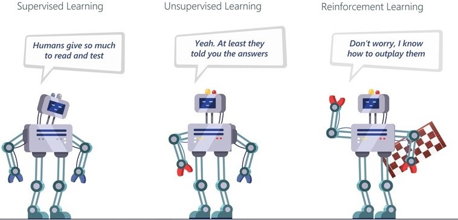
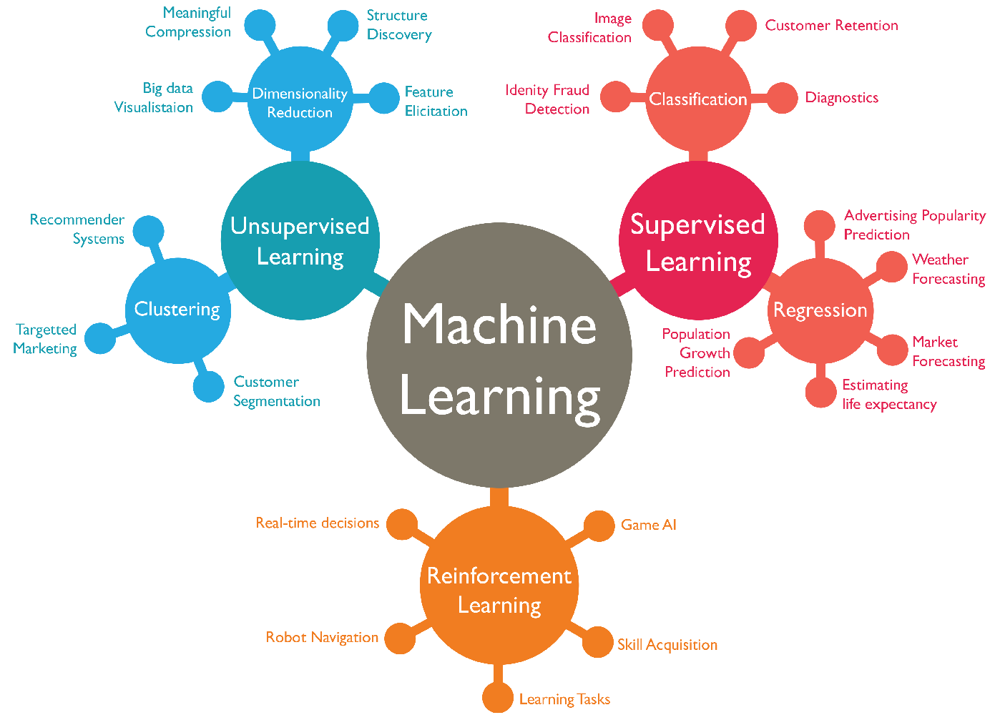
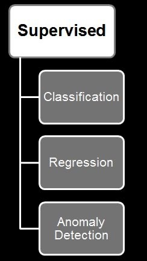
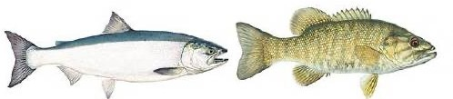
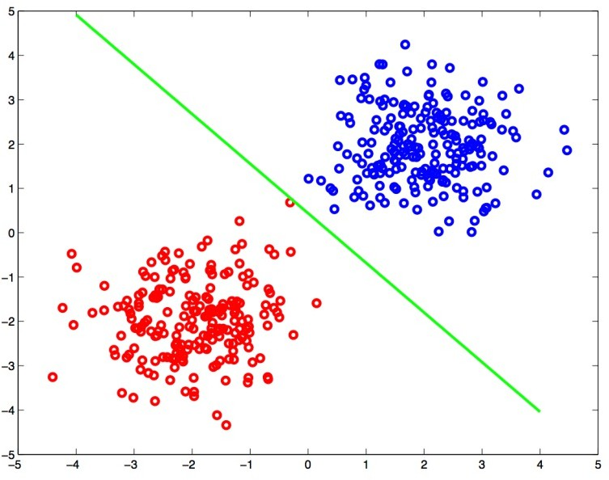
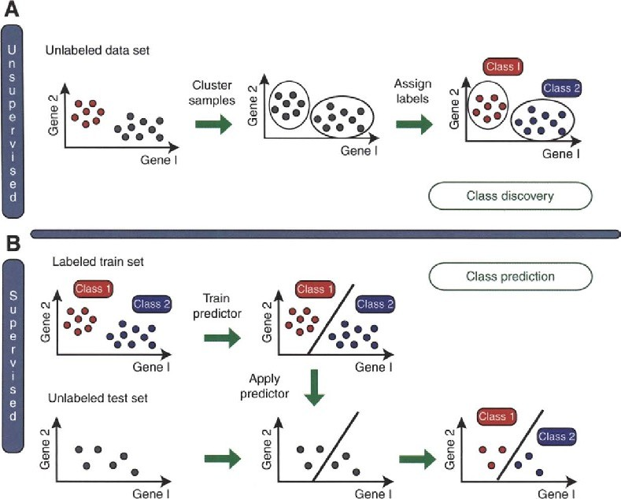
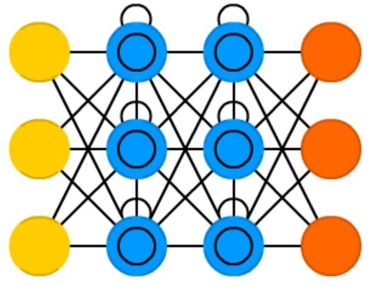
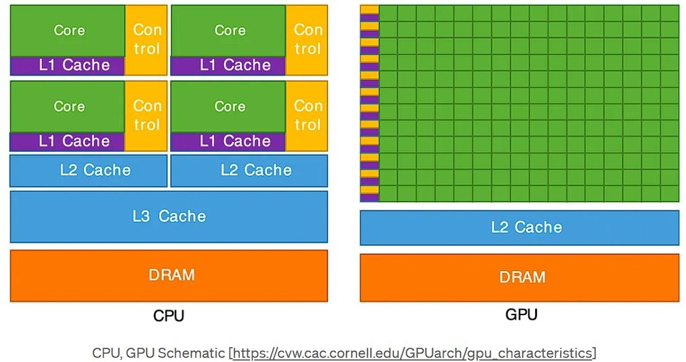

# 01a_Machine Learning Methods

**Module:** CT115-3-M Data Analytics in Cyber Security
**Total Slides:** 44

---

## Table of Contents

1. [Slide 1](#slide-1)
2. [TOPIC LEARNING OUTCOMES](#slide-2)
3. [CONTENTS & STRUCTURE](#slide-3)
4. [Slide 4](#slide-4)
5. [Slide 5](#slide-5)
6. [Slide 6](#slide-6)
7. [Artificial Intelligence (AI)](#slide-7)
8. [Machine Learning (ML)](#slide-8)
9. [Deep Learning (DL)](#slide-9)
10. [ML Algorithms](#slide-10)
11. [Difference between AI, ML and DL](#slide-11)
12. [Types of Machine Learning](#slide-12)
13. [Types of Machine Learning](#slide-13)
14. [Types of Machine Learning](#slide-14)
15. [Machine Learning](#slide-15)
16. [Supervised Learning](#slide-16)
17. [Supervised Learning](#slide-17)
18. [Supervised Learning – Types of Problems](#slide-18)
19. [Classification](#slide-19)
20. [Example: Recognizing Five Letters](#slide-20)
21. [Handwriting Recognition](#slide-21)
22. [Features: Comparing Fingerprints](#slide-22)
23. [Machine Learning](#slide-23)
24. [Unsupervised Learning – Types of Problems](#slide-24)
25. [Unsupervised: Clustering](#slide-25)
26. [Unsupervised vs. Supervised](#slide-26)
27. [Machine Learning](#slide-27)
28. [Reinforcement learning – Types of Problems](#slide-28)
29. [Reinforcement learning](#slide-29)
30. [Reinforcement learning](#slide-30)
31. [Supervised vs Unsupervised vs Reinforcement](#slide-31)
32. [Slide 32](#slide-32)
33. [Deep Learning](#slide-33)
34. [Artificial Neural Network](#slide-34)
35. [Deep Learning](#slide-35)
36. [Deep Learning](#slide-36)
37. [Machine Learning v. Deep Learning](#slide-37)
38. [Current Limits](#slide-38)
39. [Slide 39](#slide-39)
40. [Hardware is Important](#slide-40)
41. [Hardware is Important](#slide-41)
42. [CPU vs. GPU Architecture](#slide-42)
43. [Review Questions](#slide-43)
44. [Summary / Recap of Main Points](#slide-44)

---

## Slide 1: Slide 1

### Machine Learning Methods

Data Analytics in Cyber Security (CT115-3-M)(Version E)

### Machine Learning Methods

---

## Slide 2: TOPIC LEARNING OUTCOMES

### Machine Learning Methods

### At the end of this topic, you should be able to:

Understand the differences between Artificial Intelligence (AI), Machine Learning (ML) and Deep Learning (DL).

Understand types of Machine Learning.

Understand characteristics of Deep Learning.

---

## Slide 3: CONTENTS & STRUCTURE

### Machine Learning Methods

### Artificial Intelligence

### Types of Machine Learning

### Deep Learning

---

## Slide 4: Slide 4

Deep Learning (DL): A technique to perform machine learning inspired by the brain's network of neurons.

### Machine Learning (ML):

A technique by which a computer can use statistical patterns inferred from observation data to make predictions

### Artificial Intelligence (AI):

Mimicking the intelligence or behavioural pattern of humans or any other living entity.

---

## Slide 5: Slide 5

---

## Slide 6: Slide 6

---

## Slide 7: Artificial Intelligence (AI)

Artificial intelligence (AI) is a wide-ranging branch of computer science concerned with building smart machines capable of performing tasks that typically require human intelligence.

A science of making things smart or, in other words, human tasks performed by machines (e.g., visual recognition, understanding speech, etc.).

---

## Slide 8: Machine Learning (ML)

An approach (one of many) to AI that uses a system that is capable of learning from experience (typically represented by data).

It is intended not only for AI goals (e.g., copying human behavior) but it can also reduce the efforts and/or time spent for both simple and difficult tasks.

ML is a system that can recognize patterns by using examples rather than by programming them.

The system “learns” patterns in the data using mathematical and statistical analysis.

---

## Slide 9: Deep Learning (DL)

A set of techniques for implementing machine learning that recognise patterns of patterns.

For example, image recognition systems identify primary object edges, a structure, an object type, and then an object itself.

Deep Learning is using Deep Neural Networks (DNNs), which come in many forms. DNNs are an architecture, not an algorithm.

---

## Slide 10: ML Algorithms

The main mathematical tools used by all ML algorithms are a blend of:

### Linear algebra

### Analytic geometry

### Matrix decompositions

### Vector calculations

### Optimisation

### Probability/Statistics

---

## Slide 11: Difference between AI, ML and DL

### https://www.youtube.com/watch?v=vNc2z2u_nh0

---

## Slide 12: Types of Machine Learning

Machine learning is the ability of a machine to improve its performance based on previous results.

---

## Slide 13: Types of Machine Learning

Supervised learning: The computer is presented with example inputs and their desired outputs, i.e., labelled data, given by a "teacher", and the goal is to learn a general rule that maps inputs to outputs.

- e.g., learn to recognise cars by images of cars and non-cars.
Unsupervised learning: no labels are given to the learning algorithm (i.e., unlabelled data), leaving it on its own to find structure in its input. Unsupervised learning can be a goal in itself (discovering hidden patterns in data) or a means towards an end.

- e.g., group toys of a given colour or shape from a Lego set.
Reinforcement learning: a computer program interacts with a dynamic environment in which it must perform a certain goal (such as driving a vehicle), without a teacher explicitly telling it whether it has come close to its goal or not, i.e., continuous reweighting of decision model elements after series of decisions.

- e.g., learn to play tennis / table tennis.

---

## Slide 14: Types of Machine Learning

### https://www.youtube.com/watch?v=1FZ0A1QCMWc&t=1s

---

## Slide 15: Machine Learning

---

## Slide 16: Supervised Learning

### That’s nice – but where do the labels come from?

---

## Slide 17: Supervised Learning

### Learning “Healthy” Concept

### Supervisor

### y (Label)

### x

### BP: Blood pressure T: Temperature

### A: Age

### G: Gender S: Smoking

### The labels come from human intelligence

### X: Attributes (Features, Descriptors)

### Labeled example / Concept

### H: Healthy

### NH: Not healthy

| BP | T | A | G | S | y |
|---|---|---|---|---|---|
| : | : | : | : | : | H H NH H NH NH H |
| : | : | : | : | : |  |
| : | : | : | : | : |  |
| : | : | : | : | : |  |
| : | : | : | : | : |  |
| : | : | : | : | : |  |
| : | : | : | : | : |  |
| : | : | : | : | : |  |

---

## Slide 18: Supervised Learning – Types of Problems

Supervised Methods (also called Predictive): Predict an unknown value(s) of a variable(s) from the values of some attributes

Classification: predict the type/class of new cases

- Spam Filtering, Handwriting Character Recognition,
### Patient Diagnosis

Regression: predict a numerical value of new cases

- Blood Pressure, Sales Amounts
Supervised Anomaly Detection: identify items, events or observations deviating from expected patterns using data labeled as "normal" and "abnormal" (involves training a classifier)

It is common to combine different methods such as clustering and classification (Hybrid methods)

---

## Slide 19: Classification

Extracting features from given inputs allows us to separate and classify the inputs according to defined categories

---

## Slide 20: Example: Recognizing Five Letters

### A, B, C, D, E

### Example features:

### x: Number of curved segments

### y: Number of straight segments

### Where would “F” fall?

### Suggest an additional feature

### 0

### 1

### 2

### Curved strokes

### 3

### 1

### 0

### B

### C

### Straight strokes

### 4E

### 3A	D

### 2

---

## Slide 21: Handwriting Recognition

### Requires dealing with many variants of characters

---

## Slide 22: Features: Comparing Fingerprints

### http://www.youtube.com/watch?v=IrpTqKkgygA	[6min]

Criminal investigations and biometric identification

Does a fingerprint match any of the prints in a criminal database? Does the fingerprint match one recorded for an authorized user?

### Human fingerprints tend to be unique

### Even identical twins have different prints

---

## Slide 23: Machine Learning

---

## Slide 24: Unsupervised Learning – Types of Problems

Unsupervised Methods (also called Descriptive): Try to find meaningful patterns in the data.

- Clustering: group similar data into clusters
  - Market Segmentation, Document Clustering
- Association Rule Discovery: find human interpretable patterns (associations)
  - Product Recommendations, Store Shelf Management
- Sequential Pattern Discovery: describe the sequential dependencies among different events
  - Buying Patterns, Gene Sequencing
- Unsupervised anomaly detection: to detect anomalies in unlabeled data under the assumption that the majority of the instances are normal
  - Fraud Detection, Network Intrusion Detection

---

## Slide 25: Unsupervised: Clustering

Clustering is similar to classification with the only but major difference. The information about the classes of the data is unknown. There is no idea whether this data can be classified.

Usually clustering is not applied to solving a particular task in cybersecurity as it is more like one of the subtasks in a pipeline (e.g., grouping users into separate groups to adjust risk values).

---

## Slide 26: Unsupervised vs. Supervised

---

## Slide 27: Machine Learning

---

## Slide 28: Reinforcement learning – Types of Problems

Reinforcement learning is a machine-learning training method based on rewarding desired behaviors and/or punishing undesired ones. In general, a reinforcement learning agent is able to perceive and interpret its environment, take actions and learn through trial and error.

Action (for example) Robot movement Characters in games Autonomous car driving

---

## Slide 29: Reinforcement learning

### https://www.youtube.com/watch?v=nIgIv4IfJ6s&t=1s

---

## Slide 30: Reinforcement learning

https://www.theverge.com/tldr/2017/7/10/15946542/deep  mind-parkour-agent-reinforcement-learning

https://video.twimg.com/ext_tw_video/1111683489890332  672/pu/vid/1200x674/WqUJEhUETw0M0gCl.mp4?tag=8

---

## Slide 31: Supervised vs Unsupervised vs Reinforcement

---

## Slide 32: Slide 32

### Deep Learning: A technique to perform machine

learning inspired by the brain's network of neurons.

### Machine Learning:

A technique by which a computer can use statistical patterns inferred from observation data to make predictions

### Artificial Intelligence:

Mimicking the intelligence or behavioural pattern of humans or any other living entity.

---

## Slide 33: Deep Learning

Deep learning is a system architecture, not an algorithm

a style of parallel computation inspired by neurons and their adaptive connections: It’s a very different style from a sequential computation.

---

## Slide 34: Artificial Neural Network

ANN is a machine learning approach inspired by the way in which the brain performs a particular learning task

ANN has several “neurons” interconnected (architecture)

Knowledge about the learning task is stored as inter neuron connection strengths (weights)

During the learning process the	weights are modified in order to model the particular learning task correctly on the training examples.

---

## Slide 35: Deep Learning

Deep learning methods aim at learning feature hierarchies where features from higher levels of the hierarchy are formed from the lower-level features.

- The Model Defines the Features

---

## Slide 36: Deep Learning

---

## Slide 37: Machine Learning v. Deep Learning

---

## Slide 38: Current Limits

DNNs consist of multiple layers of interconnected neurons. Each neuron and layer contributes towards the task that the network has been trained to execute.

However, scalability and generalisation is not simple.

The behaviour of a NN changes with the amount of data, and it also depends on methods of training and network architecture.

–	you can’t just feed 10x more data to a NN and expect it to become 10x more precise.

Must experiment with network structures and training modes for the technology to be usable.

This has led to a LOT of variations of DNN architectures

---

## Slide 39: Slide 39

https://towardsdatascience.com/the-mostly-complete-chart-of-neural-networks-explained-3fb6f2367464

### RNN

### LSTM

### GRU

### GAN

### CNN

---

## Slide 40: Hardware is Important

Training a neural network is a compute-intensive process

DNNs require a large amount of training data to achieve high accuracy, meaning hundreds of thousands of input samples

State-of-the-art DNNs can have well over one billion parameters to adjust

Requires multiple forward passes for error detection, and multiple backward passes of adjusting the weights of millions of neurons in various layers of the network.

---

## Slide 41: Hardware is Important

Because neural networks are created from large numbers of identical neurons, they are highly parallel by nature.

This parallelism maps naturally to GPUs, which provide a significant speedup over CPU-only training.

Neural networks rely heavily on matrix math operations and require tremendous amounts of floating-point performance and bandwidth for both efficiency and speed.

GPUs have thousands of processing cores optimized for matrix math operations

---

## Slide 42: CPU vs. GPU Architecture

### versus

### Small number of powerful cores

### Very large number of simple stream

### processors

---

## Slide 43: Review Questions

### Machine Learning Methods

### What are the differences between AI, ML and DL?

### What are different types of Machine Learning?

What are the typical characteristics of Deep Learning?

---

## Slide 44: Summary / Recap of Main Points

### Machine Learning Methods

The differences between AI, ML and DL.

Types of Machine Learning.

Characteristics of Deep Learning.

---
