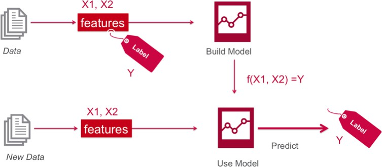
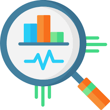
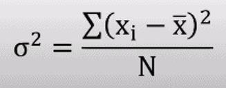
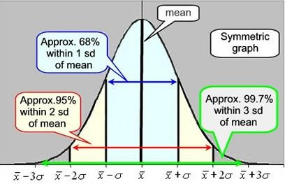
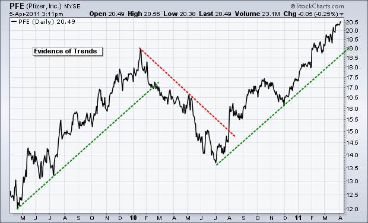
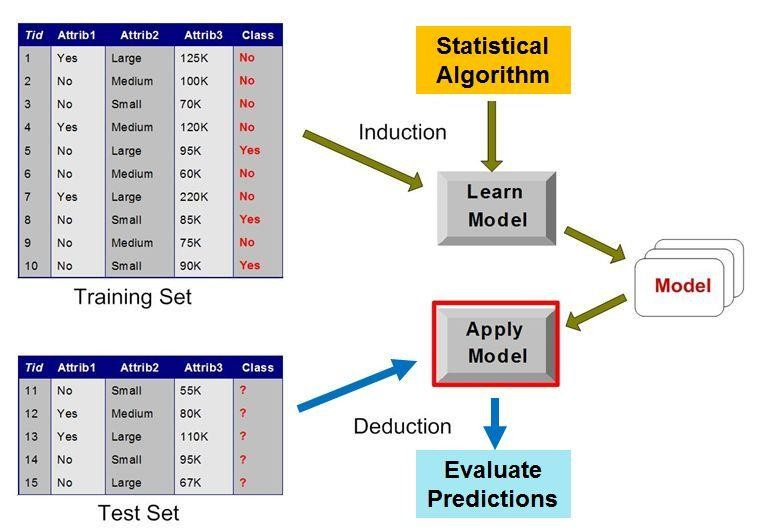

# 01b_Model Logic

**Module:** CT115-3-M Data Analytics in Cyber Security
**Total Slides:** 35

---

## Table of Contents

1. [Slide 1](#slide-1)
2. [TOPIC LEARNING OUTCOMES](#slide-2)
3. [Supervised Learning](#slide-3)
4. [Supervised Learning](#slide-4)
5. [Contents & Structure](#slide-5)
6. [Why Do We Need Statistics?](#slide-6)
7. [What is a Statistic?](#slide-7)
8. [Basics](#slide-8)
9. [Correlation](#slide-9)
10. [Basics](#slide-10)
11. [Relationship Between Mean, Median, Mode](#slide-11)
12. [Summarizing Variability](#slide-12)
13. [Variance and Standard Deviation](#slide-13)
14. [Variance and Standard Deviation](#slide-14)
15. [Histogram and Box-Plots](#slide-15)
16. [Population versus Sample](#slide-16)
17. [Summary](#slide-17)
18. [Statistical Modelling / Machine learning](#slide-18)
19. [ML/Statistical Modelling](#slide-19)
20. [Predictive Modeling](#slide-20)
21. [The Perils of Forecasting](#slide-21)
22. [Share Price Prediction](#slide-22)
23. [Google’s “Pagerank” Algorithm](#slide-23)
24. [Success Factors](#slide-24)
25. [Scientific Methods](#slide-25)
26. [Inference](#slide-26)
27. [Deductive Reasoning](#slide-27)
28. [Inductive Reasoning](#slide-28)
29. [Inductive Reasoning](#slide-29)
30. [Abductive reasoning](#slide-30)
31. [Abductive reasoning](#slide-31)
32. [Machine Learning](#slide-32)
33. [Machine Learning Pipeline](#slide-33)
34. [Further Reading](#slide-34)
35. [Review Questions](#slide-35)

---

## Slide 1: Slide 1

### Module Code & Module Title

### Slide Title

Data Analytics in Cyber Security (CT115-3-M)(Version E)

### Model Logic

---

## Slide 2: TOPIC LEARNING OUTCOMES

### Module Code & Module Title

### Slide Title

### At the end of this topic, you should be able to:

### To understand concepts in statistics

### To understand concepts in statistical modelling

### To understand concepts in predictive modelling

### To understand concepts in scientific methods

---

## Slide 3: Supervised Learning

### That’s nice – but where do the labels come from?

---

## Slide 4: Supervised Learning

### Learning “Healthy” Concept

### Supervisor

### y (Label)

### x

### BP: Blood pressure T: Temperature

### A: Age

### G: Gender S: Smoking

### X: Attributes (Features, Descriptors)

### Labeled example / Concept

### H: Healthy

### NH: Not healthy

### The labels come from human intelligence

| BP | T | A | G | S | y |
|---|---|---|---|---|---|
| : | : | : | : | : | H H NH H NH NH H |
| : | : | : | : | : |  |
| : | : | : | : | : |  |
| : | : | : | : | : |  |
| : | : | : | : | : |  |
| : | : | : | : | : |  |
| : | : | : | : | : |  |
| : | : | : | : | : |  |

---

## Slide 5: Contents & Structure

### Module Code & Module Title

### Slide Title

### Statistics

### Predictive Modeling

### Scientific Method

---

## Slide 6: Why Do We Need Statistics?

### “Impossible things usually don’t happen.”

### - Sam Treiman, Princeton University

### Statistics helps us quantify “usually.”

---

## Slide 7: What is a Statistic?

“A quantity that is computed from a sample [of data].”

### Merriam-Webster

→ a fact or piece of data obtained from a study of a large quantity of numerical data.

---

## Slide 8: Basics

### Independent Events:

- One event does not affect the other
- Knowing probability of one event does not change estimate of another
### Covariance:

- Degree that two variables vary with each
### other

- Two independent variables have Covariance of Zero
### Correlation:

- Normalized Covariance (between –1 and 1)
- Represents degree of linear relationship
- Positive: when one gets bigger, the other gets bigger
- Negative: when one gets bigger, the other gets smaller

---

## Slide 9: Correlation

---

## Slide 10: Basics

### Indices of central tendency

### Summarize Data by a Single Number

### Three most popular: mean, median, mode

Mean – sum all observations, divide by number of observations

### Median – midpoint value when sorted

### Mode – most frequent value observed

---

## Slide 11: Relationship Between Mean, Median, Mode

### mean

### median

### mode

### mean median

### modes

### mean

### median

### no mode

### mode

### median

### mean

### mode

### median

### mean

### “Gaussian” or “normal”

### “bimodal”

### “skewed”

### “skewed”

### Possible in theory

---

## Slide 12: Summarizing Variability

Summarizing by a single number is rarely enough  need statement about variability

– If two systems have same mean, tend to prefer one with less variability

### Frequency

### mean

### Response Time

### Frequency

### mean

### Response Time

---

## Slide 13: Variance and Standard Deviation

Variance = square of the distance between x and the mean	2 = (x - xത)2

- variance is often denoted 2
- Also called degrees of freedom
### Main problem is units squared

### – changing the units changes the answer squared

### So, use Standard Deviation	 = sqrt(2)

### – Same unit as mean, so can compare to mean

### Ratio of standard deviation to mean?

- Called the Coefficient of Variation (C.O.V.)
- C.O.V. =  / µ
- Takes units out and shows magnitude

---

## Slide 14: Variance and Standard Deviation

---

## Slide 15: Histogram and Box-Plots

Useful statistical plots that summarise the variability of the data

---

## Slide 16: Population versus Sample

Population refers to the entire group or set of individuals, objects, or events being studied, while a sample is a subset of the population that is used for analysis.

The word “sample” comes from the same root word as “example”; one sample does not prove a theory, but rather is an example.

Basically, a definite statement cannot be made about characteristics of all systems. Instead, make probabilistic statement about the range of most systems, i.e., Confidence intervals

---

## Slide 17: Summary

### Statistics are tools

- Help draw conclusions
- Summarize in a meaningful way in presence of noise
Indices of central tendency and Indices of central

### dispersion

- Summarize data with a few numbers

---

## Slide 18: Statistical Modelling / Machine learning

Statistical modelling is the formalization of relationships between variables in the form of mathematical equations.

Machine learning is an algorithm to optimize a performance criterion

using data of particular examples.

### Machine learning relies on Statistical modelling

---

## Slide 19: ML/Statistical Modelling

The fewer assumptions in a predictive model, the higher will be the predictive power.

Machine Learning as the name suggest needs minimal human effort.

- Machine learning works on iterations where computer tries to find out
patterns hidden in data.

- Because machine does this work on comprehensive data and is independent of all the assumptions, predictive power can be very strong for these models.
Statistical modelling are mathematics intensive and based on coefficient estimation.

- It requires the modeler to understand the relation between variables before putting them in.

---

## Slide 20: Predictive Modeling

There is a common principle that underlies all supervised machine learning algorithms for predictive modeling.

Machine learning algorithms are described as learning a target function (f) that best maps input variables (X) to an output variable (Y)

### Y = f(X)

This is a general learning task where we would like to make predictions in the future (Y) given new examples of input variables (X)

We don't know what the function (f) looks like or its form. If we did, we would use it directly and we would not need to learn it from data using machine learning algorithms.

---

## Slide 21: The Perils of Forecasting

### Nobel Laureate Physicist Niels Bohr said:

“Prediction is very difficult, especially if it’s about the future.”

### Henri Poincare was more positive:

“It is far better to foresee even without certainty than not to foresee at all.”

### Anonymous quotes about the perils of forecasting:

“Forecasting is the art of saying what will happen, and then explaining why it didn’t.”

“There are two kinds of forecasts: lucky and wrong.”

“A good forecaster is not smarter than everyone else; he merely has his ignorance better organized.”

---

## Slide 22: Share Price Prediction

Models try to predict behavior or range of behaviors

---

## Slide 23: Google’s “Pagerank” Algorithm

Algorithm to rank the hits so the “most useful” ones come first

Google takes your profile, interests, and previous searches

### into account

---

## Slide 24: Success Factors

### Data and domain understanding

- Generation of data and task
- Cleaning and representation/transformation
### Statistical insights

- Statistical properties
- Test validity of assumptions
- Performance measure
### Modeling and learning approach

- Choice or development of most suitable algorithm
- Experiments, Scientific Method (Test, Test, Test)
- Model Validation

---

## Slide 25: Scientific Methods

In science, there is a constant interplay between 	inductive inference (based on observations) and 	deductive inference (based on theory),

In science, the goal is to get closer and closer to the 	'truth,' which we can only approach but not ascertain 	with complete certainty.

In science, like everyday life, most people accept that the usefulness of a theory based on partial knowledge and probabilities is more important than its absolute validity.

---

## Slide 26: Inference

In the words of the American philosopher C.S.Peirce:

“Deduction proves that something must be; 	– If A and B then always C

Induction shows that something actually is operative;

### – If A and B then most probably C

### Abduction merely suggests that something may be.”

### – If A and B then C ?

Charles Sanders Peirce, “Pragmatism and Abduction,” (lecture, Harvard University,Cambridge, MA, May 14, 1903), In The Collected Papers of Charles Sanders Peirce, vol. 5, Pragmatism and Pragmaticism, 180-212, CP 5.186, C. Hartshorne and P. Weiss, eds. (Cambridge, MA: Harvard University Press, 1934)

---

## Slide 27: Deductive Reasoning

Deduction is the process of deriving the consequences of what is assumed. If the assumptions are true, a valid deduction guarantees the truth of the conclusion.

In other words, the deductive approach begins with a hypothesis, and we predict what the observations should be if the hypothesis is correct.

These predictions are tested with experiments, and the outcomes of the experiments support or refute our predictions (hypotheses)

– We use deductive constructs (association rules) of the form if A and B then C to help explain observations all the time

---

## Slide 28: Inductive Reasoning

Where the deductive approach goes from the general (theory) to the specific (observations), the inductive approach goes from the specific to the general.

We make many observations, discern a pattern, and infer a general explanation

This is commonly referred to as empirical logic – logic derived from observations about the world.

---

## Slide 29: Inductive Reasoning

With induction, we observe as much as we can about the world and then define general laws based on a number of observations or experiences of recurring patterns.

Each observation is a complete and separate instance from the one before, so the premises of inductive reasoning support the conclusion but do not ensure it.

### Slide <#> of 9

---

## Slide 30: Abductive reasoning

Abductive reasoning means forming a premise: what we believe to have happened based on our observations.

The selection criterion is that the hypothesis provides a satisfactory explanation of the observed facts we are interested in explaining

Abductive inference is not so much a process of inventing hypotheses but rather as one of adopting a hypothesis, which is not considered true or verified or confirmed, but seems to be a worthy candidate for further investigation

---

## Slide 31: Abductive reasoning

### Things to consider:

Data must be collected before a hypothesis can be formed

Abductive judgements can change, emphasizing or de-emphasizing certain leads.

In this sense, abduction and induction are closely tied: abduction is the end result of the induction process, and the beginning of the deduction process

---

## Slide 32: Machine Learning

### Statistical Profile

---

## Slide 33: Machine Learning Pipeline

### Abductive Reasoning:

### Problem Definition

### Goal: Decide what information is needed

Methods: Typically, committee meetings, brainstorming, and analysis of business objectives

Outcome: A project specification for the Data Scientists.

---

## Slide 34: Further Reading

### Why AI can’t solve unknown problems

https://bdtechtalks.com/2021/03/29/ai-algorithms-representations-herbert- roitblat/

### Unsupervised learning can detect unknown

### adversarial attacks

https://bdtechtalks.com/2021/08/30/unsupervised-learning-adversarial-attacks- detection/

### What Google’s AI-designed chip tells us about the

### nature of intelligence

https://bdtechtalks.com/2021/06/14/google-reinforcement-learning-ai-chip- design/amp/

---

## Slide 35: Review Questions

### Module Code & Module Title

### Slide Title

### What are the concepts in statistics

### What is statistical modelling

### What is predictive modelling

### What are scientific methods

---
