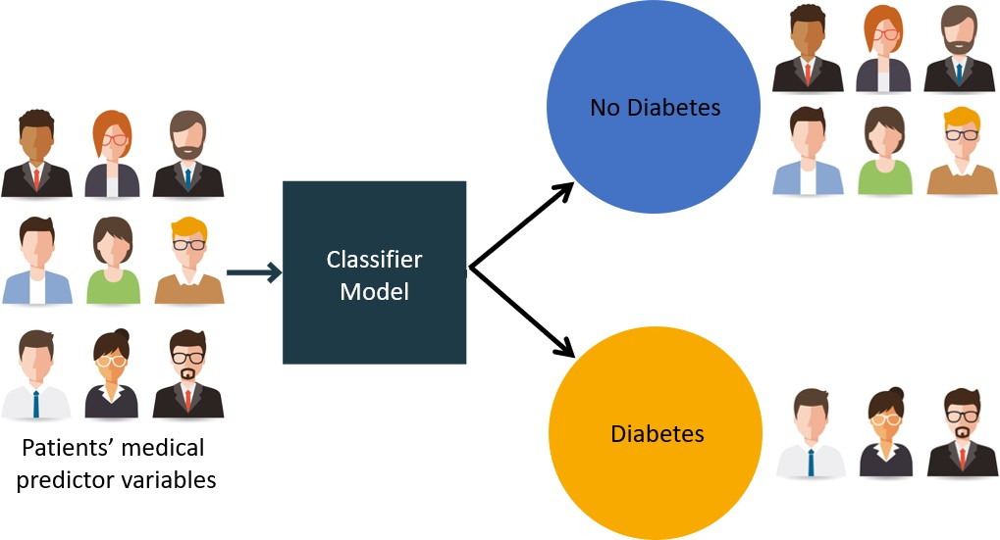
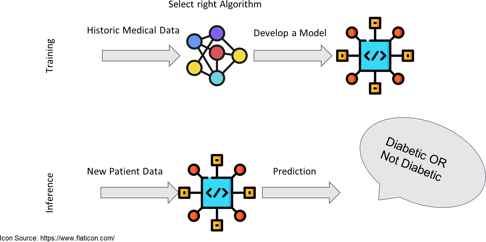

# 02_Machine Learning Pipeline

**Module:** CT115-3-M Data Analytics in Cyber Security
**Total Slides:** 28

---

## Table of Contents

1. [Slide 1](#slide-1)
2. [TOPIC LEARNING OUTCOMES](#slide-2)
3. [Develop A Diabetes Prediction System (DPS)](#slide-3)
4. [Sample Medical Data](#slide-4)
5. [Workflow For Developing DPS](#slide-5)
6. [Contents & Structure](#slide-6)
7. [ML Terminology](#slide-7)
8. [ML Terminology](#slide-8)
9. [ML Terminology](#slide-9)
10. [Input Row](#slide-10)
11. [ML Terminology](#slide-11)
12. [ML Terminology](#slide-12)
13. [ML Terminology](#slide-13)
14. [Supervised Learning](#slide-14)
15. [Pipeline of Machine Learning Task](#slide-15)
16. [Machine Learning Pipeline](#slide-16)
17. [Machine Learning Pipeline](#slide-17)
18. [Machine Learning Pipeline](#slide-18)
19. [Machine Learning Pipeline](#slide-19)
20. [Machine Learning Pipeline](#slide-20)
21. [Machine Learning Pipeline](#slide-21)
22. [Machine Learning Pipeline](#slide-22)
23. [Machine Learning Pipeline](#slide-23)
24. [Machine Learning Pipeline](#slide-24)
25. [Machine Learning Pipeline](#slide-25)
26. [Further Reading](#slide-26)
27. [Review Questions](#slide-27)
28. [Summary / Recap of Main Points](#slide-28)

---

## Slide 1: Slide 1

### Module Code & Module Title

### Slide Title

Data Analytics in Cyber Security (CT115-3-M) (Version E)

### Machine Learning Pipeline

---

## Slide 2: TOPIC LEARNING OUTCOMES

### Module Code & Module Title

### Slide Title

### At the end of this topic, you should be able to:

### Understand various Machine Learning terminologies

Understand the Machine Learning pipeline.

---

## Slide 3: Develop A Diabetes Prediction System (DPS)

Image Source: https://jnyh.medium.com/building-a-machine-learning-classifier-model-for-diabetes-4fca624daed0

---

## Slide 4: Sample Medical Data

---

## Slide 5: Workflow For Developing DPS

---

## Slide 6: Contents & Structure

### Module Code & Module Title

### Slide Title

### ML Terminology

### ML Pipeline

---

## Slide 7: ML Terminology

Dataset: A sample of real-world observations, organised

### into a table - rows and columns

Feature: a column in the dataset table. Also called a predictor, variable, input, attribute, covariate

Training example: A row in the table representing a set of feature values. Also called an observation, record, training instance

Target: What we want to predict. Also called ground truth, (class) label, desired or expected output, response variable, dependent variable

---

## Slide 8: ML Terminology

Model: A function in the form y = f(x) that we believe (or hope) is similar to the true function that represents the relationship between the target (y) and the observations in the dataset (x). Also called the target function or objective function

Prediction or Output: Outcome from applying the model to the dataset - used to distinguish from targets, which are desired or expected outputs

Classifier: An implementation that combines a Learning algorithm, a Loss function, and an Optimiser to create a model and generate predictions

---

## Slide 9: ML Terminology

Learning algorithm: A set of (mathematical) instructions that create a model using the training dataset. Most classifiers are named for the learning algorithm they implement to find or approximate the target function

Loss function: Measures how far the predicted output 	for a single training example is from its true value. Also 	called the error function.

Optimiser: An algorithm used to minimize the average or summed output of the Loss function for the entire dataset (the Cost function)

---

## Slide 10: Input Row

### Hyper-

### Parameters

### Loss Function

### Optimiser

### Behavior

### Tuning

### Classifier

### ( algorithms )

Essentially, the loss function and optimizer work together to fit the algorithm to the data in the best way possible.

|  |  |  |  |  |  |
|---|---|---|---|---|---|
|  |  |  |  |  |  |
|  | Da | ta | set |  |  |
|  |  |  |  |  |  |

---

## Slide 11: ML Terminology

Model Parameters: The parameters that the learning 	algorithm “learns” from the training data - for example, 	the slope (weight coefficients) and y-axis intercept of a 	linear regression line

Fitting a Model: The process of learning the Model

### Parameters

Hyperparameters: The tuning parameters of a classifier that affect its behavior, such as error tolerance, number of iterations, or options between variants of how the algorithm behaves. The programmer will specify defaults, and the user can pass new values with the function call.

---

## Slide 12: ML Terminology

Model Evaluation: Model performance is usually evaluated by counting the fraction of correctly classified instances out of all instances that the model attempted to classify.

– For example, if we have a test dataset of 10,000 instances and a model classified 7,000 instances correctly, then we say that the model has a 70% accuracy on that dataset.

Note that optimization and evaluation measures are usually not the same in practice.

---

## Slide 13: ML Terminology

Training/fitting a model typically involves an algorithm 	that optimizes an objective function (e.g., maximizing 	the log-likelihood or minimizing mean squared error)

In practice, we are often interested in the accuracy of a model on new, unseen data that has the same distribution as the training data (the generalization performance)

There are a number of different algorithms for model parameter optimization, as well as a number of different techniques for	estimating the generalization performance of a model

---

## Slide 14: Supervised Learning

Machine learning (ML) pipeline consists of several steps to train a model.

ML pipeline is iterative: steps are repeated to continuously improve the accuracy of the model

### Algorithm

### Observations

### Classifications

### Model

---

## Slide 15: Pipeline of Machine Learning Task

Machine learning (ML) pipelines consist of several steps to train a model.

ML pipelines are iterative as every step is repeated to continuously improve the accuracy of the model and achieve a successful algorithm.

### A typical machine learning pipeline:

- Data collection
- Data cleaning
- Feature extraction (labelling and dimensionality reduction)
- Model validation
- Visualisation

---

## Slide 16: Machine Learning Pipeline

### Problem Definition

### Data collection

### Feature extraction

- Flattening, Labeling
### Data preparation

- Normalisation by data type
- Dimensionality reduction
### Algorithm Selection

- Train and Test
### Performance Evaluation

- Visualisation
### – Parameter tuning

### Model Validation

### Selection of

### metrics

### What do I have What do I need What can I get

### Exploratory Data

### Analysis (EDA)

### May have special data preparation requirements

### Repeat Train and Test

### “Objective” in “objective function”

---

## Slide 17: Machine Learning Pipeline

### Problem Definition

### Goal: Decide what information is needed

Methods: Typically used are committee meetings, brainstorming, and analysis of business objectives

Outcome: A project specification for the Data Scientists.

---

## Slide 18: Machine Learning Pipeline

### Data Collection

### Goal: Representative sample of the population

Methods: Extract existing data from databases, gather new data

### Outcome: A large dataset

---

## Slide 19: Machine Learning Pipeline

### Feature Extraction

### Goal: Specifying features 	useful for prediction

Methods: Check distributions, 	correlation/covariance checks, 	drop unique identifiers

Outcome: A “flat” (single table) dataset with selected features.

---

## Slide 20: Machine Learning Pipeline

### Data Preparation

Goal: Clean up (normalize, regularize) the data values

Methods: Scaling, dummy variables, interpolating missing values

Outcome: Normalized data 	in numeric form appropriate 	for modeling

---

## Slide 21: Machine Learning Pipeline

### Algorithm Selection

### Goal: No a-priori best algorithm; must experiment

Methods: Draw on problem statement, domain knowledge, knowledge of ML and statistical methods, and library help files to choose candidate algorithms

Outcome: A set of algorithms 	that should be appropriate for 	the analytical task

---

## Slide 22: Machine Learning Pipeline

### Performance Evaluation

Goal: Test candidate algorithms and evaluate predictive accuracy

Methods: Fit each algorithm on the same set of historic training data, analyse confusion matrix and various other metrics

Outcome: Comparison of results from selected algorithms

---

## Slide 23: Machine Learning Pipeline

### Model Validation

Goal: Evaluate robustness of the predictive model, check for over-fitting, refine hyperparameters

### Methods: Grid search CV, k-fold CV

Outcome: Optimization of the objective function, good generalisation performance

---

## Slide 24: Machine Learning Pipeline

### Iteration:

### Algorithm Selection

Certain algorithms may be selected because they return a measure of feature importance which can be fed back to the feature extraction phase

---

## Slide 25: Machine Learning Pipeline

### Iteration:

### Model Validation

The model validation phase should lead to a new round of performance evaluation, and the set of candidate algorithms will gradually be reduced until one algorithm (or one ensemble of algorithms) is selected.

---

## Slide 26: Further Reading

### What is a Machine Learning Pipeline?

### https://youtu.be/HWWxtVL-D9k

The 7 Steps of Machine Learning https://youtu.be/nKW8Ndu7Mjw

---

## Slide 27: Review Questions

### Module Code & Module Title

### Slide Title

What are the different terminology in Machine Learning?

What are the key steps (pipeline) in Machine Learning?

---

## Slide 28: Summary / Recap of Main Points

### Module Code & Module Title

### Slide Title

Various terminologies in Machine Learning.

Various steps in the Machine Learning pipeline.

---
