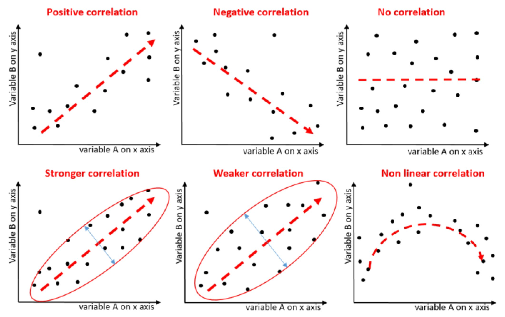
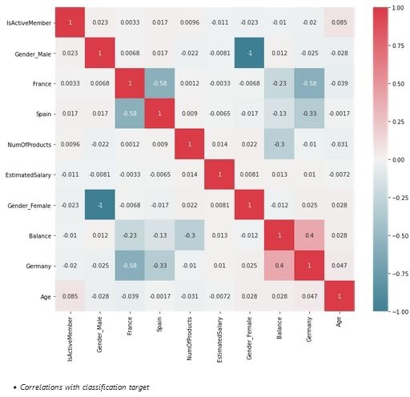
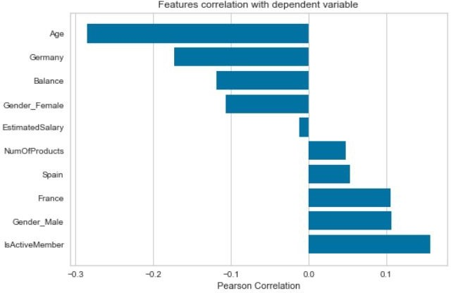
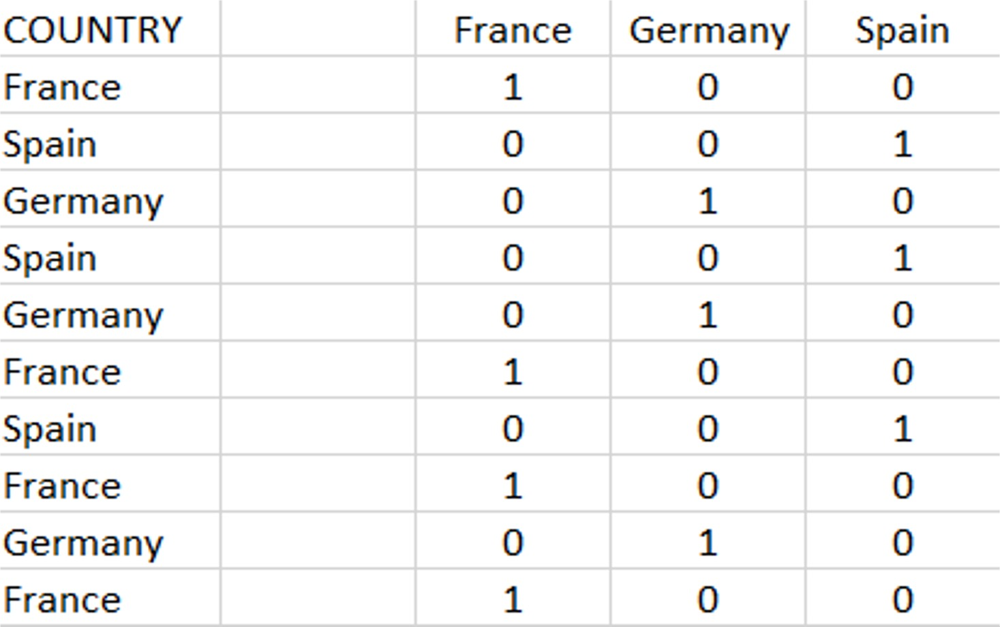

# 03_Data Preprocessing

**Module:** CT115-3-M Data Analytics in Cyber Security
**Total Slides:** 37

---

## Table of Contents

1. [Slide 1](#slide-1)
2. [TOPIC LEARNING OUTCOMES](#slide-2)
3. [Machine Learning Pipeline](#slide-3)
4. [Contents & Structure](#slide-4)
5. [Data Preprocessing](#slide-5)
6. [Machine Learning Pipeline](#slide-6)
7. [Exploratory Data Analysis (EDA)](#slide-7)
8. [Feature Selection](#slide-8)
9. [Feature Value Variance](#slide-9)
10. [Feature Covariance](#slide-10)
11. [Pearson Correlation](#slide-11)
12. [Correlation](#slide-12)
13. [Correlation Matrix “heatmap”](#slide-13)
14. [Mutual Information (MI) Correlation](#slide-14)
15. [Mutual Information (MI) Correlation](#slide-15)
16. [Correlation with Target label](#slide-16)
17. [Correlation with Target label](#slide-17)
18. [Further Reading](#slide-18)
19. [Machine Learning Pipeline](#slide-19)
20. [ML Process: Data Preparation](#slide-20)
21. [Algorithms and Data](#slide-21)
22. [Missing values](#slide-22)
23. [Missing values](#slide-23)
24. [Categorical Data](#slide-24)
25. [Encoding Categorical Data](#slide-25)
26. [One-Hot](#slide-26)
27. [One-Hot Encoding](#slide-27)
28. [Encoding Categorical Data](#slide-28)
29. [Encoding Categorical Data](#slide-29)
30. [Scaling Continuous Data](#slide-30)
31. [Scaling Continuous Data](#slide-31)
32. [100%](#slide-32)
33. [Scaling Continuous Data](#slide-33)
34. [ML Process: Data Preparation](#slide-34)
35. [Classifying by Features](#slide-35)
36. [Review Questions](#slide-36)
37. [Summary / Recap of Main Points](#slide-37)

---

## Slide 1: Slide 1

### Module Code & Module Title

### Slide Title

Data Analytics in Cyber Security (CT115-3-M) (Version E)

### Data Preprocessing

---

## Slide 2: TOPIC LEARNING OUTCOMES

### Module Code & Module Title

### Slide Title

### At the end of this topic, you should be able to:

### Understand feature selection techniques

Understand the importance of Exploratory Data Analysis (EDA)

### 2. Understand data preparation techniques

---

## Slide 3: Machine Learning Pipeline

### Problem Definition

### Data collection

### Feature extraction

- Flattening, Labeling
### Data preparation

- Normalisation by data type
- Dimensionality reduction
### Algorithm Selection

- Train and Test
### Performance Evaluation

- Visualisation
### –	Parameter tuning

### Model Validation

### Selection of metrics

### What do I have What do I need What can I get

### Exploratory Data Analysis (EDA)

### May have special data preparation requirements

### Repeat Train and Test

### “Objective” in “objective function”

---

## Slide 4: Contents & Structure

### Module Code & Module Title

### Slide Title

### Feature Selection

### Exploratory Data Analysis (EDA)

### Data Preparation

---

## Slide 5: Data Preprocessing

Data preprocessing is the first step in any machine learning project – Feature Extraction and Data Preparation.

Data preprocessing can refer to manipulation or dropping of data before it is used to ensure or enhance performance and is an important step in machine learning process.

The phrase "garbage in, garbage out" is particularly applicable to machine learning projects. If we use unclean data for machine learning, the result will not be satisfying enough for our end application

---

## Slide 6: Machine Learning Pipeline

### Feature Extraction

### Goal: Specifying features useful for prediction

Methods: Check distributions, correlation/covariance checks, drop unique identifiers

Outcome: A “flat” (single table) dataset with selected features.

---

## Slide 7: Exploratory Data Analysis (EDA)

### Checking

### Feature Distributions

### Class balance

Correlation between input variables and target variable

Correlation between input variables (collinearity)

EDA is an important step to first understand the data (identify the trends and patterns within the data, detect outliers or anomalous events, find interesting relations among the variables, points of interest, etc.) before using them for modeling, machine learning, etc.

Since the dataset will always be large, visualization is essential

---

## Slide 8: Feature Selection

The dataset may have many features that may not all be relevant and significant.

- For certain types of data, like genetics or text, the number of features can be very large compared to the number of data points.
- Curse of dimensionality: error increases with the increase in the number of features.
Feature selection is a process of selecting the most relevant variables. The goal is to determine which columns are more predictive of the output.

- Also called “dimensionality reduction” and “feature engineering”.

---

## Slide 9: Feature Value Variance

Columns with low variance provide less information for distinguishing one type of thing from another

- Remove unique identifiers
Columns with high variance have so many unique values that there may be less information for distinguishing one type of thing from another

- ‘bin’ values to reduce the number of unique values

---

## Slide 10: Feature Covariance

In the worst case, one feature can explain (or already determine) all the other features and makes them obsolete.

This results in a high redundancy among the features, increasing computational overhead

The covariance matrix can be used to find redundant features (those that measure the same thing), and make decisions about which can be removed

---

## Slide 11: Pearson Correlation

The Pearson r is a standardized covariance, and ranges from -1, 	indicating a perfect negative linear relationship, and +1,indicating 	a perfect positive relationship.

The covariance of two variables divided by the product of their standard deviations gives Pearson's correlation coefficient.

ρ (X,Y) = cov (X,Y) / σX.σY.

A value of zero suggests no linear association, but does not mean  two variables are independent, an extremely important point to remember.

Pearson r is not viable for understanding a great many dependencies

### The alternative is Mutual Information Correlation

---

## Slide 12: Correlation

---

## Slide 13: Correlation Matrix “heatmap”

### High Correlations:

### Check for greater than

### 0.7 and less

### than -0.7

---

## Slide 14: Mutual Information (MI) Correlation

Mutual Information is based on a measure of Entropy

Entropy is defined as a measure of randomness or disorder of a system

For example, if all devices connected to the network are iPhones, then device type random variable has no uncertainty (zero entropy).

However, when Android, Chromebook and iPhone devices are all connected to the network, device type entropy is non-zero, which captures the uncertainty in predicting what device types are connected to the network.

### Good Explanation with graphic

https://thenewstack.io/mutual-information-pearson-correlation-building-blocks-ai/

---

## Slide 15: Mutual Information (MI) Correlation

Mutual Information Correlation is based on a measure of Entropy

- The Pearson correlation coefficient assumes normality and linearity of two 	random variables; Mutual Information removes these assumptions.
In essence, mutual information tells us how useful the feature X is 	at predicting the random variable Y on a scale of zero to one, with 	higher numbers indicating better predictors.

- Mutual Information Correlation captures many different types of 	relationships (not just linear) and is considered the best metric.
However, it doesn’t tell us if the feature is a predictor of success or failure.

Mutual Information and Pearson measures are complementary – they do not always move the same way.

---

## Slide 16: Correlation with Target label

---

## Slide 17: Correlation with Target label

---

## Slide 18: Further Reading

Exploratory Data Analysis https://youtu.be/QiqZliDXCCg

Exploratory Data Analysis with Pandas Python 2023 https://youtu.be/xi0vhXFPegw

---

## Slide 19: Machine Learning Pipeline

### Data preparation

Goal: Clean up (normalize, regularize) the data values

Methods: Scaling, dummy variables, interpolating missing values

Outcome: Normalized data in numeric form appropriate for modeling

---

## Slide 20: ML Process: Data Preparation

### Needed for several reasons

- Some Models have strict data requirements
  - Scale of the data, data point intervals, etc.
- Some characteristics of the data may have a dramatic impact on the model performance
Time required for data preparation should not be underestimated

### Dealing with missing values

### Transforming text variables

### Scaling numeric variables

---

## Slide 21: Algorithms and Data

### 3 Types of Features

Text must be converted to a numeric representation

- An arbitrary sequence (categorical)
- A set of discrete “dummy variables”
Scaling continuous values is required by some algorithms

- usually considered a good idea
https://scikit-learn.org/stable/modules/preprocessing.html

| Discrete | binary | CPU friendly! |
|---|---|---|
| Continuous | numeric | range |
| Categorical | text | convert to numeric |

---

## Slide 22: Missing values

---

## Slide 23: Missing values

There may be many reasons for missing values, but only three ways to handle them: deletion, direct estimation, and imputation

Deleting all instances (rows) with missing values would delete a lot of potentially useful information; as basic guideline, any feature (column) with more than 30% missing values should be discarded

Direct estimation requires enough prior knowledge of the dataset to give an accurate estimate for the missing values.

The most frequently used imputation techniques are filling in 	the mean or median value for the numeric features and filling 	in the most frequent value for nominal features.

---

## Slide 24: Categorical Data

---

## Slide 25: Encoding Categorical Data

Label Encoding converts a categorical feature into a continuous

feature by assigning a unique integer based on alphabetical order.

- there is a very high probability that the model captures the relationship between countries such as China < India < Russia
One-Hot Encoding creates additional features based on the number of unique values in the categorical feature. Every unique value in the category will be added as a discrete feature.

- One-Hot Encoding is the process of creating dummy variables.
- This used to be two separate required steps
  - labelEncoder ::> onehotEncoder
- Not anymore, now we just
  - pandas.getdummies()

---

## Slide 26: One-Hot

### LabelEncoder

LabelEncoder is most often used (and useful!) for converting target labels from text to numeric values

### Required by some SciKit functions

Order does not matter – target labels are only used for matching

### One-Hot encoding is recommended

The big advantage is that the individual fields show up in the correlation matrix

### The number of columns can be a drawback though

| dns | imap | smtp | http |
|---|---|---|---|
| 1 | 0 | 0 | 0 |
| 0 | 1 | 0 | 0 |
| 0 | 0 | 1 | 0 |
| 0 | 0 | 0 | 1 |

| Protocol | Protocol_val |
|---|---|
| dns | 0 |
| http | 1 |
| imap | 2 |
| smtp | 3 |

---

## Slide 27: One-Hot Encoding

---

## Slide 28: Encoding Categorical Data

“dummy variables”: In each row, all of the data values are zero except for a single column, following the programming convention “non-zero is True”.

Adding a column for each unique data value means the size of the dataframe grows quickly, requiring more memory and CPU for the analysis.

### – This is known as “the curse of dimensionality”

Another consideration with a colourful name is “the dummy variable trap”, formally known as “multicollinearity”,

---

## Slide 29: Encoding Categorical Data

Multicollinearity means the value of one variable can easily be predicted from the values of other variables, which is a serious issue for some linear forecasting models

With linear regression, or generalized linear models estimated by maximum likelihood (ordinary least squares) and no regularization (e.g., ridge, lasso) you need to leave out one column.

- Often, people will set aside the category which is most populated or one 	which acts as a natural reference point for the other categories.
- Excellent explanation:
https://towardsdatascience.com/drop-first-can-hurt-your-ols-regression- models-interpretability-4ca529cfb707

### In every other case, keep all of the new columns

---

## Slide 30: Scaling Continuous Data

### Reduce values to a predefined range

Limit absolute magnitude, Preserve relative magnitude

### Require data to be scaled:

algorithms like linear regression, logistic regression, neural network, etc. that use gradient descent as an optimization technique

algorithms like KNN, K-means, and SVM that exploit distances between data points to determine their similarity

These work better when the values of every feature have a similar range and are close to normally distributed.

Graphical-model based classifiers (e.g.,Fisher LDA, Naive Bayes), Decision trees and Tree-based ensemble methods (RF, XGB) are invariant to feature scaling

When scaling is not strictly required, it usually does not cause complications.

---

## Slide 31: Scaling Continuous Data

Scalers are linear (or more precisely affine) transformers and differ from each other in the way they estimate the parameters used to shift and scale each feature.

StandardScaler standardizes a feature by subtracting the mean and then dividing all the values by the standard deviation. The result is a distribution with mean=0 and standard deviation=1

MinMaxScaler finds the original minimum and maximum values, then subtracts the minimum and divides by the range for each value. The original distribution is preserved with all values between 0 and 1

There are several others available, suitable for special purposes https://scikit-learn.org/stable/modules/preprocessing.html

---

## Slide 32: 100%

### Data Splitting for ML

### DATA

### TRAINING SET

### TEST SET

### 70% / 80%

### 30% / 20%

---

## Slide 33: Scaling Continuous Data

One important special consideration for supervised learning

If scaling is applied before the dataset is split into train and test sets, information about the distribution of feature values in the test set “leaks” into the train set, which may make the predictions artificially accurate.

So, the rule is: fit only on the train set, then transform the values in both the test and train sets

---

## Slide 34: ML Process: Data Preparation

scaling and redundant data are an algorithm problem, because each algorithm has a different sensitivity to these characteristics of the distribution.

That means scaler.fit() and feature selection are only applied to the training set, and

IF we do scaler.transform() on train we also must scaler.transform() on test for compatibility.

---

## Slide 35: Classifying by Features

### Possible features in the shapes:

Color: Blue, Green, Orange, Yellow Size: Large, Small (area)

Geometric shape: Square, Rectangle, Triangle, Circle, … Curvature: Straight sides only, at least one curved side

Number of edges: 1, 2, 3, 4 “Triangleness”: Yes, No Thickness?

### Material?

### Weight?

### Floats on water?

---

## Slide 36: Review Questions

### Module Code & Module Title

### Slide Title

What are some of the feature selection techniques used in machine learning?

What is exploratory data analysis and tasks involved?

What are some of data preparation techniques used in machine learning?

---

## Slide 37: Summary / Recap of Main Points

### Module Code & Module Title

### Slide Title

### Feature selection techniques

### Importance of exploratory data analysis

### Data preparation techniques

---
