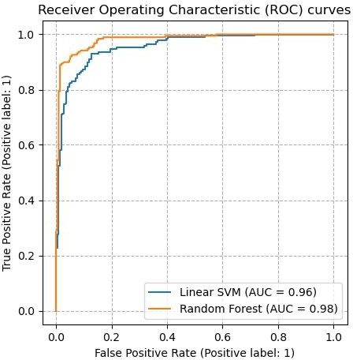
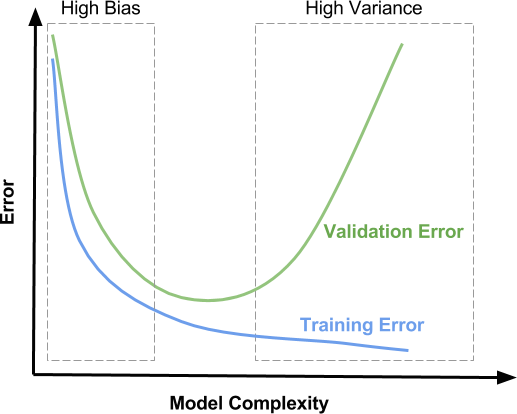
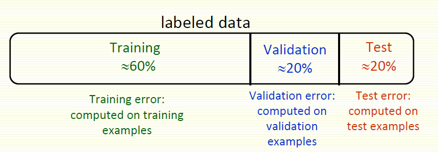

# 04_Machine Learning Performance Evaluation

**Module:** CT115-3-M Data Analytics in Cyber Security
**Total Slides:** 37

---

## Table of Contents

1. [Data Analytics in Cyber Security CT115-3-M (Version E)](#slide-1)
2. [TOPIC LEARNING OUTCOMES](#slide-2)
3. [Machine Learning – Review of concept](#slide-3)
4. [Supervised Learning](#slide-4)
5. [Contents & Structure](#slide-5)
6. [Model Evaluation](#slide-6)
7. [Confusion matrix](#slide-7)
8. [Confusion Matrix](#slide-8)
9. [Confusion Matrix](#slide-9)
10. [Confusion Matrix for a Multiclass Classifier](#slide-10)
11. [Analysis with Performance Measurement Metrics](#slide-11)
12. [Analysis with Performance Measurement Metrics](#slide-12)
13. [Accuracy Estimation](#slide-13)
14. [Precision](#slide-14)
15. [Precision and Recall](#slide-15)
16. [F1 Score (or F Score or F Measure)](#slide-16)
17. [Accuracy Score](#slide-17)
18. [Class Imbalance](#slide-18)
19. [Matthews Correlation Coefficient](#slide-19)
20. [ROC Curve](#slide-20)
21. [ROC Plot](#slide-21)
22. [ROC Plot](#slide-22)
23. [Sadly, ROC plots that look like this come from very small an...](#slide-23)
24. [ML Concepts: Underfit / Overfit](#slide-24)
25. [Slide 25](#slide-25)
26. [Video](#slide-26)
27. [Bias / Variance Tradeoff](#slide-27)
28. [Bias Variance Decomposition](#slide-28)
29. [Train, Test, Validate](#slide-29)
30. [Concept of Cross-Validation](#slide-30)
31. [k-fold CV](#slide-31)
32. [k-Fold Cross Validation](#slide-32)
33. [K-fold Cross Validation Example](#slide-33)
34. [random_state](#slide-34)
35. [random_state](#slide-35)
36. [Review Questions](#slide-36)
37. [Summary / Recap of Main Points](#slide-37)

---

## Slide 1: Data Analytics in Cyber Security CT115-3-M (Version E)

### Module Code & Module Title

### Slide Title

### Machine Learning Models:

### Metrics for Performance and Accuracy

---

## Slide 2: TOPIC LEARNING OUTCOMES

### Module Code & Module Title

### Slide Title

### At the end of this topic, you should be able to:

### Understand and use Confusion Matrix

### Understand and use ROC Curve

Understand the concepts of Bias and Variance in Machine Learning

### 5. Understand the concept of Cross-Validation

---

## Slide 3: Machine Learning – Review of concept

A classifier is used to predict an outcome of a test data 	– Such a prediction is useful in many applications

- Business forecasting, cause-and-effect analysis, etc.
A number of classifiers have evolved to support these activities.

- Each has their own merits and demerits
### Metrics for measuring accuracy

### Metrics for measuring performance

---

## Slide 4: Supervised Learning

### Collect and label observations

Split (70/30 or 80/20) into Train and Test datasets

### Pass the Train dataset to the Classifier

Use the model to predict the class of each item in the Test dataset

### Use metrics to assess the results

---

## Slide 5: Contents & Structure

### Module Code & Module Title

### Slide Title

### Metrics for Model Evaluation

### Bias and Variance

### Cross-Validation

---

## Slide 6: Model Evaluation

In the case of applied machine learning, we are interested in estimating the skill of a procedure on unseen data.

When we evaluate a model, we are in fact evaluating all steps in the procedure, including how the training data was prepared (e.g., scaling), the choice of algorithm (e.g., kNN), and how the chosen algorithm was configured (e.g., k=3).

The performance measure calculated on the predictions is an estimate of the skill of the whole procedure.

We generalize the performance measure from the skill of the procedure on the train set to the skill of the procedure on unseen data

---

## Slide 7: Confusion matrix

The confusion matrix is a useful table that presents both the class distribution in the data and the classifiers predicted class distribution with a breakdown of error types.

This means “prior probabilities” for the classes can be accounted for in error analysis.

https://www.v7labs.com/blog/confusion-matrix-guide

---

## Slide 8: Confusion Matrix

A confusion matrix for two “generic” classes (+, -) is shown above.

### There are four quadrants in the confusion matrix:

- True Positive (TP): The number of instances that were positive (+) and correctly  classified as positive (+)
- False Positive (FP): The number of instances that were negative (-) and incorrectly classified as (+). This also known as Type 1 Error
- False Negative (FN): The number of instances that were positive (+) and incorrectly classified as negative (-). This is also known as Type 2 Error
- True Negative (TN): The number of instances that were negative (-) and correctly classified as (-)

---

## Slide 9: Confusion Matrix

(TP + TN) is the number of correct classifications

(FP + FN) is the number of incorrect classification (i.e., errors)

To have good accuracy for a classifier, the left to right diagonal entries should have large values with the rest close to zero

For a perfect classifier FP = FN = 0, that is, there would be no Type 1 or Type 2 errors

There may be additional rows or columns to provide recognition rates per class and totals

---

## Slide 10: Confusion Matrix for a Multiclass Classifier

Confusion matrix with six classes labeled C1, C2, C3, C4, C5 and C6

### Class Imbalance?

### Predictive accuracy?

### Class Separability?

| Class | C1 | C2 | C3 | C4 | C5 | C6 |
|---|---|---|---|---|---|---|
| C1 | 52 | 10 | 7 | 0 | 0 | 1 |
| C2 | 15 | 50 | 6 | 2 | 1 | 2 |
| C3 | 5 | 6 | 6 | 0 | 0 | 0 |
| C4 | 0 | 2 | 0 | 10 | 0 | 1 |
| C5 | 0 | 1 | 0 | 0 | 7 | 1 |
| C6 | 1 | 3 | 0 | 1 | 0 | 24 |

---

## Slide 11: Analysis with Performance Measurement Metrics

---

## Slide 12: Analysis with Performance Measurement Metrics

---

## Slide 13: Accuracy Estimation

### Accuracy estimation

– If N is the number of instances with which a classifier is tested and

p is the number of correctly classified instances, the accuracy ∈ is

### ∈= 𝑝

### 𝑁

– Also, we can say the error rate (i.e., misclassification rate) ∈& is

### ∈&= 1 −∈

### Peformance estimation

- Metrics are
  - True Positive, True Negative (correct predictions)
  - False Positive, False Negative (misclassifications)

---

## Slide 14: Precision

### Recall

Precision is the number of	proper positive predictions divided by the total number of positive predictions.

Precision can be thought of as a measure of a classifiers exactness.

Low precision usually indicates many False Positives.

### TP / (TP + FP)

Recall is the number of positive predictions divided by the number of observations of that class in the test data.

It is also called Sensitivity or the True Positive Rate (TPR).

Recall can be thought of as a measure of a classifier’s completeness.

Low recall usually indicates many False Negatives.

### TP / (TP + FN)

---

## Slide 15: Precision and Recall

Excellent predictions mean high precision and high recall.

However, increases in one usually come at the expense of decreases in the other.

Maximizing precision will minimize the number of false positives

Maximizing recall will minimize the number of false negatives.

---

## Slide 16: F1 Score (or F Score or F Measure)

The F1 Score conveys the balance between precision and 	recall.

Alone, neither precision or recall tells the whole story. We 	can have excellent precision with terrible recall, or terrible 	precision with excellent recall.

The F-Measure is the accepted way to combine precision 	and recall into a single metric that captures both properties.

( (Precision * Recall) / (Precision + Recall) ) * 2

---

## Slide 17: Accuracy Score

Classification Accuracy is the number of correct predictions made divided by the total number of predictions made

### (TP + TN) / (TP + FP + FN + TN)

Accuracy score can be misleading - a 	simple model may have a high level of 	accuracy but be too crude to be useful.

- For example, if 96% of the sample is Category A, 	then predicting that every case is category A will 	have an accuracy of 96%.
- Scikit-learn dummy classifier does this
The underlying issue is the imbalance between the positive and negative classes

### 96

### 4

### 0

### 0

---

## Slide 18: Class Imbalance

Accuracy, Precision, F1 Score are affected by unbalanced classes in the test set

In fact, data sets with imbalanced class distributions are quite common in many real-life applications

This necessitates alternative metrics to judge the classifier performance

Two particular metrics are Balanced Accuracy and the Matthews Correlation Coefficient

---

## Slide 19: Matthews Correlation Coefficient

The Matthews Correlation Coefficient (MCC) is a statistical measure used to assess the quality of binary (two-class) classification. It is especially useful in evaluating classifiers when the dataset is imbalanced, meaning the classes are not equally represented.

Unlike accuracy, which can be misleading in such cases, the MCC provides a 	more balanced measure of performance by considering all four outcomes in a 	confusion matrix.

### MCC values range from -1 to +1:

•	+1 indicates perfect prediction (all cases are correctly classified).

- 0 indicates random prediction (no better than chance).
- -1 indicates total disagreement between prediction and truth (all cases are misclassified).

---

## Slide 20: ROC Curve

ROC as an abbreviation of Receiver Operating Characteristic, comes from signal detection theory developed during World War 2 for analysis of radar images

In the context of classifier, ROC plot is a useful tool to study the behaviour of a classifier or for comparing different classifiers

A ROC plot is a two-dimensional graph, where the X-axis represents FP rate (FPR) and Y-axis represents TP rate (TPR).

Since the value of FPR and TPR varies from 0 to 1 the two axes run from 0 to 1 only

Each point (x, y) on the plot indicates that the FPR has value x and the TPR value y

---

## Slide 21: ROC Plot

The four points (A, B, C, and D) represent the extremes

### D: FPR = 1, TPR = 1,

the model predicts every instance to be a Positive class, i.e., it is an	ultra-liberal classifier

### C: FPR = 0, TPR = 0,

the model predicts every instance to be a Negative class, i.e., it is an ultra- conservative classifier

### A: FPR = 0, TPR = 1,

the ideal model, i.e., the perfect classifier, no false results

### B: FPR = 1, TPR = 0,

the worst classifier, not able to predict a single instance

---

## Slide 22: ROC Plot

### The diagonal line corresponds to random guessing

That means the same proportion of the positive instances and the negative instances are classified correctly, so TPR = FPR

### FPR=56

### TPR=98

### Given TPR=0.98 and FPR=0.56

### Calculate precision and recall

TPR = “recall” = “sensitivity” TNR = “precision” = “specificity” FPR = one minus the TNR

The area under the curve (AUC) is commonly used to summarize the ROC curve information as a single number

---

## Slide 23: Sadly, ROC plots that look like this come from very small and carefully constructed datasets

Real ROC plots always look like this ROC plots are commonly used to compare classifiers

### AUC is always reported

---

## Slide 24: ML Concepts: Underfit / Overfit

### overfit

### underfit

The model fit is to the population using sample data

Main Idea: the model should be generic enough to represent the population

However, this may result in an underfit (loose fit) between sample data and the model.

On the other hand, if the model is overfit (tight fit) to the sample, there is a danger that it may not represent the population well.

---

## Slide 25: Slide 25

A linear function (polynomial with degree 1) is not sufficient to fit the training samples. This is called underfitting.

A polynomial of degree 4 approximates the true function almost perfectly.

At higher degrees the model will overfit the training data, i.e., it learns the noise of the training data.

---

## Slide 26: Video

Machine Learning Fundamentals: Bias and Variance [6.35]

### https://www.youtube.com/watch?v=EuBBz3bI-aA

Reducing bias generally increases the variance but the relationship is NOT fixed and predictable

---

## Slide 27: Bias / Variance Tradeoff

Bias refers to simplifying assumptions about the form of the target function that make it easier to approximate.

- For example, algorithms that can only generate linear functions have a higher bias, which makes them fast and easier to understand,
- Other algorithms that make fewer assumptions and can generate a range of possible shapes are generally slower and the outcomes are harder to explain
Variance is the amount that the estimate of the target function will change when it is applied to data that it hasn’t seen before.

There is usually a tradeoff between bias and variance

---

## Slide 28: Bias Variance Decomposition

This function returns a measure of the bias, the variance, and the overall “goodness” of a model.

The average of the value returned by the loss function for all observations over all of the bootstrap training sets is reported as the expected loss.

Turning this around, one minus the expected loss is a measure of the “goodness” of the model

The expected loss can be decomposed (mathematically) into separate measures of bias and variance (and an implicit “noise” term to account for any difference between expected loss and bias + variance)

### Slide <#> of 9

---

## Slide 29: Train, Test, Validate

### training proceeds on the training set,

### evaluation is done on the validation set,

### and when the experiment seems to be successful,

final evaluation is done on the test set.

When evaluating a model we can generate a range of performance metrics by using part of the dataset as a “validation set”:

---

## Slide 30: Concept of Cross-Validation

Normally we do not have large enough number of observations to be certain of the characteristics of the population (e.g., mean, variance).

### Cross Validation (CV) is a resampling procedure

commonly used to make best use of the available samples so the learned model will represent the true population as closely as possible.

- As usual, the original sample is partitioned into a training set to train the model, and a test set to evaluate it.
- However, for cross-validation the training set is iteratively partitioned into train and test sets to provide further comparisons and avoid the need for a validation set

---

## Slide 31: k-fold CV

### Initial Train-Test Split

https://scikit-learn.org/stable/modules/cross_validation.html

---

## Slide 32: k-Fold Cross Validation

Fold divides all the samples into k groups of samples, called folds. The prediction function is learned using k-1 folds, and the remaining fold is used as the test set.

– k is typically 3, 5 or 10 for a balance between computational complexity and validation accuracy

- A model is trained using k-1 folds as training data
- The resulting model is validated on the remaining part of the data
– It is used as a test set to compute a performance measure such as accuracy for classification or r2 for regression

- The performance measure reported by k-fold cross-validation is the average of the values computed in the loop.

---

## Slide 33: K-fold Cross Validation Example

### Split the data into 5 samples

Fit a model to the training samples and use the test sample to calculate a CV metric.

Repeat the process for the next sample, until all samples have been used to either train or test the model

### The advantages are

all observations are used for both training and validation, and each observation is used once for validation

This can be done using the Train set from the original Test-Train split

---

## Slide 34: random_state

Most classifiers make use of randomness during the process of constructing a model from the training data

This has the effect of fitting a different model each time same algorithm is run on the same data.

In turn, the slightly different models have different performance when evaluated on the same test dataset.

The proper name for this difference or random behavior within a range is stochastic.

Expect the performance to be a range and not a single value.

Expect there to be a range of models to choose from and not 	a single model.

---

## Slide 35: random_state

Random numbers are generated in software using a pseudo random number generator. It is a simple math function that generates a sequence of numbers that are random enough for most applications.

This math function is deterministic. If it uses the same starting point called a seed number, it will give the same sequence of random numbers.

We can get reproducible results by fixing the random number generator’s seed before each model we construct.

We do this by setting the random_state hyperparameter in the call to the classifier.

---

## Slide 36: Review Questions

### Module Code & Module Title

### Slide Title

How to interpret Confusion Matrix and relate to model performance?

How to use ROC Curve to compare performance of machine-learning models?

How Bias and Variance relates to under- and overfitting of data?

5. How to use cross-validation to evaluate the performance of the machine-learning models?

---

## Slide 37: Summary / Recap of Main Points

### Module Code & Module Title

### Slide Title

### At the end of this topic, you should be able to:

### Understand and use Confusion Matrix

### Understand and use ROC Curve

Understand the concepts of Bias and Variance in Machine Learning

### 5. Understand the concept of cross-validation

---
