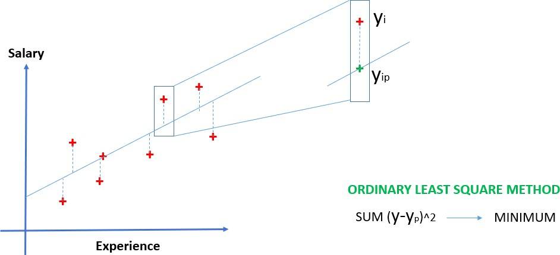
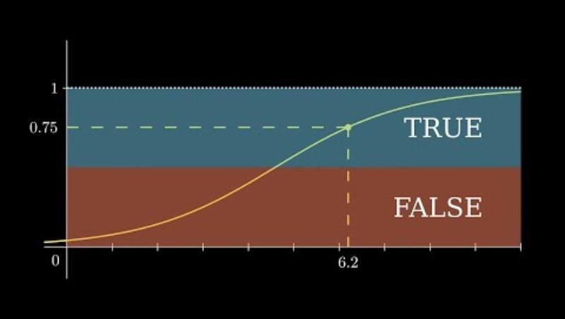
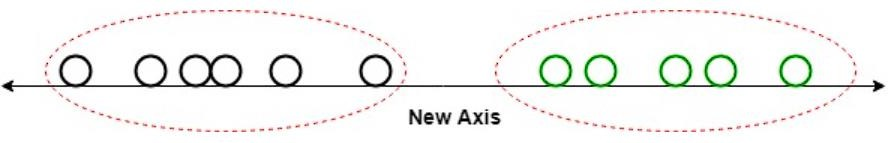
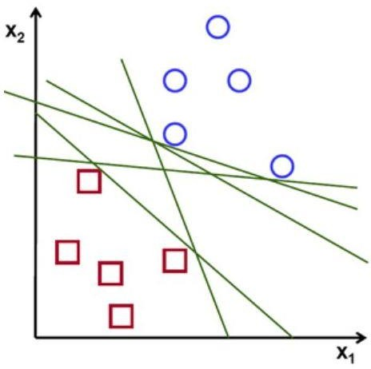
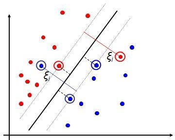
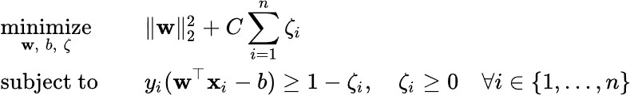
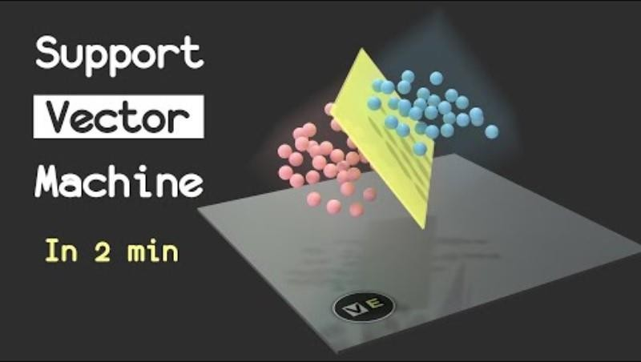
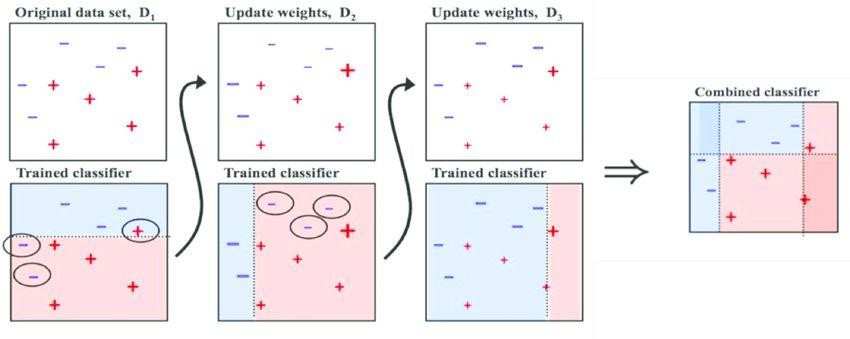
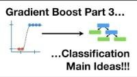
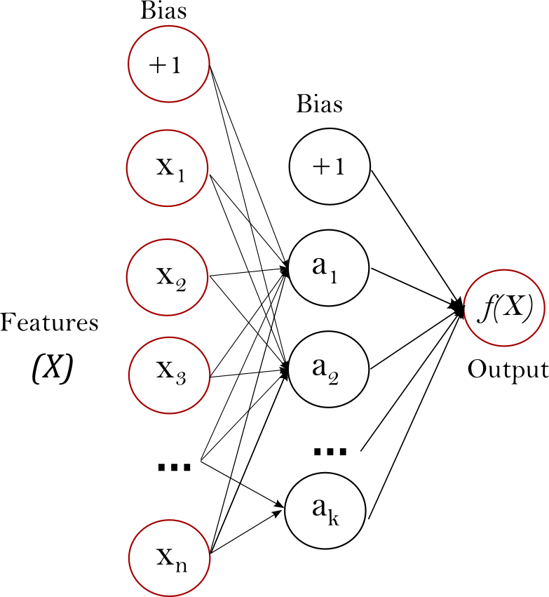

# 05_Machine Learning Algorithms

**Module:** CT115-3-M Data Analytics in Cyber Security
**Total Slides:** 62

---

## Table of Contents

1. [Slide 1](#slide-1)
2. [TOPIC LEARNING OUTCOMES](#slide-2)
3. [Machine Learning](#slide-3)
4. [Machine Learning Models](#slide-4)
5. [Machine Learning Models](#slide-5)
6. [Input Row](#slide-6)
7. [Loss Function](#slide-7)
8. [Contents & Structure](#slide-8)
9. [Algorithms for Supervised Learning](#slide-9)
10. [Linear regression](#slide-10)
11. [Linear Regression – Examples](#slide-11)
12. [Linear Regression – Examples](#slide-12)
13. [Linear Regression – Examples](#slide-13)
14. [Linear Regression](#slide-14)
15. [Logistic Regression](#slide-15)
16. [Logistic Regression](#slide-16)
17. [Logistic Regression](#slide-17)
18. [Linear Discriminant Analysis](#slide-18)
19. [Linear Discriminant Analysis](#slide-19)
20. [Linear Discriminant Analysis](#slide-20)
21. [Linear Discriminant Analysis](#slide-21)
22. [Linear Separators](#slide-22)
23. [Linear Support Vector Machine (SVM)](#slide-23)
24. [Linear SVM](#slide-24)
25. [Soft Margin Classification](#slide-25)
26. [SVM Kernel](#slide-26)
27. [SVM Kernel](#slide-27)
28. [SVM](#slide-28)
29. [Non-Linear Algorithms](#slide-29)
30. [Naïve Bayes](#slide-30)
31. [Naïve Bayes](#slide-31)
32. [Naive Bayes](#slide-32)
33. [Applications of NB](#slide-33)
34. [k-Nearest Neighbors](#slide-34)
35. [Slide 35](#slide-35)
36. [k-Nearest Neighbors](#slide-36)
37. [KNN](#slide-37)
38. [Decision Trees](#slide-38)
39. [Decision Trees](#slide-39)
40. [Example 1 - Decision Tree](#slide-40)
41. [Example 2 - Decision Tree](#slide-41)
42. [Decision Tree](#slide-42)
43. [Generic Tree Growing Algorithm](#slide-43)
44. [Ensemble Methods](#slide-44)
45. [Ensemble Methods](#slide-45)
46. [Random Forest](#slide-46)
47. [Random Forest](#slide-47)
48. [Random Forest](#slide-48)
49. [Slide 49](#slide-49)
50. [AdaBoost (Adaptive boosting)](#slide-50)
51. [AdaBoost (Adaptive boosting)](#slide-51)
52. [Gradient Boosting](#slide-52)
53. [Gradient Boosting](#slide-53)
54. [Gradient Boosting](#slide-54)
55. [Neural Network](#slide-55)
56. [Neural Network](#slide-56)
57. [Neural Network](#slide-57)
58. [Neural Network](#slide-58)
59. [Neural Network](#slide-59)
60. [Estimator Selection](#slide-60)
61. [Review Questions](#slide-61)
62. [Summary / Recap of Main Points](#slide-62)

---

## Slide 1: Slide 1

Data Analytics in Cyber Security CT115-3-M (Version E)

### Machine Learning Algorithms in Practice

### Slide Title

### Module Code & Module Title

---

## Slide 2: TOPIC LEARNING OUTCOMES

### At the end of this topic, you should be able to:

Understand different types of supervised learning algorithm.

Understand the operating details of each algorithm.

### Slide Title

### Module Code & Module Title

---

## Slide 3: Machine Learning

To perform the tasks autonomously, machines need to learn.

For this they learn a selected model using examples (training data)

For a selected model, machines learn model parameters.

This process is commonly known as “model learning”

### But what is a model?

### (For a choice of Model)

### Training Data

### Model parameters

---

## Slide 4: Machine Learning Models

---

## Slide 5: Machine Learning Models

Learning is the process of adapting model parameters

of the classifier to produce a desired response.

Model parameters are commonly known as the weights

Hyperparameters are the knobs a data scientist gets to

turn when setting up a classifier.

- They are arguments to the function that affect the algorithm’s behavior, such as number of iterations, or options between variants of how the algorithm behaves.

---

## Slide 6: Input Row

### Hyper- Parameters

### Loss Function

### Optimiser

### Behavior

### Tuning

### Classifier

### ( algorithms )

Loss function is applied to a single training example

Optimizer aims to minimize the cost function: the average loss over the entire training dataset.

A loss function (or error function) measures how far an estimated value is from its true value.

|  |  |  |  |  |  |
|---|---|---|---|---|---|
|  |  |  |  |  |  |
|  | Da | ta | set |  |  |
|  |  |  |  |  |  |

---

## Slide 7: Loss Function

A loss function (or error function) measures how far an estimated value is from its true value.

A loss function is for a single training example, and a cost function is the average loss over the entire training dataset.

– Classifier optimization strategies aim to minimize the

### cost function

In essence, the loss function and the optimizer work 	together to fit the algorithm to the data in the best way 	possible.

There are many different loss functions and optimisers

---

## Slide 8: Contents & Structure

### Module Code & Module Title

### Slide Title

### Algorithms for supervised learning

### Five general types

---

## Slide 9: Algorithms for Supervised Learning

### Support Vector

### (various kernels)

### Linear Models

### Linear Regression

### Logistic Regression

### Linear Discriminant Analysis

### Ensemble

### Bagging

### Random Forest

### Boosting

### AdaBoost

### Gradient Tree Boosting

### Non-Linear Models

### Naïve Bayes

### k-Nearest Neighbours

### Decision Tree

### Neural Network

### Perceptron & MLP

---

## Slide 10: Linear regression

Linear Regression fits a linear model ( y = 𝒂 + 𝒃𝑿 ) that best fits the relationship between the input variables (X) and the variable we will predict (y)

The slope of the line is b, and a is the intercept (the value of y when X = 0)

Different techniques can be used to learn the linear regression model from data, such as ordinary least squares and gradient descent optimization (these are hyperparameters for the classifier)

### Scikit Learn Documentation

### Slide <#> of 9

---

## Slide 11: Linear Regression – Examples

---

## Slide 12: Linear Regression – Examples

In most common case, the line is determined by minimising the sum of the squares of the distances (vertical offset) of all points to points on the line.

---

## Slide 13: Linear Regression – Examples

---

## Slide 14: Linear Regression

### https://youtu.be/aPHg1kGeKsg

### Slide <#> of 9

---

## Slide 15: Logistic Regression

Logistic regression is the go-to method for binary classification problems (two class values).

### Examples: Pass/Fail, Good/Bad, Defect/Not Defect,

Mammal/Not Mammal.

Does not assume a linear relationship between dependent and independent variables.

Unlike linear regression, the prediction is transformed using a logistic function

### Slide <#> of 9

---

## Slide 16: Logistic Regression

This is useful because we can apply a rule to the output of the logistic function to snap values to zero and one (e.g. IF less than 0.5 THEN output 0) and predict a class value.

Predictions made by logistic regression can also be used as the probability of a given data instance belonging to class 0 or class 1.

### Scikit Learn Documentation

The logistic function will transform any value into the range 0 to 1

### Slide <#> of 9

---

## Slide 17: Logistic Regression

### https://youtu.be/EKm0spFxFG4

### Slide <#> of 9

---

## Slide 18: Linear Discriminant Analysis

LDA works by identifying a linear combination of features that separates or characterises two or more classes of objects or events.

LDA does this by projecting data with two or more dimensions into one dimension so that it can be more easily classified. The technique is, therefore, sometimes referred to as dimensionality reduction.

For example, we have two classes, and we need to separate them efficiently. Classes can have multiple features. Using only a single feature to classify them may result in some overlapping.

### Slide <#> of 9

---

## Slide 19: Linear Discriminant Analysis

LDA assumes that the data has a Gaussian distribution and that the covariance matrices of the different classes are equal. It also assumes that the data is linearly separable, meaning that  a  linear  decision  boundary  can  accurately  classify  the different classes. Two criteria are used by LDA to create a new axis:

### Scikit Learn Documentation

### Slide <#> of 9

---

## Slide 20: Linear Discriminant Analysis

Linear  Discriminant  Analysis  uses  both axes (X and Y) to create a new axis and projects data onto a new axis in a way to maximise  the  separation  of  the  two categories  and  hence,  reduces  the  2D graph into a 1D graph.

### Slide <#> of 9

---

## Slide 21: Linear Discriminant Analysis

### https://youtu.be/azXCzI57Yfc?t=34

### Slide <#> of 9

---

## Slide 22: Linear Separators

What if we cannot do it in two dimensions, but we could in 3?

Binary classification can be viewed as the task of separating 2 classes in feature space:

### But which of the linear separators is optimal?

### Slide <#> of 9

---

## Slide 23: Linear Support Vector Machine (SVM)

Observations on the margin are the support vectors that define the optimal hyperplane

Support Vector Machines can do both, based on the concept of a hyperplane that separates the classes

### Slide <#> of 9

---

## Slide 24: Linear SVM

Maximun Margin classification is strictly based on observations at the margin between classes.

An important consequence of this geometric description is that the max-margin hyperplane is completely determined by those points lie nearest to it, called support vectors.

---

## Slide 25: Soft Margin Classification

Parameter  C  is  used  for 	controlling the outliers: low 	C  implies  we  are  allowing

### more	outliers;	high	C implies		we	are

### allowing

fewer outliers.

### Scikit Learn Documentation

---

## Slide 26: SVM Kernel

Kernelization maps non-linear data into another space which may either be of same dimension or higher dimension to improve the linear separability.

### Scikit Learn Documentation

---

## Slide 27: SVM Kernel

Kernelization is helpful if the right kernel can be found.

However, finding the suitable kernel is often a challenge.

Observations on the margin are the support vectors that define the optimal hyperplane

### The line looks like a plane in 3d

---

## Slide 28: SVM

### https://youtu.be/_YPScrckx28

Detailed Explanation (with Math): https://youtu.be/ny1iZ5A8ilA

### Slide <#> of 9

---

## Slide 29: Non-Linear Algorithms

Nonlinear machine learning algorithms do not make strong assumptions about the form of the mapping function

By not making assumptions, they are free to learn any functional form from the training data.

Nonlinear methods may achieve better accuracy at the expense of requiring more data and training time.

---

## Slide 30: Naïve Bayes

### Slide <#> of 9

The Naïve Bayes model is comprised of two types of probabilities that can be calculated directly from the training data:

- The probability of each class.
- The conditional probability for each class given each x value
Once calculated, the probability model can be used to make predictions for new data using Bayes Theorem.

It is common to assume a Gaussian distribution (bell curve)

Naive Bayes is called naive because it assumes that each input variable is independent.

This is a strong assumption and unrealistic for real data

Nevertheless, the technique is very effective on a large range of

complex problems.

### Scikit Learn Documentation

---

## Slide 31: Naïve Bayes

The Naïve Bayes model is comprised of two types of probabilities that can be calculated directly from the training data:

- The probability of each class.
- The conditional probability for each class given each x value
### Slide <#> of 9

---

## Slide 32: Naive Bayes

### https://youtu.be/H3EjCKtlVog?t=47

### Slide <#> of 9

---

## Slide 33: Applications of NB

### Slide 33 of 35

### Naive Bayes is mostly applied to:

- real time classification - the speed of Naive Bayes 	allows it to classify things in real time
- text classification - Naive Bayes functions well for 	text classification. It is popularly used for categorizing 	news, sentiment analysis, and to identify spam email.

---

## Slide 34: k-Nearest Neighbors

### Slide <#> of 9

The KNN algorithm is simple and effective but can be very slow

The model representation for KNN is the entire training dataset. This approach is known as a lazy learner

Predictions are made for a new data point by searching through the entire training set for the K most similar instances (the neighbours) and summarizing the output variable for those K instances.

The trick is in how to determine the similarity between the data instances. The simplest technique if your attributes are all of the same scale (all in inches for example) is to use the Euclidean distance, a number you can calculate directly based on the differences between each input variable.

---

## Slide 35: Slide 35

### Slide <#> of 9

---

## Slide 36: k-Nearest Neighbors

### https://youtu.be/0p0o5cmgLdE

### Slide <#> of 9

---

## Slide 37: KNN

### Slide <#> of 9

KNN can require a lot of memory or space to store all of the data, but only performs a calculation (learns) when a prediction is needed, just in time.

How to choose a good value of k for a particular dataset? Try several different values and compute the error rate using cross-validation.

The idea of distance or closeness can break down in very high dimensions (lots of input variables) which can negatively affect the performance of the algorithm on your problem. This is called the curse of dimensionality. It means you need to only use the input variables that are most relevant to predicting the output variable (feature selection).

### Scikit Learn Documentation

---

## Slide 38: Decision Trees

### Slide <#> of 9

The representation of the decision tree model is a binary tree, straight from the algorithms and data structures textbook.

Each node represents a single input variable (x) and a split point on that variable (assuming the variable is numeric).

The leaf nodes of the tree contain an output variable (y) which is used to make a prediction.	Predictions are made by walking the splits of the tree until arriving at a leaf node and output the class value at that leaf node.

### Scikit Learn Documentation

---

## Slide 39: Decision Trees

### Slide <#> of 9

---

## Slide 40: Example 1 - Decision Tree

### 10

### Refund

### MarSt

### TaxInc

### YES

### NO

### NO

### NO

### Yes

### No

### Married

### Single, Divorced

### < 80K

### > 80K

### Splitting Attributes

### Training Data

### Slide 40 of 43

### Model:	Decision Tree

| Tid | Refund | Marital Status | Taxable Income | Cheat |
|---|---|---|---|---|
| 1 | Yes | Single | 125K | No |
| 2 | No | Married | 100K | No |
| 3 | No | Single | 70K | No |
| 4 | Yes | Married | 120K | No |
| 5 | No | Divorced | 95K | Yes |
| 6 | No | Married | 60K | No |
| 7 | Yes | Divorced | 220K | No |
| 8 | No | Single | 85K | Yes |
| 9 | No | Married | 75K | No |
| 10 | No | Single | 90K | Yes |

---

## Slide 41: Example 2 - Decision Tree

### 10

### MarSt

### Refund

### TaxInc

### YES

### NO

### NO

### NO

### Slide 41 of 43

### Yes

### No

### Married

### Single,

### Divorced

### < 80K

### > 80K

### There could be more than one tree that

### fits the same data!

| Tid | Refund | Marital Status | Taxable Income | Cheat |
|---|---|---|---|---|
| 1 | Yes | Single | 125K | No |
| 2 | No | Married | 100K | No |
| 3 | No | Single | 70K | No |
| 4 | Yes | Married | 120K | No |
| 5 | No | Divorced | 95K | Yes |
| 6 | No | Married | 60K | No |
| 7 | Yes | Divorced | 220K | No |
| 8 | No | Single | 85K | Yes |
| 9 | No | Married | 75K | No |
| 10 | No | Single | 90K | Yes |

---

## Slide 42: Decision Tree

### https://youtu.be/7YTeMIq6-9s

### Slide 41 of 43

---

## Slide 43: Generic Tree Growing Algorithm

Start with entire dataset and create a root node.

Select the best attribute – the one that best splits data based on a chosen metric.

### Split the dataset into subsets based on selected

attribute.

For each subset, create a child node and assign subset to this node.

### Repeat recursively Steps 2 – 4 until one of the

stopping criteria is met.

Assign most common class label of the instances in the node to the leaf node.

---

## Slide 44: Ensemble Methods

### Goal is to reduce the

### variance of predictions

### Voting Algorithm

### (bagging)

### Use different sub-samples of the data set

Combine results from multiple instances of a classifier

---

## Slide 45: Ensemble Methods

### Use different sub-samples of the data set

Combine results from multiple instances of a classifier

### Goal is to reduce the variance of predictions

### In Bagging, data subsets are drawn randomly with

replacement from the training dataset at the beginning

In Boosting, every new subset comprises the elements that were misclassified by previous models

In Bagging, classifiers run in parallel, and results are

### aggregated when all of them finish

In Boosting, classifiers run in sequence, and results are aggregated at the end of each run

---

## Slide 46: Random Forest

### Slide <#> of 9

Random Forest is a bagging method that uses a large number of deep trees, fitted on bootstrap samples

The Random forest algorithm adds the concept of random feature subspace selection to create more robust models:

– In addition to sampling the observations in the dataset we also sample the features, and keep only a random subset of them to generate each bootstrap sample

This means all trees use different information to make 	their decisions, which reduces the correlation between 	their outputs

### Scikit Learn Documentation

---

## Slide 47: Random Forest

### Slide <#> of 9

---

## Slide 48: Random Forest

### https://youtu.be/J4Wdy0Wc_xQ?t=9

### Slide <#> of 9

---

## Slide 49: Slide 49

Boosting classifiers aggregate the individual predictions of several instances of an estimator on repeatedly modified versions of the data.

Boosting starts with one instance, and adds new instances one after another

Each model in the sequence is fitted giving more importance to observations in the dataset that were misclassified by the previous models in the sequence

This is done based on the the loss function and weighting

---

## Slide 50: AdaBoost (Adaptive boosting)

Train model on train set with equal weights for all samples

### Compute error of model on train set

### Increase weights on train cases model gets wrong

### Train new model on re-weighted train set

Go back to step 2 - Repeat until tired (100+ iterations)

### Slide <#> of 9

### Scikit Learn Documentation

---

## Slide 51: AdaBoost (Adaptive boosting)

### https://youtu.be/LsK-xG1cLYA?t=11

### Slide <#> of 9

---

## Slide 52: Gradient Boosting

AdaBoost was the first really successful boosting algorithm developed for binary classification

### Actually uses short decision trees

### Gradient boosting is similar to AdaBoost but uses

### a different process to fit the trees sequentially

- Construct a base tree
- Build the next tree based on errors of the previous tree
- Combine the previous tree with new tree
- Go back to step 2 - Repeat until tired (100+ iterations)
  - Scikit Learn Documentation
### Slide <#> of 9

---

## Slide 53: Gradient Boosting

### https://youtu.be/3CC4N4z3GJc?t=10

### Slide <#> of 9

---

## Slide 54: Gradient Boosting

### https://youtu.be/jxuNLH5dXCs?t=17

### Slide <#> of 9

---

## Slide 55: Neural Network

Neural networks are complex models, which try to mimic the way the human brain develops classification rules. A neural net consists of many different layers of neurons, with each layer receiving inputs from previous layers, and passing outputs to further layers.

---

## Slide 56: Neural Network

The learning (training) process of a neural network is an iterative process in which the calculations are carried out forward and backward through each layer in the network until the loss function is minimized.

### Fundamentally, three steps are involved:

- Forward propagation (Forward pass)
- Calculation of the loss function
- Backward propagation (Backward pass/Backpropagation)
### Scikit Learn Documentation

---

## Slide 57: Neural Network

---

## Slide 58: Neural Network

### https://www.youtube.com/watch?v=bfmFfD2RIcg

---

## Slide 59: Neural Network

### https://www.youtube.com/watch?v=CqOfi41LfDw&t=1s

---

## Slide 60: Estimator Selection

### No a-priori best estimator; must experiment

The estimator selection and evaluation phases provide information that can be used to refine feature selection, transformation, and scaling.

In practice, this means starting off by generating predictions with a set of candidate algorithms, comparing their performance in terms of predictive accuracy, and making judgements which one have the most potential.

---

## Slide 61: Review Questions

What are the four types of supervised learning algorithms?

How each supervised learning algorithms are trained?

### Slide Title

### Module Code & Module Title

---

## Slide 62: Summary / Recap of Main Points

### At the end of this topic, you should be able to:

Understand different types of supervised learning algorithms

Understand the operating details of each algorithms.

### Slide Title

### Module Code & Module Title

---
