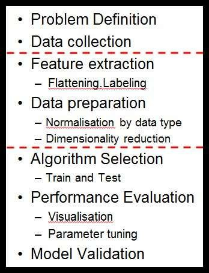
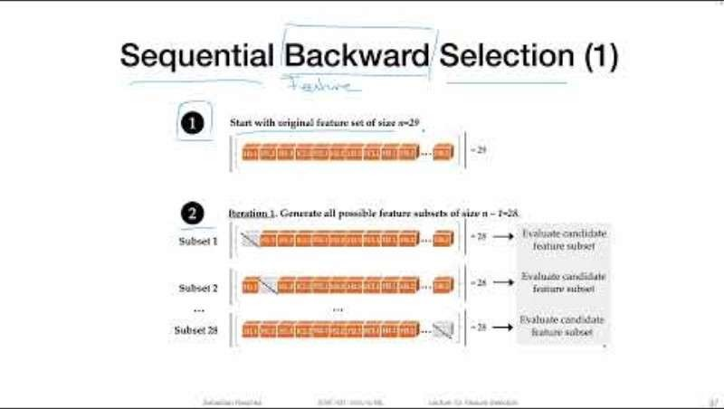
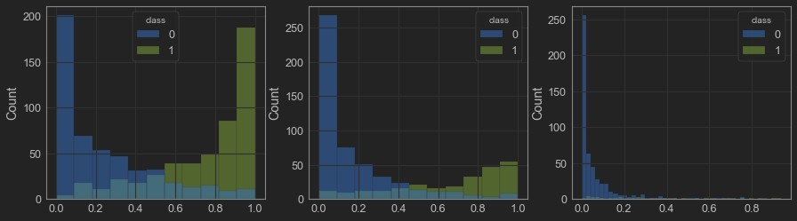

# 07_Model Optimisation Strategies

**Module:** CT115-3-M Data Analytics in Cyber Security
**Total Slides:** 38

---

## Table of Contents

1. [Slide 1](#slide-1)
2. [TOPIC LEARNING OUTCOMES](#slide-2)
3. [Machine Learning Pipeline](#slide-3)
4. [Contents & Structure](#slide-4)
5. [Feature selection](#slide-5)
6. [Feature Engineering](#slide-6)
7. [Feature Covariance](#slide-7)
8. [Pearson Correlation](#slide-8)
9. [High Correlations:](#slide-9)
10. [Mutual Information Correlation](#slide-10)
11. [Feature Filter](#slide-11)
12. [Hyperparameters](#slide-12)
13. [Many sets of Model parameters](#slide-13)
14. [Many sets of Model parameters](#slide-14)
15. [Bias / Variance Tradeoff](#slide-15)
16. [Hyperparameter Tuning](#slide-16)
17. [Hyperparameter Tuning](#slide-17)
18. [Hyperparameter Tuning Methods](#slide-18)
19. [k-Fold Cross Validation](#slide-19)
20. [K-fold Cross Validation Example](#slide-20)
21. [Best Practice](#slide-21)
22. [Permutation Feature Importance](#slide-22)
23. [Permutation Feature Importance](#slide-23)
24. [Permutation Feature Importance](#slide-24)
25. [Sequential Feature Selection](#slide-25)
26. [Sequential Feature Selection](#slide-26)
27. [Sequential Feature Selection](#slide-27)
28. [Resampling](#slide-28)
29. [Resampling Strategies](#slide-29)
30. [Resampling: Class Separability](#slide-30)
31. [Datasets (artificial)](#slide-31)
32. [Probability of Predicted Class](#slide-32)
33. [Probability of Predicted Class](#slide-33)
34. [UnderSampling Strategy](#slide-34)
35. [Resampling](#slide-35)
36. [Resampling](#slide-36)
37. [Review Questions](#slide-37)
38. [Summary / Recap of Main Points](#slide-38)

---

## Slide 1: Slide 1

### Module Code & Module Title

### Slide Title

Data Analytics in Cyber Security CT115-3-M (Version E)

### Model Optimisation Strategies

---

## Slide 2: TOPIC LEARNING OUTCOMES

### Module Code & Module Title

### Slide Title

### At the end of this topic, you should be able to:

### Understand the concepts of Hyperparameter Tuning

### Understand the concepts of Feature Selection

### Understand the concepts of Re-Sampling

---

## Slide 3: Machine Learning Pipeline

### Iteration:

### Model Validation

The model validation phase should lead to a new round of performance evaluation, and the set of candidate algorithms will gradually be reduced until one algorithm (or one ensemble of algorithms) is selected.

---

## Slide 4: Contents & Structure

### Module Code & Module Title

### Slide Title

### Hyperparameter tuning

### Feature selection

### Resampling

---

## Slide 5: Feature selection

The dataset may have a large number of features that may not all be relevant and significant.

- For certain types of data, like genetics or text, the number of 	features can be very large compared to the number of data 	points.
- Curse of dimensionality: error increases with the increase in the number of features.
Feature selection is a process of selecting the most relevant variables. The goal is to determine which columns are more predictive of the output.

- Also called “dimensionality reduction” and “feature 	engineering“

---

## Slide 6: Feature Engineering

The feature engineering process involves selecting the minimum required features to produce a valid model because the more features a model contains, the more complex it is (and the more sparse the data), therefore the more sensitive the model is to errors due to variance.

A common approach to eliminating features is to find their relative importance, then eliminate weak features or combinations of features and re-evalute to see if the model fares better during cross-validation

---

## Slide 7: Feature Covariance

In the worst case, one feature can explain (or already determine) all the other features and makes them obsolete.

This results in a high redundancy among the features, increasing computational overhead

The covariance matrix can be used to find redundant features (those that measure the same thing), and make decisions about which can be removed

---

## Slide 8: Pearson Correlation

The Pearson r is a standardized covariance, and ranges from -1, 	indicating a perfect negative linear relationship, and +1,indicating 	a perfect positive relationship.

The covariance of two variables divided by the product of their 	standard deviations gives Pearson's correlation coefficient.

ρ (X,Y) = cov (X,Y) / σX.σY.

A value of zero suggests no linear association, but does not mean 	two variables are independent, an extremely important point to 	remember.

Pearson r is not viable for understanding a great many dependencies

### The alternative is Mutual Information Correlation

---

## Slide 9: High Correlations:

### Check for greater than

### 0.7 and less

### than -0.7

### Correlation Matrix “heatmap”

---

## Slide 10: Mutual Information Correlation

Mutual Information Correlation is based on a measure of Entropy

- The Pearson correlation coefficient assumes normality and linearity of two 	random variables; Mutual Information removes these assumptions
In essence, mutual information tells us how useful the feature X is 	at predicting the random variable Y on a scale of zero to one, with 	higher numbers indicating better predictors.

- Mutual Information Correlation captures many different types of 	relationships (not just linear) and is considered the best metric
However, it doesn’t tell us if the feature is a predictor of success 	or failure.

Mutual Information and Pearson measures are complementary – they do not always move the same way

---

## Slide 11: Feature Filter

There is a feature filter function in the sample code local library

It selects all of the features with a Pearson or Mutual Information correlation with the target variable that is less than a given threshold (or “floor”)

Low correlation with the target variable means these features are not very valuable as predictors by themselves (we can’t say if they are more useful when combined with other variables)

### Nonetheless, this is a commonly used technique

---

## Slide 12: Hyperparameters

Creating a machine learning model requires design choices as to how to define the model architecture

Where the model parameters specify how to transform the input data into the desired output, the hyperparameters define how our model is actually structured.

- hyperparameters define the model architecture
- In scikit-learn they are passed as arguments to the 	constructor of the estimator classes.
The process of searching for the ideal model architecture is referred to as Hyperparameter Tuning.

### Slide <#> of 9

---

## Slide 13: Many sets of Model parameters

Goal: to find the model/solution with minimum loss/error

Mathematically, a “loss function” returns a measure of how good a prediction model does in terms of being able to predict the expected outcome.

### The curved line represents the 	solution space

The dots represent the loss for a 	given set of model parameters

### Vertical lines represent the error

between actual and predicted.

---

## Slide 14: Many sets of Model parameters

### The line depicts the predicted relationship

### The dots represent the actual values

Vertical lines represent the error between 	actual and predicted.

The optimum model (or optimum solution) is the combination of model parameters that gives minimum error between the actual output and the modeled	output

The set of all possible models with unique sets of parameters is referred to as the “solution space”.

### The tuning of these parameters require

the minimization of a cost function (or searching for the minimum cost function).

---

## Slide 15: Bias / Variance Tradeoff

Reducing bias generally increases the variance but the relationship is NOT fixed and predictable

In practice, optimisation of algorithm parameters is often a battle to find the desired balance for the bias/variance tradeoff.

We quantitatively evaluate overfitting / underfitting using cross-validation –usually in conjunction with hyperparameter tuning

Iterative – next steps, feeds back to previous steps

---

## Slide 16: Hyperparameter Tuning

### Slide <#> of 9

Hyperparameter tuning methods allow us to automatically test possible combinations of values

Tuning the hyper-parameters of an estimator is often referred to as "searching the hyperparameter space” for the optimum values.

Two methods: Grid Search and Randomised Search 	– GridSearchCV evaluates all possible combinations

### of parameter values from a list

– RandomizedSearchCV samples each setting from a distribution of possible parameter values.

---

## Slide 17: Hyperparameter Tuning

### Slide <#> of 9

### https://youtu.be/DTcfH5W6o08

---

## Slide 18: Hyperparameter Tuning Methods

Both Grid Search and Randomised Search use the score function of the estimator to evaluate a parameter setting.

### The defaults are

- sklearn.metrics.accuracy_score for classification
### and

- Sklearn.metrics.r2_score for regression
A Grid Search strategy for hyperparameter tuning is commonly combined with cross validation

### Slide <#> of 9

---

## Slide 19: k-Fold Cross Validation

Fold divides all the samples into k groups of samples, called folds. The prediction function is learned using k-1 folds, and the remaining fold is used as the test set.

–  k is typically 2, 5 or 10 for a balance between computational complexity and validation accuracy

- A model is trained using k-1 folds as training data
- The resulting model is validated on the remaining part of the data
– It is used as a test set to compute a performance measure such as accuracy for classification or r2 for regression

- The performance measure reported by k-fold cross-validation is the average of the values computed in the loop.

---

## Slide 20: K-fold Cross Validation Example

### Split the data into 5 samples

Fit a model to the training samples and use the test sample to calculate a CV metric.

Repeat the process for the next sample, until all samples have been used to either train or test the model

### The advantages are

all observations are used for both training and validation, and each observation is used once for validation

This can be done using the Train set from the original Test-Train split

---

## Slide 21: Best Practice

### Slide <#> of 9

(Other approaches generally follow the same principles)

The cross-validation information allows us to evaluate not only how much variance can be explained by the model, but also the predictive accuracy of the model.

Good models should have a high predictive AND explanatory power!

While this is a great way to make sure you’ve spanned the parameter space, the time required to train a model increases exponentially with the number of parameters.

The upside is that having many parameters typically indicates that an algorithm has greater flexibility. It can often achieve very good accuracy, provided you can find the right combination of parameter settings.

---

## Slide 22: Permutation Feature Importance

It is a model inspection technique that measures the contribution of each feature to a fitted model’s statistical performance on a given tabular dataset.

We measure the importance of a feature by calculating the increase in the model’s prediction error after permuting the feature. A feature is “important” if shuffling its values increases the model error, because in this case the model relied on the feature for the prediction. A feature is “unimportant” if shuffling its values leaves the model error unchanged, because in this case the model ignored the feature for the prediction.

---

## Slide 23: Permutation Feature Importance

### https://youtu.be/VUvShOEFdQo

---

## Slide 24: Permutation Feature Importance

### mlxtend.evaluate.feature_importance_permutation

can be used with any classifier or regressor, and can be run on the test set as well

The default metric is accuracy for classifiers and r2 for regressors. Optionally, metric= can designate a custom scoring function

### It returns two arrays:

- the first array contains the actual importance values we are 	interested in.
- When num_rounds > 1 the permutation is repeated multiple 	times with different random seeds, and the first array holds the 	average of the importance values, with all individual values 	from these runs in the second array.

---

## Slide 25: Sequential Feature Selection

mlxtend.feature_selection.SequentialFeatureSelector

Sequential feature selection algorithms remove or add one feature at a time based on the classifier performance until a feature subset of the desired size is reached.

Features are selected based on a performance metric hyperparameter (like accuracy or AUC_ROC) rather than feature weight coefficients ( coef_ )

Each feature importance value has both a magnitude and a direction (positive or negative), which indicate how each feature affects a particular prediction.

– A negative value means that feature makes the loss go up; in other words, the feature is worse than noise

---

## Slide 26: Sequential Feature Selection

### https://youtu.be/0vCXcGJg5Bo

---

## Slide 27: Sequential Feature Selection

### Slide <#> of 9

### http://rasbt.github

.io/mlxtend/user_ guide/feature_sel ection/Sequential FeatureSelector/

---

## Slide 28: Resampling

### General Principle

Purpose of the test set is to represent the population

Purpose of the train set is to represent the characteristics of the classes

### So:

An imbalanced test set is fine – some classes naturally occur more frequently than others

An imbalanced train set is a problem – there are not enough observations of some classes to distinguish their unique characteristics

---

## Slide 29: Resampling Strategies

https://www.kaggle.com/code/rafjaa/resampling-strategies-for-imbalanced-datasets

---

## Slide 30: Resampling: Class Separability

https://github.com/vinyluis/Articles/tree/main/Kolmogorov-Smirnov

https://towardsdatascience.com/evaluating-classification-models-with-kolmogorov- smirnov-ks-test-e211025f5573

As an example, three artificial datasets with different levels of separation between classes

---

## Slide 31: Datasets (artificial)

500 observations for each class: “True” [nonzero] and “False” [zero]

In the “good” dataset, the classes don’t overlap, and they have a 	good noticeable gap between them.

In the “medium” one there is enough overlap to confuse the classifier.

In the “bad” dataset the overlap is so intense that the classes are 	almost inseparable.

---

## Slide 32: Probability of Predicted Class

After training a default Naïve Bayes classifier for each dataset, we can see the distributions of the predictions for each class by plotting histograms.

On the x-axis we have the probability of an observation being classified “True” [nonzero] and on the y-axis the count of observations in each bin of the graph:

---

## Slide 33: Probability of Predicted Class

The “good” example (left) has a perfect separation, as expected.

The “medium” one (center) has a bit of an overlap, but most of the examples should be correctly classified [ Note the change in the scale of axis Y ! ].

The classifier cannot separate the “bad” example (right) [ Note the change in the scale of axis X and Y ! ].

---

## Slide 34: UnderSampling Strategy

Three datasets based on the “medium” one: – The original, where the “True” class has

### 100% of the original examples (500)

A new dataset where the “True” class has 	50% of the original examples (250)

A new dataset where the “True” class has 	only 10% of the original examples (50)

In all three cases, the “False” [zero] class will be unchanged with all 500 examples.

---

## Slide 35: Resampling

### Histograms after training the classifiers:

The original “medium” dataset is on the left.

The “50%” one (center) [ Note the change in the scale of axis Y ! ].

The “10%” one (right) [ Note how the “True” class “disappears” ! ].

---

## Slide 36: Resampling

One approach to addressing imbalanced datasets is to oversample the minority class.

The simplest approach involves duplicating examples in the minority class, although these examples don’t add any new information to the model.

Instead, new examples can be synthesized from the existing examples: the new examples are similar to the existing examples, but not exact copies.

This type of data augmentation for the minority class is referred to as the Synthetic Minority Oversampling Technique, or SMOTE for short.

---

## Slide 37: Review Questions

### Module Code & Module Title

### Slide Title

How to use hyperparameter tuning to improve the model performance?

How to use feature selection to improve model performance?

How to use re-sampling strategies to improve model performance?

---

## Slide 38: Summary / Recap of Main Points

### Module Code & Module Title

### Slide Title

### At the end of this topic, you should be able to:

### Understand the concepts of Hyperparameter Tuning

### Understand the concepts of Feature Selection

### Understand the concepts of Re-Sampling

---
