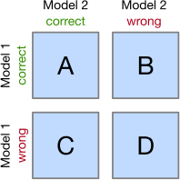

# 08_Model Selection

**Module:** CT115-3-M Data Analytics in Cyber Security
**Total Slides:** 20

---

## Table of Contents

1. [Slide 1](#slide-1)
2. [TOPIC LEARNING OUTCOMES](#slide-2)
3. [Machine Learning Pipeline](#slide-3)
4. [Contents & Structure](#slide-4)
5. [The Final Model](#slide-5)
6. [random_state](#slide-6)
7. [random_state](#slide-7)
8. [Report the Uncertainty](#slide-8)
9. [Comparing Models](#slide-9)
10. [Statistical Hypothesis Testing](#slide-10)
11. [McNemar's Test](#slide-11)
12. [McNemar's Test](#slide-12)
13. [McNemar's Test](#slide-13)
14. [5x2cv paired (t or f) test](#slide-14)
15. [5x2CV paired (t or f) test procedure](#slide-15)
16. [Wilcoxon Signed-Rank Test](#slide-16)
17. [Wilcoxon Signed-Rank Test](#slide-17)
18. [Wilcoxon Signed-Rank Test](#slide-18)
19. [Review Questions](#slide-19)
20. [Summary / Recap of Main Points](#slide-20)

---

## Slide 1: Slide 1

### Module Code & Module Title

### Slide Title

Data Analytics in Cyber Security CT115-3-M (Version E)

### Model Selection

---

## Slide 2: TOPIC LEARNING OUTCOMES

### Module Code & Module Title

### Slide Title

### At the end of this topic, you should be able to:

Understand the essential steps in model validation.

Understand different model comparison and selection techniques.

---

## Slide 3: Machine Learning Pipeline

### Module Code & Module Title

### Slide Title

### Iteration:

### Model Validation

The model validation phase should lead to a new round of performance evaluation, and the set of candidate algorithms will gradually be reduced until one algorithm (or one ensemble of algorithms) is selected.

---

## Slide 4: Contents & Structure

### Module Code & Module Title

### Slide Title

### Model selection

### Comparing models

### Case study

---

## Slide 5: The Final Model

The final model is the one prepared on the entire training dataset, once we have chosen an algorithm and configuration.

In statistics, more samples give us higher confidence that our model is representative of the population.

One strategy to gather a population of performance measures

is to use several runs of k-fold cross validation.

Or, build an ensemble of models, each trained with a different random number seed.

– Using a simple voting ensemble, each model makes a prediction and the mean of all predictions is reported as the final prediction.

---

## Slide 6: random_state

Most classifiers make use of randomness during the process of

### constructing a model from the training data

This has the effect of fitting a different model each time same algorithm is run on the same data.

In turn, the slightly different models have different performance

when evaluated on the same test dataset.

The proper name for this difference or random behavior within a range is stochastic.

Expect the performance to be a range and not a single value.

Expect there to be a range of models to choose from and not

a single model.

---

## Slide 7: random_state

Random numbers are generated in software using a pseudo random number generator. It’s a simple math function that generates a sequence of numbers that are random enough for most applications.

This math function is deterministic. If it uses the same starting point called a seed number, it will give the same sequence of random numbers.

We can get reproducible results by fixing the random number generator’s seed before each model we construct.

We do this by setting the random_state hyperparameter in the

call to the classifier.

---

## Slide 8: Report the Uncertainty

### Then report summary statistics on this population

Report the mean and standard deviation of performance, and	the highest and lowest performance observed (the range)

- Create a figure with a “box and whisker” plot for each algorithm’s sample of results.
- The box shows the middle 50 percent of the data, the orange line in the middle of each box shows the median of the sample, and the green triangle in each box shows the mean of the sample.

---

## Slide 9: Comparing Models

Differences in performance measures might easily turn out to be merely by chance, not because one model systematically predicts better than the other.

Statistical significance tests can determine if the difference between one population of result measures is significantly different from a second population of results.

– many methods exist that apply statistics to the selection of

Machine Learning models.

The most robust way to do such comparisons is called paired designs, which compare the performance of two models (or algorithms) on the same data.

---

## Slide 10: Statistical Hypothesis Testing

A statistical hypothesis test quantifies how plausible it is to say two data samples have not been drawn from the same distribution.

That describes the null hypothesis. We can test this null hypothesis by applying some statistical calculations.

If the test result infers insufficient evidence to reject the null hypothesis, then any observed difference in the model scores is a happened by chance.

If the test result infers sufficient evidence to reject the null hypothesis, then any observed difference in model scores is real.

---

## Slide 11: McNemar's Test

McNemar's test compares the predictions of two models based on a version of a 2x2 confusion matrix

### Cells B and C (the off-diagonal

### entries) tell us how the models differ

Null hypothesis: the performance of the two models is the same

### Set a significance threshold, normally α = 0.05

Compute the p-value, the probability of observing the given empirical (or a larger) chi-squared value

If the p-value is lower than our chosen significance level, we can

reject the null hypothesis that the two model's performances are equal

---

## Slide 12: McNemar's Test

McNemar's test compares the predictions of two models based on a version of a 2x2 confusion matrix

### Cells B and C (the off-diagonal

### entries) tell us how the models differ

Null hypothesis: the performance of the two models is the same

McNemar's test is unique because it uses the actual predictions from the models – these other tests use a metric derived from the confusion matrix, like accuracy, precision, recall, F1, roc_auc, … etc.

---

## Slide 13: McNemar's Test

### https://youtu.be/nzznkiW8ulk?t=143

---

## Slide 14: 5x2cv paired (t or f) test

5x2cv paired t-test: Dietterich, T. G. (1998). Approximate statistical tests for comparing supervised classification learning algorithms. Neural computation, 10(7), 1895-1923

Low false positive rate, slightly more powerful than

### McNemar

Recommended if computational efficiency (runtime) is not an issue (10 times more computations than McNemar)

https://rasbt.github.io/mlxtend/user_guide/evaluate/

### paired_ttest_5x2cv/

Combined 5×2cv f-test: Alpaydin, Ethem (1999). 	"Combined 5×2cv f-test for comparing supervised classification 	learning algorithms." Neural computation 11(8), 1885-1892

### More robust than 5x2cv paired t-test

https://rasbt.github.io/mlxtend/user_guide/evaluate/c ombined_ftest_5x2cv/

The difference is the distribution used to calculate the p-value:

### t-distribution or

### f-distribution

### (McNiemar uses chi-squared distribution)

---

## Slide 15: 5x2CV paired (t or f) test procedure

Let’s say we have two classifiers, A and B. We randomly split the data in 50% training and 50% test. Then, we train each model on the training data and compute the difference in accuracy between the models from the test set, called DiffA. Then, the training and test splits are reversed and the difference is calculated again in DiffB. This is repeated five times, after which the mean and variance of the differences is computed.

---

## Slide 16: Wilcoxon Signed-Rank Test

The Wilcoxon signed-rank test is the non-parametric version of the paired Student’s t-test. It can be used when the sample size is small and the data does not follow a normal distribution.

We can apply this significance test for comparing two Machine Learning models.

- Create a set of accuracy scores for each model, using k-fold cross validation or several runs with different random number seeds.
  - This gives us two samples, one for each model.
- Then, we use the Wilcoxon signed-rank test to see if the two
accuracy score samples differ significantly from each other.

  - If they do, then one is more accurate than the other.

---

## Slide 17: Wilcoxon Signed-Rank Test

The result will be a p-value. If that value is lower than 0.05 we can reject the null hypothesis that there are no significant differences between the models.

NOTE: It is important to keep the same folds between the models to make sure the samples are drawn from the same population. This is achieved by simply using the same random_state value.

---

## Slide 18: Wilcoxon Signed-Rank Test

### https://youtu.be/NZsL2eDQiDQ

---

## Slide 19: Review Questions

### Module Code & Module Title

### Slide Title

### What are the essential steps in model validation?

What are the different model comparison and selection techniques?

---

## Slide 20: Summary / Recap of Main Points

### Module Code & Module Title

### Slide Title

Understand the essential steps in model validation.

Understand different model comparison and selection techniques.

---
