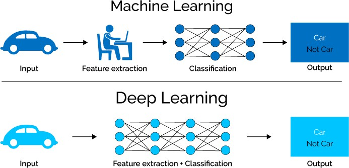
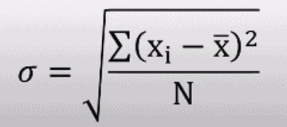
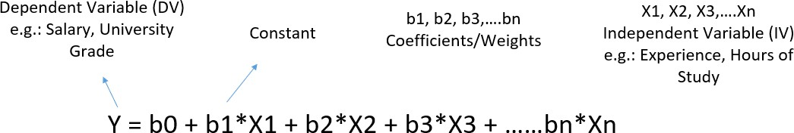
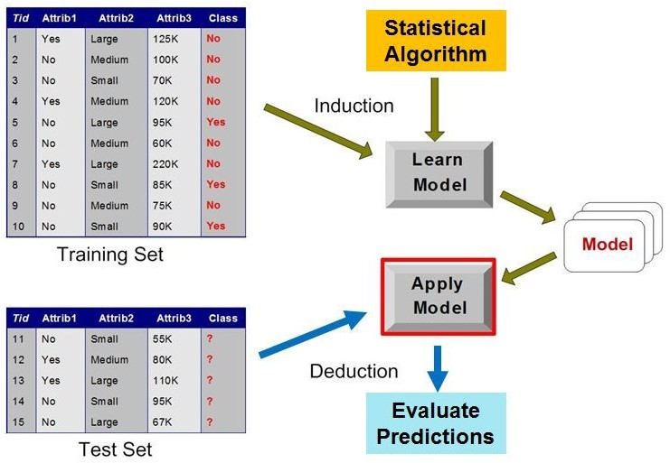

# 09_ML Review (CT)

**Module:** CT115-3-M Data Analytics in Cyber Security
**Total Slides:** 79

---

## Table of Contents

1. [Slide 1](#slide-1)
2. [Slide 2](#slide-2)
3. [Types of Machine Learning](#slide-3)
4. [Reinforcement learning – Types of Problems](#slide-4)
5. [Machine Learning](#slide-5)
6. [Slide 6](#slide-6)
7. [Supervised vs Unsupervised vs Reinforcement](#slide-7)
8. [Deep Learning](#slide-8)
9. [Deep Learning](#slide-9)
10. [Machine Learning v. Deep Learning](#slide-10)
11. [What is a Statistic?](#slide-11)
12. [Basics](#slide-12)
13. [Variance and Standard Deviation](#slide-13)
14. [Population versus Sample](#slide-14)
15. [Statistical Modelling / Machine learning](#slide-15)
16. [Predictive Modeling](#slide-16)
17. [Inference](#slide-17)
18. [Machine Learning](#slide-18)
19. [Machine Learning Pipeline](#slide-19)
20. [ML Terminology](#slide-20)
21. [ML Terminology](#slide-21)
22. [ML Terminology](#slide-22)
23. [Input Row](#slide-23)
24. [Supervised Learning](#slide-24)
25. [ML Terminology](#slide-25)
26. [ML Terminology](#slide-26)
27. [Pipeline of Machine Learning Task](#slide-27)
28. [Machine Learning Pipeline](#slide-28)
29. [Machine Learning Pipeline](#slide-29)
30. [Machine Learning Pipeline](#slide-30)
31. [Machine Learning Pipeline](#slide-31)
32. [Machine Learning Pipeline](#slide-32)
33. [Machine Learning Pipeline](#slide-33)
34. [Machine Learning Pipeline](#slide-34)
35. [Machine Learning Pipeline](#slide-35)
36. [Machine Learning Pipeline](#slide-36)
37. [Machine Learning Pipeline](#slide-37)
38. [Data Preprocessing](#slide-38)
39. [Exploratory Data Analysis (EDA)](#slide-39)
40. [Feature Selection](#slide-40)
41. [Pearson Correlation](#slide-41)
42. [Correlation](#slide-42)
43. [Correlation Matrix “heatmap”](#slide-43)
44. [Mutual Information (MI) Correlation](#slide-44)
45. [ML Process: Data Preparation](#slide-45)
46. [Missing values](#slide-46)
47. [Encoding Categorical Data](#slide-47)
48. [Scaling Continuous Data](#slide-48)
49. [Confusion matrix](#slide-49)
50. [Confusion Matrix](#slide-50)
51. [Analysis with Performance Measurement Metrics](#slide-51)
52. [Accuracy Estimation](#slide-52)
53. [Precision](#slide-53)
54. [Precision and Recall](#slide-54)
55. [ROC Plot](#slide-55)
56. [F1 Score (or F Score or F Measure)](#slide-56)
57. [Accuracy Score](#slide-57)
58. [ML Concepts: Underfit / Overfit](#slide-58)
59. [Bias Variance Decomposition](#slide-59)
60. [k-Fold Cross Validation](#slide-60)
61. [K-fold Cross Validation Example](#slide-61)
62. [random_state](#slide-62)
63. [random_state](#slide-63)
64. [Why Are Results Different With The Same Data?](#slide-64)
65. [Feature Engineering](#slide-65)
66. [Feature Filter](#slide-66)
67. [Hyperparameter tuning](#slide-67)
68. [Hyperparameter Tuning](#slide-68)
69. [Permutation Feature Importance](#slide-69)
70. [Sequential Feature Selection](#slide-70)
71. [Sequential Feature Selection](#slide-71)
72. [Resampling](#slide-72)
73. [Resampling Strategies](#slide-73)
74. [Report the Uncertainty](#slide-74)
75. [Statistical Hypothesis Testing](#slide-75)
76. [McNemar's Test](#slide-76)
77. [5x2cv paired (t or f) test](#slide-77)
78. [Wilcoxon Signed-Rank Test](#slide-78)
79. [Wilcoxon Signed-Rank Test](#slide-79)

---

## Slide 1: Slide 1

### Module Code & Module Title

### Slide Title

Data Analytics for Cyber Security CT115-3-M (Version E)

### Machine Learning:	Review

---

## Slide 2: Slide 2

### Module Code & Module Title

### Slide Title

### Deep Learning (DL):

A technique to perform machine learning inspired by the brain's

network of neurons.

### Machine Learning (ML):

A technique by which a computer can use statistical patterns inferred from observation data to make predictions

### Artificial Intelligence (AI):

Mimicking the intelligence or behavioural pattern of humans or any other living entity.

---

## Slide 3: Types of Machine Learning

Supervised learning: given correct answers for each example (labelled data), construct a model to map input features to labels

- e.g. learn to recognize cars by images of cars and non-cars
Unsupervised learning: discover patterns in unlabelled data

- Group toys of a given colour or shape from a Lego set
- e.g. learn to categorize stars or genomic data when no labels is given (clustering, grouping)
Reinforcement learning: continuous reweighting of decision model elements after series of decisions

- e.g. learn to play tennis / table tennis

---

## Slide 4: Reinforcement learning – Types of Problems

Reinforcement learning is a machine-learning training method based on rewarding desired behaviors and/or punishing undesired ones. In general, a reinforcement learning agent is able to perceive and interpret its environment, take actions and learn through trial and error.

Action (for example) Robot movement Characters in games Autonomous car driving

---

## Slide 5: Machine Learning

---

## Slide 6: Slide 6

---

## Slide 7: Supervised vs Unsupervised vs Reinforcement

### FOR THE EXAM REVIEW

---

## Slide 8: Deep Learning

Deep learning is a system architecture, not an algorithm

a style of parallel computation inspired by neurons and their adaptive connections: It’s a very different style from a sequential computation.

---

## Slide 9: Deep Learning

Deep learning methods aim at learning feature hierarchies where features from higher levels of the hierarchy are formed from the lower- level features.

- The Model Defines the Features

---

## Slide 10: Machine Learning v. Deep Learning

---

## Slide 11: What is a Statistic?

“A quantity that is computed from a sample [of data].”

### Merriam-Webster

→ a fact or piece of data obtained from a study of a large quantity of numerical data.

---

## Slide 12: Basics

### Indices of central tendency

### Summarize Data by a Single Number

### Three most popular: mean, median, mode

Mean – sum all observations, divide by number of observations

### Median – midpoint value when sorted

### Mode – most frequent value observed

---

## Slide 13: Variance and Standard Deviation

Variance = square of the distance between x and the mean	2 = (x - x!)2

- variance is often denoted 2
- Also called degrees of freedom
### Main problem is units squared

### – changing the units changes the answer squared

### So, use Standard Deviation	 = sqrt(2)

### – Same unit as mean, so can compare to mean

### Ratio of standard deviation to mean?

- Called the Coefficient of Variation (C.O.V.)
- C.O.V. =  / µ
- Takes units out and shows magnitude

---

## Slide 14: Population versus Sample

Population refers to the entire group or set of individuals, objects, or events being studied, while a sample is a subset of the population that is used for analysis.

The word “sample” comes from the same root word as “example”; one sample does not prove a theory, but rather is an example.

Basically, a definite statement cannot be made about characteristics of all systems. Instead, make probabilistic statement about the range of most systems, i.e., Confidence intervals

---

## Slide 15: Statistical Modelling / Machine learning

Statistical modelling is the formalization of relationships between variables in the form of mathematical equations.

Machine learning is an algorithm to optimize a performance criterion using data of particular examples.

### Machine learning relies on Statistical modelling

---

## Slide 16: Predictive Modeling

There is a common principle that underlies all supervised machine learning algorithms for predictive modeling.

Machine learning algorithms are described as learning a target function (f) that best maps input variables (X) to an output variable (y)

### y = f(X)

This is a general learning task where we would like to make predictions in the future (y) given new examples of input variables (X)

We don't know what the function (f) looks like or its form. If we did, we would use it directly and we would not need to learn it from data using machine learning algorithms.

---

## Slide 17: Inference

In the words of the American philosopher C.S.Peirce:

“Deduction proves that something must be; 	– If A and B then always C

Induction shows that something actually is operative;

### – If A and B then most probably C

Abduction merely suggests that something may be.” 	– If A and B then C ?

Charles Sanders Peirce, “Pragmatism and Abduction,” (lecture, Harvard University,Cambridge, MA, May 14, 1903), In The Collected Papers of Charles Sanders Peirce, vol. 5, Pragmatism and Pragmaticism, 180-212, CP 5.186, C. Hartshorne and P. Weiss, eds. (Cambridge, MA: Harvard University Press, 1934)

---

## Slide 18: Machine Learning

### Statistical Profile

---

## Slide 19: Machine Learning Pipeline

### Abductive Reasoning: Problem Definition

### Goal: Decide what information is needed

Methods: Typically, committee meetings, brainstorming, and analysis of business objectives

Outcome: A project specification for the Data Scientists.

---

## Slide 20: ML Terminology

Dataset: A sample of real-world observations, organised into a table - rows and columns

Feature: a column in the dataset table. Also called a predictor, variable, input, attribute, covariate

Training example: A row in the table representing a set of feature values. Also called an observation, record, training instance

Target: What we want to predict. Also called ground truth, (class) label, desired or expected output, response variable, dependent variable

---

## Slide 21: ML Terminology

Model: A function in the form y = f(x) that we believe (or hope) is similar to the true function that represents the relationship between the target (y) and the observations in the dataset (x). Also called the target function or objective function

Prediction or Output: Outcome from applying the model to the dataset - used to distinguish from targets, which are desired or expected outputs

Classifier: An implementation that combines a Learning algorithm, a Loss function, and an Optimiser to create a model and generate predictions

---

## Slide 22: ML Terminology

Learning algorithm: A set of (mathematical) instructions that create a model using the training dataset. Most classifiers are named for the learning algorithm they implement to find or approximate the target function

Loss function: Measures how far the predicted output for a single training example is from its true value. Also called the error function.

Optimiser: An algorithm used to minimize the average or summed output of the Loss function for the entire dataset (the Cost function)

---

## Slide 23: Input Row

### Hyper-

### Parameters

### Loss Function

### Optimiser

### Behavior Tuning

### Classifier

### ( algorithms )

Essentially, the loss function and optimizer work together to fit the algorithm to the data in the best way possible.

|  |  |  |  |  |  |
|---|---|---|---|---|---|
|  |  |  |  |  |  |
|  | Da | t | ase | t |  |
|  |  |  |  |  |  |

---

## Slide 24: Supervised Learning

For every example in the data there is always a predefined outcome

Models the relations between a set of descriptive features and a target

- (Fits data to a function)
### 2 groups of problems:

- Classification
- Regression

---

## Slide 25: ML Terminology

Model Parameters: The parameters that the learning algorithm “learns” from the training data - for example, the slope (weight coefficients) and y-axis intercept of a linear regression line

Fitting a Model: The process of learning the Model Parameters

Hyperparameters: The tuning parameters of a classifier that affect its behavior, such as error tolerance, number of iterations, or options between variants of how the algorithm behaves. The programmer will specify defaults, and the user can pass new values with the function call.

---

## Slide 26: ML Terminology

Model Evaluation: Model performance is usually evaluated by counting the fraction of correctly classified instances out of all instances that the model attempted to classify.

– For example, if we have a test dataset of 10,000 instances and a model classified 7,000 instances correctly, then we say that the model has a 70% accuracy on that dataset.

Note that optimization and evaluation measures are usually not the same in practice.

---

## Slide 27: Pipeline of Machine Learning Task

Machine learning (ML) pipelines consist of several steps to train a model.

ML pipelines are iterative as every step is repeated to continuously improve the accuracy of the model and achieve a successful algorithm.

---

## Slide 28: Machine Learning Pipeline

### Problem Definition

### Data collection

### Feature extraction

- Flattening,Labeling
### Data preparation

- Normalisation by data type
- Dimensionality reduction
### Algorithm Selection

- Train and Test
### Performance Evaluation

- Visualisation
- Parameter tuning
### Model Validation

---

## Slide 29: Machine Learning Pipeline

### Slide <#> of 9

### Problem Definition

### Goal: Decide what information is needed

Methods: Typically used are committee meetings, brainstorming, and analysis of business objectives

Outcome: A project specification for the Data Scientists.

---

## Slide 30: Machine Learning Pipeline

### Slide <#> of 9

### Data collection

### Goal: Representative sample of the population

Methods: Extract existing data from databases, gather new data

### Outcome: A large dataset

---

## Slide 31: Machine Learning Pipeline

### Slide <#> of 9

### Feature extraction

### Goal: Specifying features useful for prediction

Methods: Check distributions, correlation/covariance checks, drop unique identifiers

Outcome: A “flat” (single table) dataset with selected features.

---

## Slide 32: Machine Learning Pipeline

### Slide <#> of 9

### Data preparation

Goal: Clean up (normalize, regularize) the data values

Methods: Scaling, dummy variables, interpolating missing values

Outcome: Normalized data in numeric form appropriate for modeling

---

## Slide 33: Machine Learning Pipeline

### Algorithm Selection

### Goal: No a-priori best algorithm; must experiment

Methods: Draw on problem statement, domain knowledge, knowledge of ML and statistical methods, and library help files to choose candidate algorithms

Outcome: A set of algorithms that should be appropriate for the analytical task

### Slide <#> of 9

---

## Slide 34: Machine Learning Pipeline

### Slide <#> of 9

### Performance Evaluation

Goal: Test candidate algorithms and evaluate predictive accuracy

Methods: Fit each algorithm on the same set of historic training data, analyse confusion matrix and various other metrics

Outcome: Comparison of results from selected algorithms

---

## Slide 35: Machine Learning Pipeline

### Slide <#> of 9

### Model Validation

Goal: Evaluate robustness of the predictive model, check for over-fitting, refine hyperparameters

### Methods: Grid search CV, k-fold CV

Outcome: Optimization of the objective function, good generalisation performance

---

## Slide 36: Machine Learning Pipeline

### Slide <#> of 9

### Iteration:

### Algorithm Selection

Certain algorithms may be selected because they return a measure of feature importance which can be fed back to the feature extraction phase

---

## Slide 37: Machine Learning Pipeline

### Slide <#> of 9

### Iteration:

### Model Validation

The model validation phase should lead to a new round of performance evaluation, and the set of candidate algorithms will gradually be reduced until one algorithm (or one ensemble of algorithms) is selected.

---

## Slide 38: Data Preprocessing

Data preprocessing is the first step in any machine learning project – Feature Extraction and Data Preparation.

Data preprocessing can refer to manipulation or dropping of data before it is used to ensure or enhance performance and is an important step in machine learning process.

The phrase "garbage in, garbage out" is particularly applicable to machine learning projects. If we use unclean data for machine learning, the result will not be satisfying enough for our end application

---

## Slide 39: Exploratory Data Analysis (EDA)

### Checking

### Feature Distributions

### Class balance

Correlation between input variables and target variable

Correlation between input variables (collinearity)

EDA is an important step to first understand the data (identify the trends and patterns within the data, detect outliers or anomalous events, find interesting relations among the variables, points of interest, etc.) before using them for modeling, machine learning, etc.

Since the dataset will always be large, visualization is essential

---

## Slide 40: Feature Selection

The dataset may have many features that may not all be relevant and significant.

- For certain types of data, like genetics or text, the number of features can be very large compared to the number of data points.
- Curse of dimensionality: error increases with the increase in the number of features.
Feature selection is a process of selecting the most relevant variables. The goal is to determine which columns are more predictive of the output.

- Also called “dimensionality reduction” and “feature engineering”.

---

## Slide 41: Pearson Correlation

The Pearson r is a standardized covariance, and ranges from -1, 	indicating a perfect negative linear relationship, and +1,indicating 	a perfect positive relationship.

The covariance of two variables divided by the product of their standard deviations gives Pearson's correlation coefficient.

ρ (X,Y) = cov (X,Y) / σX.σY.

A value of zero suggests no linear association, but does not mean  two variables are independent, an extremely important point to remember.

Pearson r is not viable for understanding a great many dependencies

### The alternative is Mutual Information Correlation

---

## Slide 42: Correlation

---

## Slide 43: Correlation Matrix “heatmap”

### High Correlations:

### Check for greater than

### 0.7 and less

### than -0.7

---

## Slide 44: Mutual Information (MI) Correlation

Mutual Information Correlation is based on a measure of Entropy

- The Pearson correlation coefficient assumes normality and linearity of two 	random variables; Mutual Information removes these assumptions.
In essence, mutual information tells us how useful the feature X is 	at predicting the random variable Y on a scale of zero to one, with 	higher numbers indicating better predictors.

- Mutual Information Correlation captures many different types of 	relationships (not just linear) and is considered the best metric.
However, it doesn’t tell us if the feature is a predictor of success or failure.

Mutual Information and Pearson measures are complementary – they do not always move the same way.

---

## Slide 45: ML Process: Data Preparation

### Needed for several reasons

- Some Models have strict data requirements
  - Scale of the data, data point intervals, etc
- Some characteristics of the data may have a dramatic impact on the model performance
Time required for data preparation should not be underestimated

### Dealing with missing values

### Transforming text variables

### Scaling numeric variables

---

## Slide 46: Missing values

There may be many reasons for missing values, but only three ways to handle them: deletion, direct estimation, and imputation

Deleting all instances (rows) with missing values would delete a lot of potentially useful information; as basic guideline, any feature (column) with more than 30% missing values should be discarded

Direct estimation requires enough prior knowledge of the dataset to give an accurate estimate for the missing values.

The most frequently used imputation techniques are filling in 	the mean or median value for the numeric features and filling 	in the most frequent value for nominal features.

---

## Slide 47: Encoding Categorical Data

Label Encoding converts a categorical feature into a continuous

feature by assigning a unique integer based on alphabetical order.

- there is a very high probability that the model captures the relationship between countries such as China < India < Russia
One-Hot Encoding creates additional features based on the number of unique values in the categorical feature. Every unique value in the category will be added as a discrete feature.

- One-Hot Encoding is the process of creating dummy variables.
- This used to be two separate required steps
  - labelEncoder ::> onehotEncoder
- Not anymore, now we just
  - pandas.getdummies()

---

## Slide 48: Scaling Continuous Data

Scalers are linear (or more precisely affine) transformers and differ from each other in the way they estimate the parameters used to shift and scale each feature.

StandardScaler standardizes a feature by subtracting the mean and then dividing all the values by the standard deviation. The result is a distribution with mean=0 and standard deviation=1

MinMaxScaler finds the original minimum and maximum values, then subtracts the minimum and divides by the range for each value. The original distribution is preserved with all values between 0 and 1

There are several others available, suitable for special purposes https://scikit-learn.org/stable/modules/preprocessing.html

---

## Slide 49: Confusion matrix

The confusion matrix is a useful table that presents both the class distribution in the data and the classifiers predicted class distribution with a breakdown of error types.

This means “prior probabilities” for the classes can be accounted for in error analysis.

https://www.v7labs.com/blog/confusion-matrix-guide

---

## Slide 50: Confusion Matrix

A confusion matrix for two “generic” classes (+, -) is shown above.

### There are four quadrants in the confusion matrix:

- True Positive (TP): The number of instances that were positive (+) and correctly  classified as positive (+)
- False Positive (FP): The number of instances that were negative (-) and incorrectly classified as (+). This also known as Type 1 Error
- False Negative (FN): The number of instances that were positive (+) and incorrectly classified as negative (-). This is also known as Type 2 Error
- True Negative (TN): The number of instances that were negative (-) and correctly classified as (-)

---

## Slide 51: Analysis with Performance Measurement Metrics

---

## Slide 52: Accuracy Estimation

### Things to be measured for a given classifier

- Accuracy
- Performance
### Accuracy estimation

- If N is the number of instances with which a classifier is tested and p is the number of correctly classified instances, the accuracy ∈ is
### ∈= 𝑝

### 𝑁

–	Also, we can say the error rate (i.e., misclassification rate) ∈& is

### ∈&= 1 −∈

### Peformance estimation

- Metrics are
  - True Positive, True Negative (correct predictions)
  - False Positive, False Negative (misclassifications)
### CS 40003: Data Analytics

---

## Slide 53: Precision

### Recall

Precision is the number of	proper positive predictions divided by the total number of positive predictions.

Precision can be thought of as a measure of a classifiers exactness.

Low precision usually indicates many False Positives.

### TP / (TP + FP)

Recall is the number of positive predictions divided by the number of observations of that class in the test data.

It is also called Sensitivity or the True Positive Rate (TPR).

Recall can be thought of as a measure of a classifiers completeness.

Low recall usually indicates many False Negatives.

### TP / (TP + FN)

---

## Slide 54: Precision and Recall

Excellent predictions mean high precision and high recall.

However, increases in one usually come at the expense of decreases in the other.

Maximizing precision will minimize the number of false positives

Maximizing recall will minimize the number of false negatives.

---

## Slide 55: ROC Plot

### The diagonal line corresponds to random guessing

That means the same proportion of the positive instances and the negative instances are classified correctly, so TPR = FPR

### FPR=56

### TPR=98

### Given TPR=0.98 and FPR=0.56

### Calculate precision and recall

TPR = “recall” = “sensitivity” TNR = “precision” = “specificity” FPR = one minus the TNR

The area under the curve (AUC) is commonly used to summarize the ROC curve information as a single number

---

## Slide 56: F1 Score (or F Score or F Measure)

The F1 Score conveys the balance between precision and 	recall.

Alone, neither precision or recall tells the whole story. We 	can have excellent precision with terrible recall, or terrible 	precision with excellent recall.

The F-Measure is the accepted way to combine precision 	and recall into a single metric that captures both properties.

( (Precision * Recall) / (Precision + Recall) ) * 2

---

## Slide 57: Accuracy Score

Classification Accuracy is the number of correct predictions made divided by the total number of predictions made

### (TP + TN) / (TP + FP + FN + TN)

Accuracy score can be misleading - a 	simple model may have a high level of 	accuracy but be too crude to be useful.

- For example, if 96% of the sample is Category A, 	then predicting that every case is category A will 	have an accuracy of 96%.
- Scikit-learn dummy classifier does this
The underlying issue is the imbalance between the positive and negative classes

### 96

### 4

### 0

### 0

---

## Slide 58: ML Concepts: Underfit / Overfit

### overfit

### underfit

The model fit is to the population using sample data

Main Idea: the model should be generic enough to represent the population

However, this may result in an underfit (loose fit) between sample data and the model.

On the other hand, if the model is overfit (tight fit) to the sample, there is a danger that it may not represent the population well.

---

## Slide 59: Bias Variance Decomposition

This function returns a measure of the bias, the variance, and the overall “goodness” of a model.

The average of the value returned by the loss function for all observations over all of the bootstrap training sets is reported as the expected loss.

Turning this around, one minus the expected loss is a measure of the “goodness” of the model

The expected loss can be decomposed (mathematically) into separate measures of bias and variance (and an implicit “noise” term to account for any difference between expected loss and bias + variance)

### Slide <#> of 9

---

## Slide 60: k-Fold Cross Validation

Fold divides all the samples into k groups of samples, called folds. The prediction function is learned using k-1 folds, and the remaining fold is used as the test set.

– k is typically 3, 5 or 10 for a balance between computational complexity and validation accuracy

- A model is trained using k-1 folds as training data
- The resulting model is validated on the remaining part of the data
– It is used as a test set to compute a performance measure such as accuracy for classification or r2 for regression

- The performance measure reported by k-fold cross-validation is the average of the values computed in the loop.

---

## Slide 61: K-fold Cross Validation Example

### Split the data into 5 samples

Fit a model to the training samples and use the test sample to calculate a CV metric.

Repeat the process for the next sample, until all samples have been used to either train or test the model

### The advantages are

all observations are used for both training and validation, and each observation is used once for validation

This can be done using the Train set from the original Test-Train split

---

## Slide 62: random_state

Most classifiers make use of randomness during the process of constructing a model from the training data

This has the effect of fitting a different model each time same algorithm is run on the same data.

In turn, the slightly different models have different performance when evaluated on the same test dataset.

The proper name for this difference or random behavior within a range is stochastic.

Expect the performance to be a range and not a single value.

Expect there to be a range of models to choose from and not 	a single model.

---

## Slide 63: random_state

Random numbers are generated in software using a pseudo random number generator. It is a simple math function that generates a sequence of numbers that are random enough for most applications.

This math function is deterministic. If it uses the same starting point called a seed number, it will give the same sequence of random numbers.

We can get reproducible results by fixing the random number generator’s seed before each model we construct.

We do this by setting the random_state hyperparameter in the call to the classifier.

---

## Slide 64: Why Are Results Different With The Same Data?

Machine learning algorithms are stochastic in practice

Expect there to be a range of models to choose from and not a single model.

Expect the performance to be a range and not a single value.

These are very real expectations that MUST be addressed in practice.

### Different runs of an algorithm with

### Different random numbers give

### Different models with

### Different performance characteristics

… But the differences are within a range.

The proper name for this difference or random behavior within a range is stochastic.

---

## Slide 65: Feature Engineering

The feature engineering process involves selecting the minimum required features to produce a valid model because the more features a model contains, the more complex it is (and the more sparse the data), therefore the more sensitive the model is to errors due to variance.

A common approach to eliminating features is to find their relative importance, then eliminate weak features or combinations of features and re-evalute to see if the model fares better during cross-validation

---

## Slide 66: Feature Filter

There is a feature filter function in the sample code local library

It selects all of the features with a Pearson or Mutual Information correlation with the target variable that is less than a given threshold (or “floor”)

Low correlation with the target variable means these features are not very valuable as predictors by themselves (we can’t say if they are more useful when combined with other variables)

### Nonetheless, this is a commonly used technique

---

## Slide 67: Hyperparameter tuning

Creating a machine learning model requires design choices as to how to define the model architecture

Where the model parameters specify how to transform the input data into the desired output, the hyperparameters define how our model is actually structured.

- hyperparameters define the model architecture
- In scikit-learn they are passed as arguments to the constructor of the estimator classes.
The process of searching for the ideal model architecture is referred to as hyperparameter tuning

The training time and accuracy can sometimes be sensitive to getting just the right settings.

---

## Slide 68: Hyperparameter Tuning

### Slide <#> of 9

Hyperparameter tuning methods allow us to automatically test possible combinations of values

Tuning the hyper-parameters of an estimator is often referred to as "searching the hyperparameter space” for the optimum values.

Two methods: Grid Search and Randomised Search 	– GridSearchCV evaluates all possible combinations

### of parameter values from a list

– RandomizedSearchCV samples each setting from a distribution of possible parameter values.

---

## Slide 69: Permutation Feature Importance

It is a model inspection technique that measures the contribution of each feature to a fitted model’s statistical performance on a given tabular dataset.

We measure the importance of a feature by calculating the increase in the model’s prediction error after permuting the feature. A feature is “important” if shuffling its values increases the model error, because in this case the model relied on the feature for the prediction. A feature is “unimportant” if shuffling its values leaves the model error unchanged, because in this case the model ignored the feature for the prediction.

---

## Slide 70: Sequential Feature Selection

mlxtend.feature_selection.SequentialFeatureSelector

Sequential feature selection algorithms remove or add one feature at a time based on the classifier performance until a feature subset of the desired size is reached.

Features are selected based on a performance metric hyperparameter (like accuracy or AUC_ROC) rather than feature weight coefficients ( coef_ )

Each feature importance value has both a magnitude and a direction (positive or negative), which indicate how each feature affects a particular prediction.

– A negative value means that feature makes the loss go up; in other words, the feature is worse than noise

---

## Slide 71: Sequential Feature Selection

### Slide <#> of 9

### http://rasbt.github

.io/mlxtend/user_ guide/feature_sel ection/Sequential FeatureSelector/

---

## Slide 72: Resampling

### General Principle

Purpose of the test set is to represent the population

Purpose of the train set is to represent the characteristics of the classes

### So:

An imbalanced test set is fine – some classes naturally occur more frequently than others

An imbalanced train set is a problem – there are not enough observations of some classes to distinguish their unique characteristics

---

## Slide 73: Resampling Strategies

https://www.kaggle.com/code/rafjaa/resampling-strategies-for-imbalanced-datasets

---

## Slide 74: Report the Uncertainty

### Then report summary statistics on this population

Report the mean and standard deviation of performance, and	the highest and lowest performance observed (the range)

- Create a figure with a “box and whisker” plot for each algorithm’s 	sample of results.
- The box shows the middle 50 percent of the data, the orange line 	in the middle of each box shows the median of the sample, and 	the green triangle in each box shows the mean of the sample.

---

## Slide 75: Statistical Hypothesis Testing

A statistical hypothesis test quantifies how plausible it is to say two data samples have not been drawn from the same distribution.

That describes the null hypothesis. We can test this null hypothesis by applying some statistical calculations.

If the test result infers insufficient evidence to reject the null hypothesis, then any observed difference in the model scores is a happened by chance.

If the test result infers sufficient evidence to reject the null hypothesis, then any observed difference in model scores is real.

---

## Slide 76: McNemar's Test

McNemar's test compares the predictions of two models based on a version of a 2x2 confusion matrix

Cells B and C (the off-diagonal entries) tell us how the models differ

Null hypothesis: the performance of the two models is the same

### Set a significance threshold, normally α = 0.05

Compute the p-value, the probability of observing the given empirical (or a larger) chi-squared value

If the p-value is lower than our chosen significance level, we can reject the null hypothesis that the two model's performances are equal

---

## Slide 77: 5x2cv paired (t or f) test

5x2cv paired t-test: Dietterich, T. G. (1998). Approximate statistical tests for comparing supervised classification learning algorithms. Neural computation, 10(7), 1895-1923

Low false positive rate, slightly more powerful than McNemar

Recommended if computational efficiency (runtime) is not an issue (10 times more computations than McNemar)

https://rasbt.github.io/mlxtend/user_guide/evaluate/ paired_ttest_5x2cv/

Combined 5×2cv f-test: Alpaydin, Ethem (1999). "Combined 5×2cv f-test for comparing supervised classification learning algorithms." Neural computation 11(8), 1885-1892

### More robust than 5x2cv paired t-test

https://rasbt.github.io/mlxtend/user_guide/evaluate/c ombined_ftest_5x2cv/

The difference is the distribution used to calculate the p-value:

### t-distribution or

### f-distribution

### (McNiemar uses chi-squared distribution)

---

## Slide 78: Wilcoxon Signed-Rank Test

The Wilcoxon signed-rank test is the non-parametric version of the paired Student’s t-test. It can be used when the sample size is small and the data does not follow a normal distribution.

We can apply this significance test for comparing two Machine Learning models.

- Create a set of accuracy scores for each model, using k-fold cross validation or several runs with different random number seeds.
  - This gives us two samples, one for each model.
- Then, we use the Wilcoxon signed-rank test to see if the two accuracy score samples differ significantly from each other.
  - If they do, then one is more accurate than the other.

---

## Slide 79: Wilcoxon Signed-Rank Test

The result will be a p-value. If that value is lower than 0.05 we can reject the null hypothesis that there are no significant differences between the models.

NOTE: It is important to keep the same folds between the models to 	make sure the samples are drawn from the same population. This is 	achieved by simply using the same random_state value.

---
